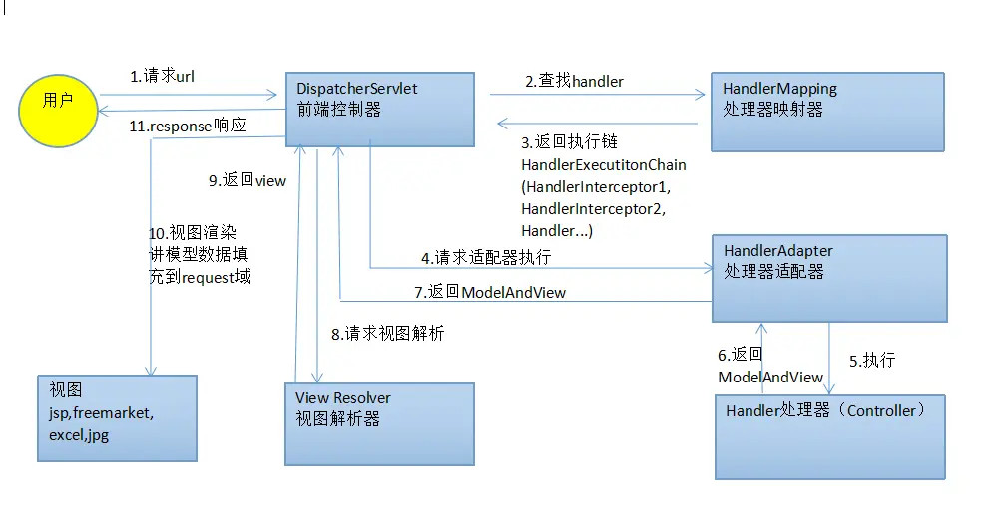

# SpringMVC 的执行流程

1. 用户发送请求到 DispatcherServlet
2. DispatcherServlet 收到请求后调用处理映射器 HandlerMapping
3. 处理映射器根据请求的 url 找到具体的处理器(controller 里映射到这个 url 的方法)，生成处理器执行链 HandlerExecutionChain（包含处理器和处理器拦截器）返回给 DispatcherServlet
4. DispatcherServlet 根据处理器获取对应的适配器 HandlerAdapter
5. 适配器调用处理器
6. 处理器执行完成后返回 ModelAndView
7. 适配器返回 ModelAndView
8. DispatcherServlet 统一将返回的 ModelAndView 派送到视图解析器 ViewResolver 解析
9. 视图解析器解析之后返回 View
10. 对 View 进行渲染
11. 响应用户

