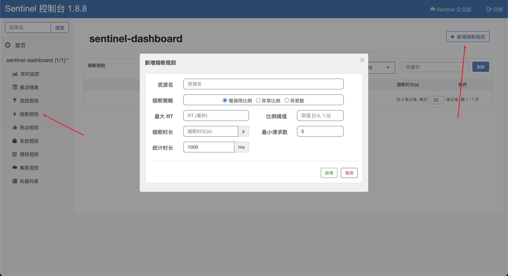

# 熔断

熔断降级涉及到的属性:

1. resource: 资源名，即规则的作用对象
2. grade: 熔断策略，支持慢调用比例/异常比例/异常数策略, 默认慢调用比例
3. count: 慢调用比例模式下为慢调用临界 RT(即最大的响应时间)。异常比例/异常数模式下为对应的阈值
4. timeWindow: 熔断时长，单位为 s
5. minRequestAmount: 熔断触发的最小请求数，请求数小于该值时即使异常比率超出阈值也不会熔断, 默认 5
6. statIntervalMs: 统计时长(单位为 ms), 默认 1000 ms
7. slowRatioThreshold: 慢调用比例阈值，仅慢调用比例模式有效

## 熔断策略

### 慢调用比例

慢调用比例 (SLOW_REQUEST_RATIO)：选择以慢调用比例作为阈值，需要设置允许的慢调用 RT(count)，请求的响应时间大于该值则统计为慢调用。当单位统计时长(statIntervalMs)内请求数目大于设置的最小请求数目，并且慢调用的比例大于阈值(slowRatioThreshold)，则接下来的熔断时长(timeWindow)内请求会自动被熔断。经过熔断时长后熔断器会进入探测恢复状态(HALF-OPEN 状态)，若接下来的一个请求响应时间小于设置的慢调用 RT 则结束熔断，若大于设置的慢调用 RT 则会再次被熔断。

### 异常比例

异常比例 (ERROR_RATIO)：当单位统计时长(statIntervalMs)内请求数目大于设置的最小请求数目(minRequestAmount)，并且异常的比例大于阈值(count)，则接下来的熔断时长(timeWindow)内请求会自动被熔断。经过熔断时长后熔断器会进入探测恢复状态(HALF-OPEN 状态)，若接下来的一个请求成功完成(没有错误)则结束熔断，否则会再次被熔断。异常比率的阈值范围是 `[0.0, 1.0]`，代表 `0% ~ 100%`。

### 异常数

异常数 (ERROR_COUNT)：当单位统计时长(statIntervalMs)内的异常数目超过阈值(count)之后会自动进行熔断。经过熔断时长(timeWindow)后熔断器会进入探测恢复状态(HALF-OPEN 状态)，若接下来的一个请求成功完成(没有错误)则结束熔断，否则会再次被熔断。
