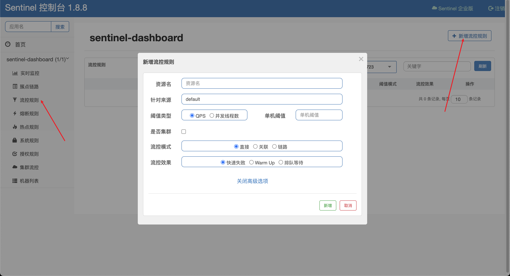

# 流量控制

流量控制(flow control)，其原理是监控应用流量的 QPS 或并发线程数等指标，当达到指定的阈值时对流量进行控制，以避免被瞬时的流量高峰冲垮，从而保障应用的高可用性。

QPS：每秒请求数，即在不断向服务器发送请求的情况下，服务器每秒能够处理的请求数量。

并发线程数: 能同时处理的请求数量。

同一个资源可以创建多条限流规则，一条限流规则由以下元素组成：

- 资源名(resource): 限流规则的作用对象
- 针对来源(limitApp): 流控针对的调用来源。默认值 default: 不区分调用来源
- 阈值类型(grade): 限流阈值类型。1: QPS, 0: 并发线程数，默认值 1
- 单机阈值(count): 限流阈值
- 流控模式(strategy): 判断的根据。0: 直接, 1: 关联, 2: 链路, 默认值 0
- 流控效果(controlBehavior): 0: 快速失败, 1: Warm Up, 2: 排队等待，默认值 0

## 流控模式

### 直接

默认的流量控制方式，当 QPS 超过任意规则的阈值后，新的请求就会被立即拒绝，拒绝方式为抛出 FlowException。

### 关联

A 接口关联 B 接口，一旦 B 接口达到阈值，则 A 接口被限流。

### 链路

只记录指定链路上的流量。

## 流控效果

### 快速失败

默认的流量控制方式，当 QPS 超过任意规则的阈值后，新的请求就会被立即拒绝，拒绝方式为抛出 FlowException。

## warm up

即预热/冷启动方式, 根据令牌桶算法实现。当系统长期处于低水位的情况下，当流量突然增加时，直接把系统拉升到高水位可能瞬间把系统压垮。通过"冷启动"，让通过的流量缓慢增加，在一定时间内逐渐增加到阈值上限，给冷系统一个预热的时间，避免冷系统被压垮。这一效果只针对 QPS 流控，并发线程数流控不支持。

冷却因子默认值是 3，即请求 QPS 从 `阈值 / 3` 开始，经预热时长逐渐升至设定的 QPS 阈值。比如设定 QPS 阈值为 3，预热时长为 5 秒，QPS 起初会从每秒通过一次请求(`3 / 3 = 1`)开始预热直到 5 秒之后达到每秒通过 3 次请求。

## 排队等待

根据漏桶算法实现。以固定的间隔时间让请求通过, 当请求到来的时候，如果当前请求距离上个通过的请求通过的时间间隔不小于预设值，则让当前请求通过。否则，计算当前请求的预期通过时间，如果该请求的预期通过时间小于预设的超时时间，则该请求会排队等待处理。若预期的通过时间超出最大排队时长，则直接拒接这个请求。这一效果只针对 QPS 流控，并发线程数流控不支持。

比如设置 QPS 阈值为 1，超时时间为 10000 毫秒，以每秒 1 次的请求处理能力处理数据，如果 QPS 超过 1，则排队等待，排队的请求最多只有 10 秒的预计处理时长。如果后面再来的请求计算预计等待时长超过 10 秒，则拒绝该请求。
