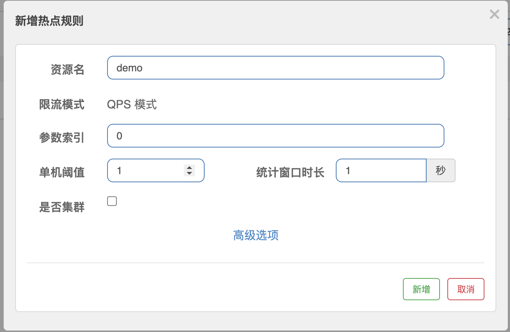

# 热点参数限流

热点即经常访问的数据。很多时候我们希望统计某个热点数据中访问频次最高的 Top K 数据，并对其访问进行限制。比如：

- 商品 ID 为参数，统计一段时间内最常购买的商品 ID 并进行限制
- 用户 ID 为参数，针对一段时间内频繁访问的用户 ID 进行限制

热点参数限流会统计传入参数中的热点参数，并根据配置的限流阈值与模式，对包含热点参数的资源调用进行限流。热点参数限流可以看做是一种特殊的流量控制，仅对包含热点参数的资源调用生效。

Sentinel 利用 LRU 策略统计最近最常访问的热点参数，结合令牌桶算法来进行参数级别的流控。

## 基本使用

1. 创建资源

```java
import com.alibaba.csp.sentinel.annotation.SentinelResource;
import com.alibaba.csp.sentinel.slots.block.BlockException;
import org.springframework.stereotype.Service;

@Service
public class DemoService {

    @SentinelResource(value = "demo", blockHandler = "exceptionHandler")
    public String demo(String p1, String p2) {
        return "hello " + p1 + " " + p2;
    }

    /**
     * Block 异常处理函数，参数最后多一个 BlockException，其余与原函数一致.
     */
    public String exceptionHandler(String p1, String p2, BlockException ex) {
        return "Oops, error occurred at " + p1 + " " + p2;
    }
}
```

2. 创建接口

```java
import org.springframework.beans.factory.annotation.Autowired;
import org.springframework.web.bind.annotation.RequestBody;
import org.springframework.web.bind.annotation.RequestMapping;
import org.springframework.web.bind.annotation.RestController;

import java.util.Map;

@RestController
@RequestMapping("/test")
public class DemoController {

    @Autowired
    private DemoService demoService;

    @RequestMapping("/demo")
    public String demo(@RequestBody Map<String, String> map) {
        return demoService.demo(map.get("p1"), map.get("p2"));
    }
}
```

3. 配置热点规则



当资源中的第 0 个参数的 QPS 超过 1 秒 1 次将会被限流。参数索引是从 0 开始，第 0 个就是对应 service 中的 p1 这个参数。

4. 请求热点参数, 连续请求后限流

```sh
curl --location --request GET 'http://localhost:27441/test/demo' \
--header 'Content-Type: application/json' \
--data-raw '{
    "p1": "111",
    "p2": "222"
}'
```

5. 请求不包含热点参数, 连续请求也不会限流

```sh
curl --location --request GET 'http://localhost:27441/test/demo' \
--header 'Content-Type: application/json' \
--data-raw '{
    "p2": "222"
}'
```
