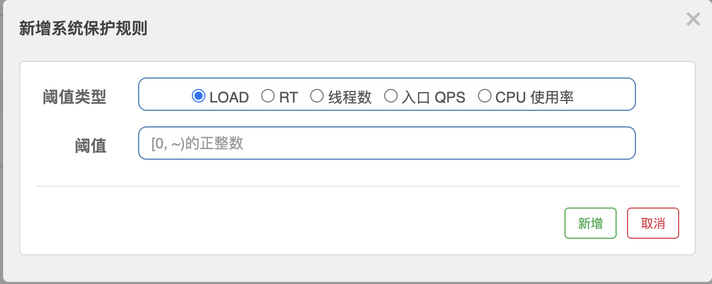

# 系统自适应保护

前面的限流都是针对的某个接口，系统规则限流针对是整个系统的入口流量。

阈值类型:

- LOAD: 仅对 Linux/Unix-like 机器生效, 当系统 load1(即系统的负载)超过阈值，且系统当前的并发线程数超过系统容量时才会触发系统保护。系统容量由系统的 `maxQps * minRt` 计算得出。设定参考值一般是 `CPU cores * 2.5`
- RT: 当单台机器上所有入口流量的平均 RT（即最大的响应时间）达到阈值即触发系统保护，单位是毫秒
- 线程数: 当单台机器上所有入口流量的并发线程数达到阈值即触发系统保护
- 入口 QPS: 当单台机器上所有入口流量的 QPS 达到阈值即触发系统保护
- CPU 使用率: 当系统 CPU 使用率超过阈值即触发系统保护（取值范围 0.0-1.0）
