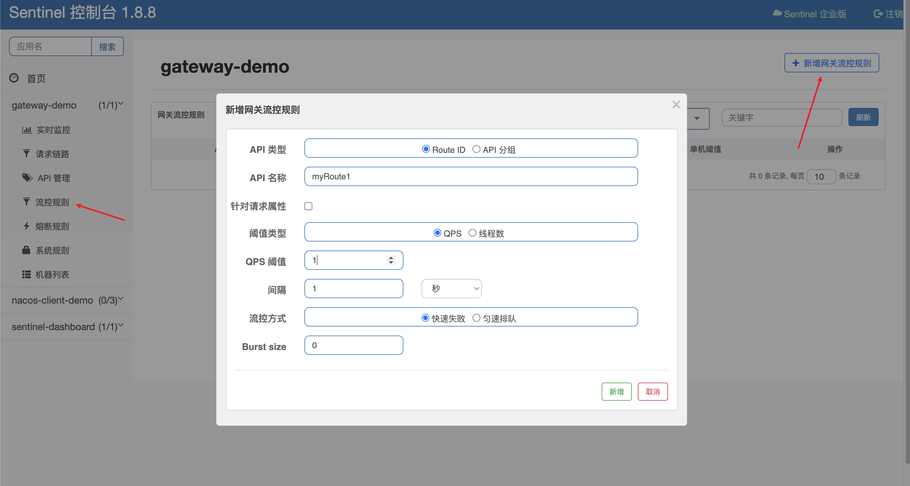
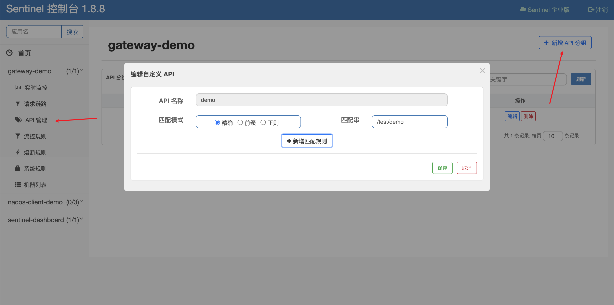
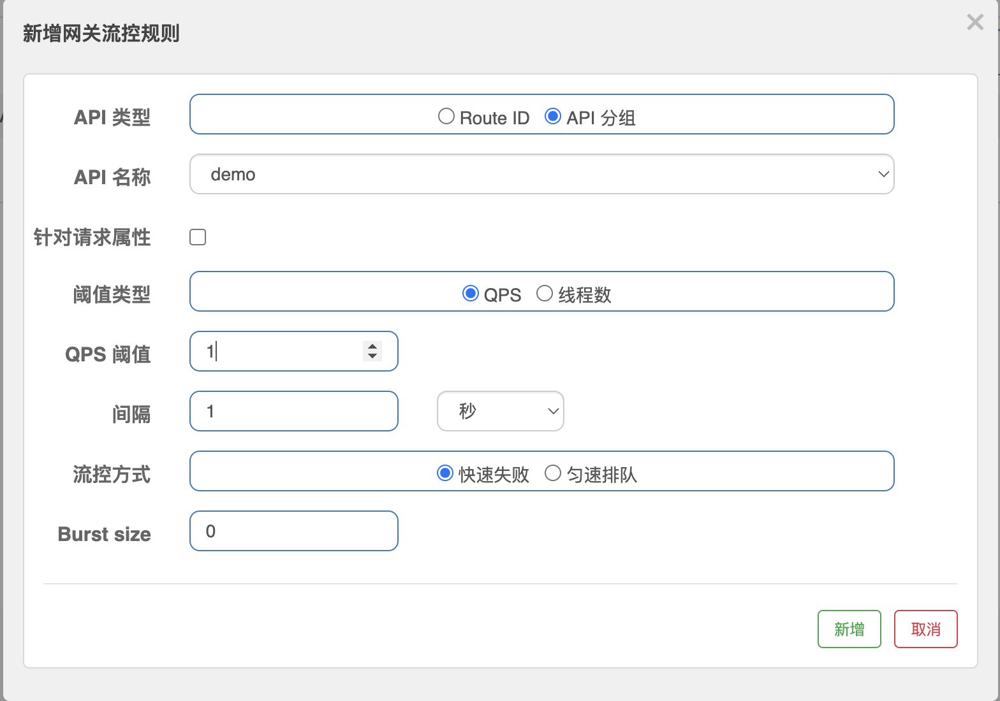

# 网关限流

从 1.6.0 版本开始，Sentinel 提供了 SpringCloud Gateway 的适配，可以提供两种资源维度的限流：

- route 维度：在配置文件中配置的路由条目，资源名为对应的 routeId，一般是对某个微服务进行限流
- 自定义 API 维度：针对某一类的 uri 进行匹配限流，可以跨多个微服务

## route 维度

1. 依赖

```xml
<dependency>
    <groupId>com.alibaba.cloud</groupId>
    <artifactId>spring-cloud-starter-alibaba-nacos-discovery</artifactId>
    <version>2.2.9.RELEASE</version>
</dependency>
<dependency>
    <groupId>org.springframework.cloud</groupId>
    <artifactId>spring-cloud-starter-gateway</artifactId>
</dependency>
<dependency>
    <groupId>com.alibaba.cloud</groupId>
    <artifactId>spring-cloud-starter-alibaba-sentinel</artifactId>
    <version>2.2.9.RELEASE</version>
</dependency>
<dependency>
    <groupId>com.alibaba.cloud</groupId>
    <artifactId>spring-cloud-alibaba-sentinel-gateway</artifactId>
    <version>2.2.9.RELEASE</version>
</dependency>
```

2. 配置

```yaml
server:
  port: 8090

spring:
  application:
    name: gateway-demo
  cloud:
    nacos:
      discovery:
        server-addr: localhost:8848
    sentinel:
      transport:
        # 指定控制台的地址
        dashboard: localhost:8081
      eager: true
    gateway:
      routes:
        - id: myRoute1
          # 格式 lb://服务名
          uri: lb://nacos-client-demo
          predicates:
            - Path=/test/**
```

3. 启动后, 就可以在 sentinel 控制台找到这个网关服务

4. 在 sentinel 控制台配置限流规则



5. 访问 http://localhost:8090/test/hello, 限流生效

## 自定义 API 维度

1. 新增 API 分组



2. 配置限流规则



3. 访问 http://localhost:8090/test/hello, 限流生效
