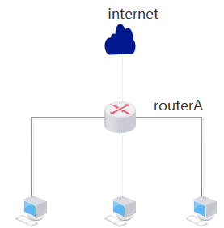
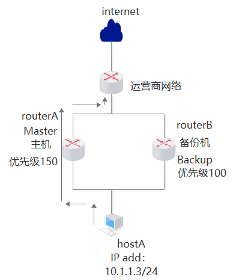

# 虚拟路由器冗余协议

虚拟路由冗余协议(Virtual Router Redundancy Protocol, 简称VRRP)是由IETF提出的解决局域网中配置静态网关出现单点失效现象的路由协议

局域网中的用户终端通常采用配置一个默认网关的形式访问外部网络, 如果此时默认网关设备发生故障, 将中断所有用户终端的网络访问, 所以通过部署多个网关的方式来解决单点故障问题

VRRP协议既可以实现网关的备份, 又能解决多个网关之间互相冲突的问题

VRRPv2 适用于IPv4网络, VRRPv3适用于IPv4和IPv6两种网络

# 单网关缺陷

当网关路由器RouterA出现故障时, 本网段内以该设备为网关的主机都不能与 Internet进行通信

# VRRP主备工作原理

VRRP能够在不改变组网的情况下, 将多台路由器虚拟成一个虚拟路由器, 通过配置虚拟路由器的IP地址为默认网关, 实现网关的备份。

当RouterB指定时间内未收到Master发送的状态通告报文, 则立即成为Master。当RouterA故障恢复后, 发现收到RouterB的VRRP报文中的优先级比自己低, RouterA立即抢占重新成为Master。

# 虚拟IP实现原理

虚拟IP主要是靠ARP协议实现的。

因为ip地址只是一个逻辑地址, 在以太网中MAC地址才是真正用来进行数据传输的物理地址, 每台主机中都有一个ARP高速缓存, 存储同一个网络内的IP地址与MAC地址的对应关系, 以太网中的主机发送数据时会先从这个缓存中查询目标IP对应的MAC地址, 会向这个MAC地址发送数据。操作系统会自动维护这个缓存。

如: 

- 192.168.1.217为master主机
- 192.168.1.218为slave主机
- 192.168.1.219为虚拟IP

一开始master会告诉所有主机, 虚拟IP 192.168.1.219对应的MAC地址是master的MAC地址。

当master正常服务时, 发送到192.168.1.219的数据包都会发送到master。

当slave发现master宕机后, 会告诉所有主机192.168.1.219这个IP对应的MAC地址是slave的MAC地址, 这样所有发送到192.168.1.219的数据包都会发送到slave。

# ARP

地址解析协议, 即ARP(Address Resolution Protocol), 是根据IP地址获取物理地址的一个TCP/IP协议。主机发送信息时将包含目标IP地址的ARP请求广播到局域网络上的所有主机, 并接收返回消息, 以此确定目标的物理地址；收到返回消息后将该IP地址和物理地址存入本机ARP缓存中并保留一定时间, 下次请求时直接查询ARP缓存以节约资源。
