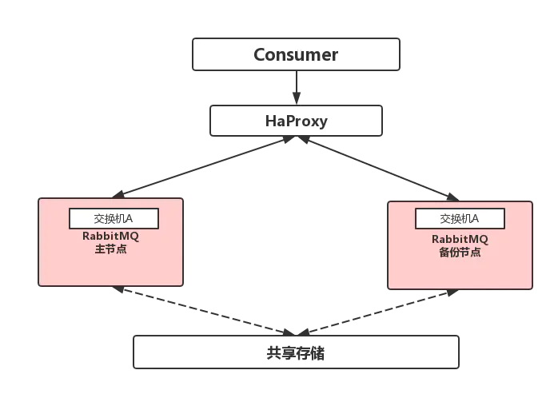
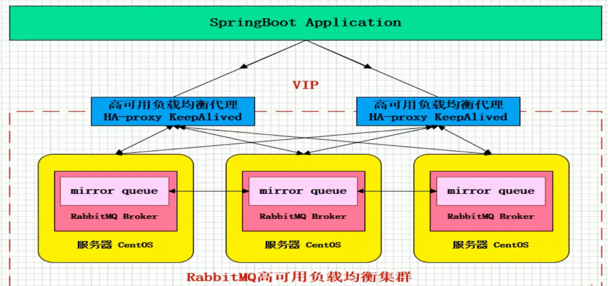

# 主备模式

主备模式: 主节点提供读写，从节点不提供读写服务，只是负责提供备份服务,备份节点的主要功能是在主节点宕机时，完成自动切换 从-->主



HaProxy配置
```conf
listen rabbitmq_cluster
bind 0.0.0.0:5672 
mode tcp  #配置TCP模式
balance roundrobin #简单的轮询
# inter 5000: 每隔5秒对mq集群做健康检查
# rise 2: 2次正确证明服务器可用
# fall 3: 3次失败证明服务器不可用
server bhz76 192.168.11.12:5672 check inter 5000 rise 2 fall 3 #主节点
server bhz77 192.168.11.13:5672 backup check inter 5000 rise 2 fall 3 #备用节点
```

# 镜像模式



Mirror镜像队列，目的是为了保证rabbitmq数据的高可靠性解决方案，主要就是实现数据的同步，一般来讲是2-3个实现数据同步

