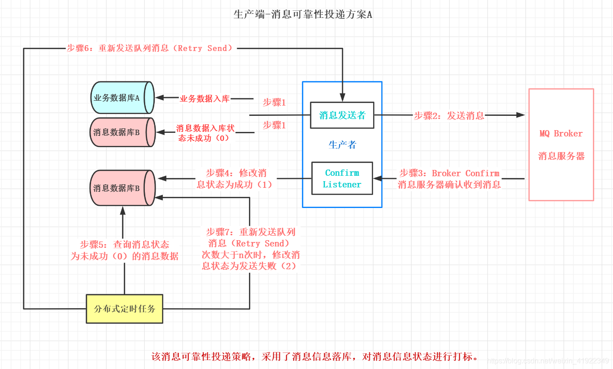
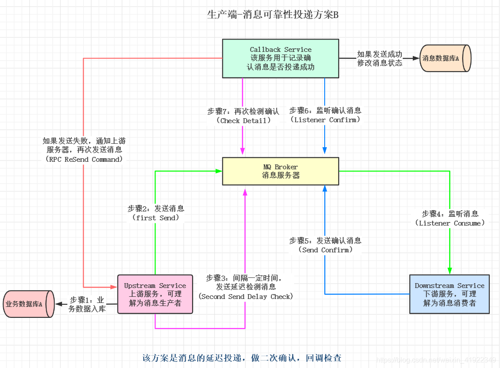

# 消息落库方案

1. 业务数据和消息数据入库（此时消息状态为未成功0）。
2. 向消息服务器发送消息。
3. 消息服务器收到消息后, 发送确认消息（确认应答) Ack。
4. 生产者接收到服务器发送的确认消息 Ack, 修改数据库中消息的状态为成功（1）。
5. 定时任务, 查询数据库中消息状态为未成功（0）的数据。
6. 重新发送未成功的消息。
7. 定时任务查询, 当重新发送的次数, 大于一定的值时, 修改该条消息状态为发送失败（2）。

# 延迟投递方案

1. 上游服务器（消息生产者）维护业务数据入库。
2. 上游服务器向消息服务器发送消息。
3. 上游服务器在发送消息后的n秒(时间根据业务自定义), 发送延迟投递消息。
4. 下游服务器（消息消费者）监听消息服务器上的消息, 并对消息进行消费。
5. 下游服务器向消息服务器发送确认消息。这里响应不是正常的ACK, 而是重新生成一条消息, 投递到MQ中。
6. Callback 服务监听下游服务发送的确认消息, 如果收到消息则对消息状态做记录。
7. Callback 服务监听上游服务器发送的延迟消息, 收到延迟消息后去检查DB中是否存在消息, 如果存在, 则不需要做任何处理。如果不存在或者消费失败了, 那么Callback service就需要主动发起RPC通信给上游服务, 告诉它延迟投递的这条消息没有找到, 需要重新发送, 生产端收到信息后就会重新查询业务消息然后将消息发送出去。

这种方案不一定能保障百分百投递成功, 但是基本上可以保障大概99.9%的消息是OK的, 有些特别极端的情况只能是人工去做补偿了, 或者使用定时任务去做

主要目的是为了减少数据库操作, 提高并发量, 在高并发场景下, 最关心的不是消息100%投递成功, 而是一定要保证性能, 保证能抗得住这么大的并发量, 所以能减少数据库的操作就尽量减少, 可以异步的进行补偿
