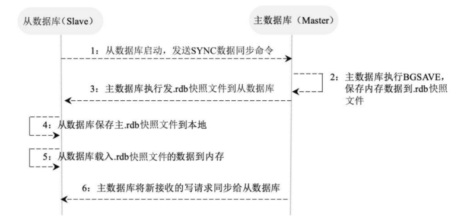

# Redis集群数据复制原理

Redis提供了复制功能，可以实现在Master中的数据更新后，自动将更新的数据同步到Slave。

1. 一个从数据库在启动后，会向主数据库发送SYNC命令。
2. 主数据库在接收到SYNC命令后会开始在后台保存快照（即RDB），并将保存快照期间接收到的命令缓存起来。在该持久化过程中会生成一个.rdb快照文件。
3. 在主数据库快照执行完成后，Redis会将快照文件和所有缓存的命令以.rdb快照文件的形式发送给从数据库。
4. 从数据库收到主数据库的.rdb快照文件后，载入该快照文件到本地。
5. 从数据库执行载入后的.rdb快照文件，将数据写入内存中。以上过程被称为复制初始化。
6. 在复制初始化结束后，主数据库在每次收到写命令时都会将命令同步给从数据库，从而保证主从数据库的数据一致。
