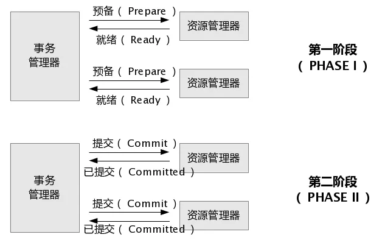

# 2PC

2PC即两阶段提交协议，是将整个事务流程分为两个阶段，准备阶段（Prepare phase）、提交阶段（commit phase），2是指两阶段，P是指准备阶段，C是提交阶段。

1. 准备阶段：事务管理器给每个参与者发送Prepare消息，每个数据库参与者在本地执行事务，并写本地的Undo/Redo日志，此时事务没有提交。（Undo日志是记录修改前的数据，用于数据库回滚；Redo日志是记录修改后的数据，用于提交事务后写入数据文件）
2. 提交阶段：如果事务管理器收到两参与者的执行失败或者超时消息时，直接给每个参与者发送回滚（Rollback）消息；否则，发送提交（Commit）消息；参与者根据事务管理器的指令执行提交或者回滚操作，并释放事务处理过程中使用的锁资源。注意 ：必须在最后阶段释放锁资源。

# XA

2PC的传统方案是在数据库层面实现的，Oracle、MySQL都支持2PC协议，基于数据库的XA协议来实现2PC又称为XA方案

定义
- AP（Application Program）：应用程序，可以理解为使用分布式事务的程序。
- RM（Resource Manager）：资源管理器，事务的参与者，一般情况下是指一个数据库实例。
- TM（Transaction Manager）：事务管理器，负责协调和管理事务，协调各个RM。

执行流程
1. AP持有用户库和积分库两个数据源。
2. AP通过TM通知用户库RM新增用户，同时通知积分库RM为该用户新增积分，RM此时并未提交事务，此时用户和积分资源锁定。
3. TM收到执行回复，只要有一方失败则分别向其他RM发起回滚事务，回滚完毕，资源锁释放。
4. TM收到执行回复，全部成功，此时向所有RM发起提交事务，提交完毕，资源锁释放。
