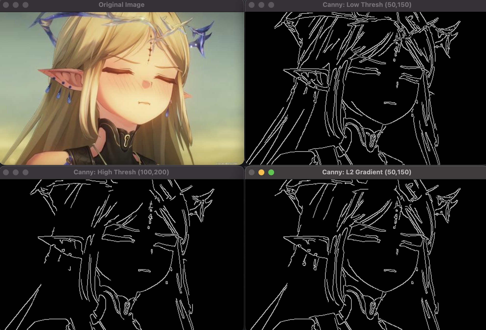

# Canny 边缘检测

Canny 边缘检测是 OpenCV 中最经典、应用最广的边缘检测算法，通过 “多阶段筛选” 实现低误检、高定位、单像素边缘的检测效果，核心是结合梯度计算、非极大值抑制和双阈值处理，比单纯的梯度算法（如 Sobel）边缘更精准、更干净。

Canny 算法通过 5 个阶段逐步筛选边缘，确保结果可靠：

1. 高斯滤波去噪：用高斯核平滑图像，减少噪声（噪声会导致虚假边缘，必须先去除）
2. 计算梯度：用 Sobel 算子计算图像的水平（Gx）和垂直（Gy）梯度，得到边缘的强度（梯度大小）和方向（梯度角度）
3. 非极大值抑制（NMS）：遍历梯度图像，仅保留梯度方向上的 “局部最大值” 像素（将宽边缘压缩为单像素边缘）
4. 双阈值处理：用两个阈值（高阈值 high_thresh、低阈值 low_thresh）筛选边缘：
   - 梯度强度 > 高阈值：确定为 “强边缘”（直接保留）
   - 梯度强度 < 低阈值：确定为 “非边缘”（直接丢弃）
   - 低阈值 < 梯度强度 < 高阈值：确定为 “弱边缘”，需进一步判断
5. 边缘连接：检查弱边缘是否与强边缘连通，连通则保留（视为强边缘的延伸），否则丢弃（视为噪声）

```py
edges = cv2.Canny(image, threshold1, threshold2, apertureSize=3, L2gradient=False)
```

- image 输入图像（单通道灰度图，不可直接用彩色图）
- threshold1 低阈值（双阈值中的下限，通常为高阈值的 1/2~1/3）
- threshold2 高阈值（双阈值中的上限，核心参数，控制强边缘的数量）
- apertureSize Sobel 算子的核大小（默认 3，可选 3、5、7），核越大，边缘越平滑
- L2gradient 梯度强度计算方式

```py
import cv2

# 读取图像并转为灰度图（Canny仅支持单通道灰度图）
img = cv2.imread("test.jpg")
gray = cv2.cvtColor(img, cv2.COLOR_BGR2GRAY)

# 先高斯滤波（进一步减少噪声，避免虚假边缘）
# 注意：Canny内部已包含高斯滤波，此处额外滤波是为了处理高噪声图像
blurred = cv2.GaussianBlur(gray, (3, 3), 0)  # 3×3高斯滤波，sigma=0自动计算

# 不同阈值的Canny检测（核心：调整threshold1和threshold2）
# （1）低阈值组合（边缘多，但可能有噪声）
canny_low = cv2.Canny(blurred, threshold1=50, threshold2=150, apertureSize=3)
# （2）高阈值组合（边缘少，但更干净）
canny_high = cv2.Canny(blurred, threshold1=100, threshold2=200, apertureSize=3)
# （3）高精度模式（L2gradient=True，梯度计算更准确）
canny_l2 = cv2.Canny(blurred, threshold1=50, threshold2=150, apertureSize=3, L2gradient=True)

cv2.imshow("Original Image", img)
cv2.imshow("Canny: Low Thresh (50,150)", canny_low)  # 边缘多，细节丰富
cv2.imshow("Canny: High Thresh (100,200)", canny_high)  # 边缘少，无噪声
cv2.imshow("Canny: L2 Gradient (50,150)", canny_l2)  # 边缘更精准

cv2.waitKey(0)
cv2.destroyAllWindows()
```


