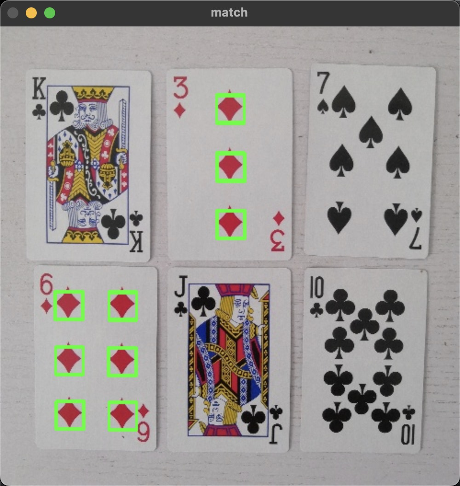

# 模板匹配

```py
import cv2
import numpy as np

img = cv2.imread('a.jpg')

# 转成灰度图
gray = cv2.cvtColor(img, cv2.COLOR_BGR2GRAY)

# 选取原图的一个区域作为模板
template = gray[75:105, 235:265]
h, w = template.shape  # 获取模板的高和宽

# 匹配模版
match = cv2.matchTemplate(gray, template, cv2.TM_CCOEFF_NORMED)
# 找出匹配系数大于0.9的匹配点
locations = np.where(match >= 0.9)

# 遍历所有匹配点
# 注意：locations返回的是一个元组，包含两个数组: (y坐标数组, x坐标数组)
# 使用zip重组出坐标数组，每次获取一个点的(y, x)
for y, x in zip(*locations):
    # 绘制矩形框（左上角(x,y)，右下角(x+w, y+h), 颜色是绿色）
    cv2.rectangle(img, (x, y), (x + w, y + h), (0, 255, 0), 2)

# 显示结果
cv2.imshow("match", img)
cv2.waitKey(0)
cv2.destroyAllWindows()
```

效果:


