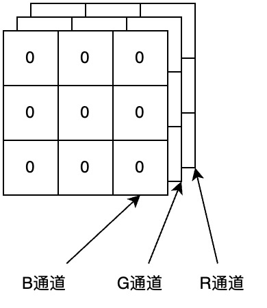
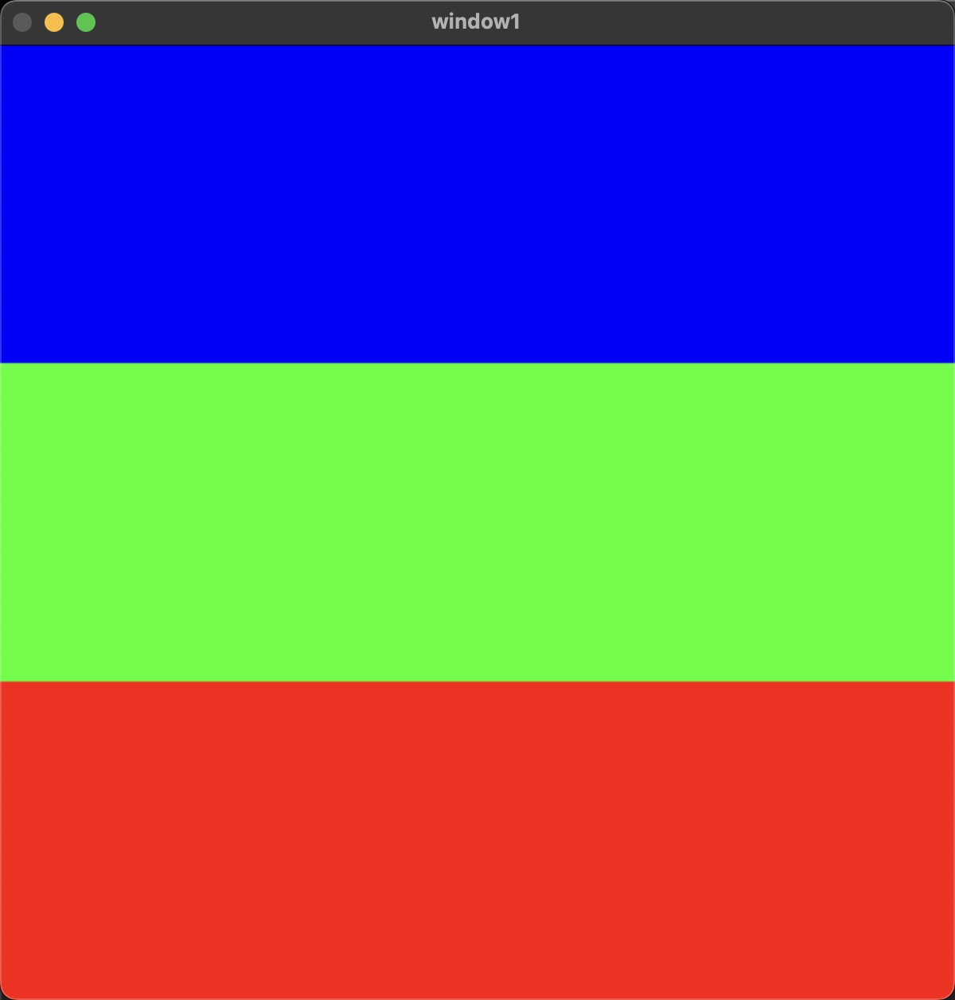

# 彩色图像

RGB 模式的彩色图像在 OpenCV 内会以 BGR 模式的三维数组形式存储。可以使用 `[]` 表达式访问数组内的值。

一张 3×3 大小的白色图像的 numpy 数组如下:



例如，有一幅纯红色的图像, 则它的 B 通道上所有的值都是 0, G 通道上所有的值都是 0, R 通道上所有的值都是 255。

- `img[1, 2, 0]`​：访问图像 img 第 1 行第 2 列第 0 个通道的像素值。第 0 个通道是 B 通道，会得到 B 通道内第 1 行第 2 列的位置所对应的值是 0
- `img[1, 2, 1]`​：访问图像 img 第 1 行第 2 列第 1 个通道的像素值。第 1 个通道是 G 通道，会得到 G 通道内第 1 行第 2 列的位置所对应的值是 0
- `img[1, 2, 2]`​：访问图像 img 第 1 行第 2 列第 2 个通道的像素值。第 2 个通道是 R 通道，会得到 R 通道内第 1 行第 2 列的位置所对应的值是 255
- `img[1, 2]`​：访问图像 img 第 1 行第 2 列像素点的 BGR 三个通道的值。得到 `[0, 0, 255]`

```py
import cv2
import numpy as np

# 使用Numpy库来生成一个600×600大小的数组，用来模拟一个600×600像素的黑色图像

# shape: (600, 600, 3)
# 600: 图像的高度
# 600: 图像的宽度
# 3: 图像的通道数，3表示RGB三通道
# dtype=np.uint8 表示数组的元素类型为无符号8位整数
img = np.zeros(shape=(600, 600, 3), dtype=np.uint8)

# 把第[0...200)行的蓝色通道设置为255, 则图像的上半部分为蓝色
img[0:200, :, 0] = 255
# 把第[200...400)行的绿色通道设置为255, 则图像的中间部分为绿色
img[200:400, :, 1] = 255
# 把第[400...600)行的红色通道设置为255, 则图像的下半部分为红色
img[400:600, :, 2] = 255

# 显示图像
cv2.imshow('window1', img)
cv2.waitKey(0)
cv2.destroyAllWindows()
```

输出:


