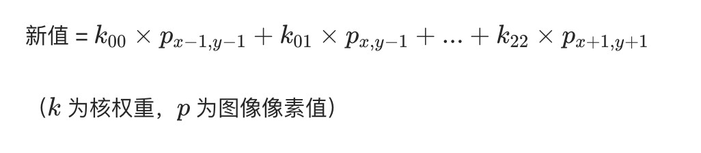

# 2D 卷积

在 OpenCV 中，2D 卷积（2D Convolution）是一种基础的图像操作，通过自定义的卷积核（Kernel） 与图像进行卷积运算，实现各种图像处理效果（如边缘检测、模糊、锐化等）。核心原理是 “滑动窗口加权求和”：用卷积核遍历图像的每个像素，将核内权重与对应像素值相乘后求和，得到新的像素值。

2D 卷积的核心原理

1. 卷积核（Kernel）：一个小型矩阵（如 3×3、5×5，通常为奇数大小），每个元素是权重值，决定了卷积的效果（如模糊核、锐化核、边缘检测核）
2. 卷积过程：
   1. 将卷积核的中心对准图像的每个像素
   2. 核内每个权重与对应位置的图像像素值相乘
   3. 求和得到的结果作为当前像素的新值
   4. 遍历完所有像素，生成卷积后的图像

例如，用 3×3 模糊核对像素  (x,y)  卷积：



```py
import cv2
import numpy as np

img = cv2.imread("test.jpg")

# 定义不同卷积核（核心：权重矩阵决定效果）
# （1）模糊核（均值模糊，3×3）
blur_kernel = np.ones((3, 3), np.float32) / 9  # 权重总和为1，避免亮度变化

# （2）锐化核（增强边缘，3×3）
sharpen_kernel = np.array([
    [0, -1, 0],
    [-1, 5, -1],
    [0, -1, 0]
], np.float32)  # 中心权重高，周围负权重，增强差异

# （3）边缘检测核（Sobel水平边缘，3×3）
edge_kernel = np.array([
    [-1, -2, -1],
    [0, 0, 0],
    [1, 2, 1]
], np.float32)  # 上下权重相反，突出水平边缘

# 应用2D卷积
blur_img = cv2.filter2D(img, -1, blur_kernel)  # 模糊效果
sharpen_img = cv2.filter2D(img, -1, sharpen_kernel)  # 锐化效果
edge_img = cv2.filter2D(img, -1, edge_kernel)  # 边缘检测效果

cv2.imshow("Original", img)
cv2.imshow("Blur (3x3)", blur_img)
cv2.imshow("Sharpen (3x3)", sharpen_img)
cv2.imshow("Edge Detection (Sobel Horizontal)", edge_img)

cv2.waitKey(0)
cv2.destroyAllWindows()
```

## 常用卷积核及效果

| 卷积核类型       | 核示例（3×3）                    | 效果说明                                        |
| ---------------- | -------------------------------- | ----------------------------------------------- |
| 均值模糊         | `[[1,1,1],[1,1,1],[1,1,1]] / 9`  | 邻域平均，平滑图像（等价于均值滤波）            |
| 高斯模糊         | `[[1,2,1],[2,4,2],[1,2,1]] / 16` | 高斯加权平均，平滑更自然（等价于 3×3 高斯滤波） |
| 锐化             | `[[0,-1,0],[-1,5,-1],[0,-1,0]]`  | 增强像素差异，使图像更清晰                      |
| 边缘检测（水平） | `[[-1,-2,-1],[0,0,0],[1,2,1]]`   | 突出水平方向的边缘（像素值突变区域）            |
| 边缘检测（垂直） | `[[-1,0,1],[-2,0,2],[-1,0,1]]`   | 突出垂直方向的边缘                              |
| 浮雕效果         | `[[-2,-1,0],[-1,1,1],[0,1,2]]`   | 模拟浮雕的凹凸感，通过灰度差体现立体感          |
