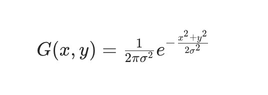
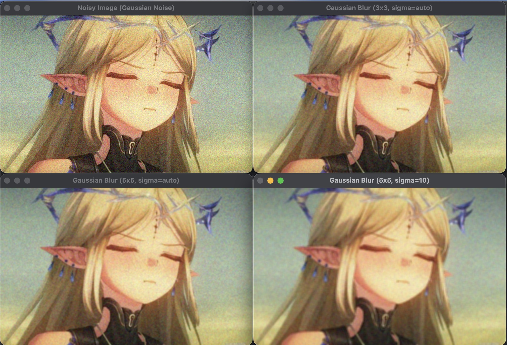

# 高斯滤波

高斯滤波（Gaussian Filtering）是一种常用的线性平滑滤波算法，通过高斯函数生成的加权核对图像进行卷积，实现平滑去噪。与均值滤波的 “等权重平均” 不同，高斯滤波对邻域内的像素按 “距离中心的远近” 分配权重（中心像素权重最高，边缘像素权重最低），在平滑噪声的同时能更好地保留图像边缘，是处理高斯噪声（自然场景中最常见的噪声类型）的首选方法。

## 高斯核的加权平均

高斯函数：滤波核的权重由二维高斯函数计算，公式为：



其中，(x,y)  是核内像素相对于中心的坐标，σ（sigma, 标准差）控制高斯曲线的 “宽窄”：σ  越大，权重分布越均匀（接近均值滤波）；σ  越小，中心权重越集中（边缘保留更好）。

核生成：根据高斯函数生成一个  n×n（n  为奇数）的核，确保中心像素权重最高，向四周逐渐降低，且核内所有权重之和为 1（归一化，避免图像亮度变化）。

卷积操作：用高斯核对图像进行卷积（每个像素值 = 邻域内像素 × 对应权重的总和），实现平滑。

```py
import cv2
import numpy as np

img = cv2.imread("test.jpg")
# 添加高斯噪声（均值0，标准差20）
h, w = img.shape[:2]
gauss_noise = np.random.normal(0, 20, (h, w, 3)).astype(np.int16)
noisy_img = np.clip(img.astype(np.int16) + gauss_noise, 0, 255).astype(np.uint8)

# （1）3×3核，sigmaX=0（自动计算）
gauss_3x3 = cv2.GaussianBlur(noisy_img, (3, 3), sigmaX=0)

# （2）5×5核，sigmaX=0（更强平滑）
gauss_5x5 = cv2.GaussianBlur(noisy_img, (5, 5), sigmaX=0)

# （3）5×5核，sigmaX=10（手动指定大sigma，权重更均匀）
gauss_5x5_s10 = cv2.GaussianBlur(noisy_img, (5, 5), sigmaX=10)

cv2.imshow("Noisy Image (Gaussian Noise)", noisy_img)
cv2.imshow("Gaussian Blur (3x3, sigma=auto)", gauss_3x3)
cv2.imshow("Gaussian Blur (5x5, sigma=auto)", gauss_5x5)
cv2.imshow("Gaussian Blur (5x5, sigma=10)", gauss_5x5_s10)

cv2.waitKey(0)
cv2.destroyAllWindows()
```


