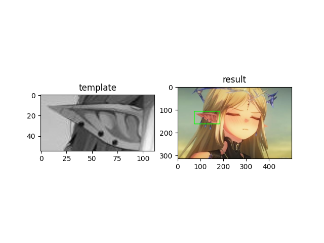

# 模板匹配

模板匹配（Template Matching）是一种在源图像中寻找与模板图像（小图）最相似区域的技术，常用于目标定位、特征匹配等场景。其核心思想是通过滑动模板图像在源图像上的每个可能位置，计算两者的相似度，最终找到匹配度最高的区域。

## 常用匹配方法

OpenCV 提供了 6 种度量方式（通过 method 参数指定）

| 方法常量               | 含义（数值越小/越大表示匹配度越高）        |
| ---------------------- | ------------------------------------------ |
| `cv2.TM_SQDIFF`        | 平方差匹配（越小越好）                     |
| `cv2.TM_SQDIFF_NORMED` | 归一化平方差匹配（越小越好）               |
| `cv2.TM_CCORR`         | 相关性匹配（越大越好）                     |
| `cv2.TM_CCORR_NORMED`  | 归一化相关性匹配（越大越好）               |
| `cv2.TM_CCOEFF`        | 相关性系数匹配（越大越好）                 |
| `cv2.TM_CCOEFF_NORMED` | 归一化相关性系数匹配（越大越好，推荐使用） |

```py
import cv2
import matplotlib.pyplot as plt

# 读取源图像和模板图像
img = cv2.imread('a.jpg')
# 转为灰度图
img_gray = cv2.cvtColor(img, cv2.COLOR_BGR2GRAY)
# 直接读为灰度图
template = cv2.imread('b.jpg', 0)

# 选择匹配方法（推荐归一化相关性系数）
method = cv2.TM_CCOEFF_NORMED

# 执行模板匹配，返回结果矩阵result
result = cv2.matchTemplate(img_gray, template, method)

# 获取result中的最大值、最小值及对应坐标
min_val, max_val, min_loc, max_loc = cv2.minMaxLoc(result)

print(f'最大值: {max_val:.4f}')
print(f'最小值: {min_val:.4f}')
print(f'最大值坐标: {max_loc}')
print(f'最小值坐标: {min_loc}')

# 最大值为最佳匹配
top_left = max_loc

# 获取模板的尺寸（高h，宽w）
h, w = template.shape[:2]
# 计算匹配区域的右下角坐标
bottom_right = (top_left[0] + w, top_left[1] + h)

# 绘制矩形框
cv2.rectangle(img, top_left, bottom_right, (0, 255, 0), 2)  # 绿色边框，线宽2

# 显示结果
plt.subplot(121), plt.imshow(template, cmap='gray'), plt.title('template')
plt.subplot(122), plt.imshow(cv2.cvtColor(img, cv2.COLOR_BGR2RGB)), plt.title('result')
plt.show()
```


