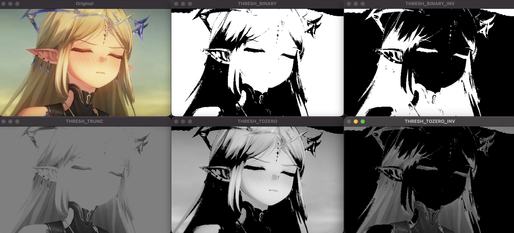

# 固定阈值处理

```py
ret, dst = cv2.threshold(src, thresh, maxval, type)
```

- src 输入图像，必须是 单通道灰度图像（不能直接用彩色图像，需先转灰度）
- thresh 设定的阈值（如 127，需根据图像亮度调整）
- maxval 阈值处理后的 “最大值”（通常设为 255，即白色，仅部分阈值类型使用）
- type 阈值处理类型（核心参数，决定像素值的分类规则，共 5 种）
- ret 返回的阈值（与输入 thresh 一致，若用自适应阈值则为计算出的阈值）
- dst 输出的二值图像（单通道，像素值为 0 或 255）

## 阈值处理类型

| 阈值类型常量            | 类型名称   | 处理规则（`T`=阈值，`maxval`=255）        | 适用场景                           |
| ----------------------- | ---------- | ----------------------------------------- | ---------------------------------- |
| `cv2.THRESH_BINARY`     | 二值阈值   | 像素 > T → 255（白）；像素 ≤ T → 0（黑）  | 目标与背景对比明显（如黑底白字）   |
| `cv2.THRESH_BINARY_INV` | 反二值阈值 | 像素 > T → 0（黑）；像素 ≤ T → 255（白）  | 目标与背景需反转（如白底黑字）     |
| `cv2.THRESH_TRUNC`      | 截断阈值   | 像素 > T → T（保持阈值）；像素 ≤ T → 不变 | 抑制高亮区域（如去除图像过亮部分） |
| `cv2.THRESH_TOZERO`     | 零阈值     | 像素 > T → 不变；像素 ≤ T → 0（黑）       | 保留亮目标，去除暗背景             |
| `cv2.THRESH_TOZERO_INV` | 反零阈值   | 像素 > T → 0（黑）；像素 ≤ T → 不变       | 保留暗目标，去除亮背景             |

```py
import cv2
import numpy as np

# 读取图像并转为灰度图（阈值处理必须输入单通道灰度图）
img = cv2.imread("test_gray.jpg")
gray = cv2.cvtColor(img, cv2.COLOR_BGR2GRAY)

# 设定阈值参数（阈值thresh=127，最大值maxval=255）
thresh = 127
maxval = 255

# （1）二值阈值
ret1, dst1 = cv2.threshold(gray, thresh, maxval, cv2.THRESH_BINARY)
# （2）反二值阈值
ret2, dst2 = cv2.threshold(gray, thresh, maxval, cv2.THRESH_BINARY_INV)
# （3）截断阈值
ret3, dst3 = cv2.threshold(gray, thresh, maxval, cv2.THRESH_TRUNC)
# （4）零阈值
ret4, dst4 = cv2.threshold(gray, thresh, maxval, cv2.THRESH_TOZERO)
# （5）反零阈值
ret5, dst5 = cv2.threshold(gray, thresh, maxval, cv2.THRESH_TOZERO_INV)

# 显示所有结果
cv2.imshow('Original', img)
cv2.imshow('THRESH_BINARY', dst1)
cv2.imshow('THRESH_BINARY_INV', dst2)
cv2.imshow('THRESH_TRUNC', dst3)
cv2.imshow('THRESH_TOZERO', dst4)
cv2.imshow('THRESH_TOZERO_INV', dst5)

cv2.waitKey(0)
cv2.destroyAllWindows()
```


