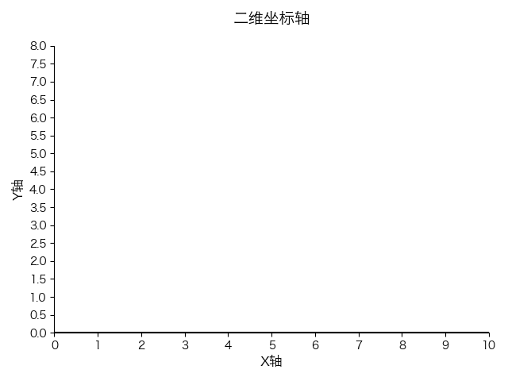

# 添加坐标轴标签和标题

```py
import numpy as np
import matplotlib.pyplot as plt

plt.rcParams['font.sans-serif'] = ['Hiragino Sans GB']
plt.rcParams['axes.unicode_minus'] = False

plt.figure()
x_min, x_max = 0, 10
y_min, y_max = 0, 8
plt.xlim(x_min, x_max)
plt.ylim(y_min, y_max)
plt.axhline(y=0, color='k', linewidth=1.5)
plt.axvline(x=0, color='k', linewidth=1.5)
plt.xticks(np.arange(x_min, x_max + 1, 1))
plt.yticks(np.arange(y_min, y_max + 0.5, 0.5))

# 添加坐标轴标签和标题
plt.xlabel('X轴', fontsize=12)
plt.ylabel('Y轴', fontsize=12)
plt.title('二维坐标轴', fontsize=14, pad=20)

ax = plt.gca()
ax.spines['top'].set_visible(False)
ax.spines['right'].set_visible(False)
plt.tight_layout()
plt.show()
```

效果:


