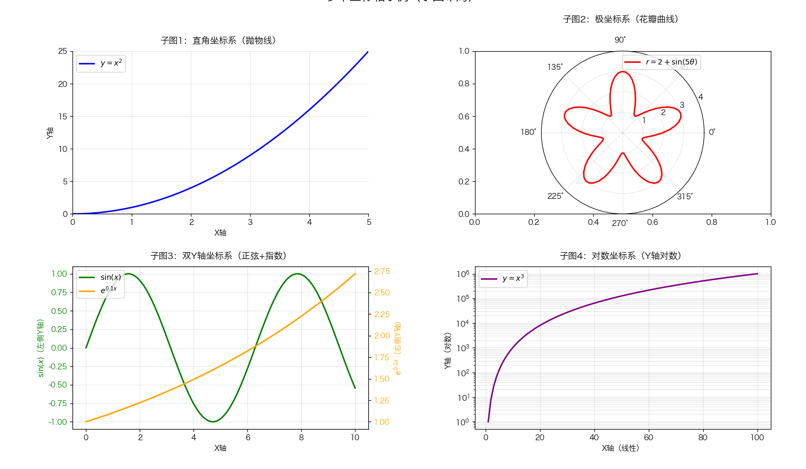

# 创建多个坐标轴

```py
import numpy as np
import matplotlib.pyplot as plt

plt.rcParams['font.sans-serif'] = ['Hiragino Sans GB']
plt.rcParams['axes.unicode_minus'] = False

# 1. 创建画布和2x2子图布局（figsize控制整体大小，dpi提升清晰度）
fig, axes = plt.subplots(2, 2, figsize=(12, 10), dpi=100)

# 2. 子图1：标准直角坐标系（第一象限，原点在左下）
ax1 = axes[0, 0]  # 第1行第1列子图
# 绘制函数图像
x1 = np.linspace(0, 5, 100)
y1 = x1 ** 2  # 抛物线
ax1.plot(x1, y1, color='blue', linewidth=2, label='$y=x^2$')
# 设置坐标轴
ax1.set_xlim(0, 5)
ax1.set_ylim(0, 25)
ax1.set_xlabel('X轴', fontsize=10)
ax1.set_ylabel('Y轴', fontsize=10)
ax1.set_title('子图1：直角坐标系（抛物线）', fontsize=12, pad=10)
ax1.legend()
ax1.grid(True, alpha=0.3)
# 隐藏顶部/右侧边框，突出左下坐标轴
ax1.spines['top'].set_visible(False)
ax1.spines['right'].set_visible(False)

# 3. 子图2：极坐标系
ax2 = axes[0, 1]  # 第1行第2列子图
ax2 = plt.subplot(2, 2, 2, polar=True)  # 单独设置为极坐标（覆盖原有子图）
# 绘制函数图像
theta = np.linspace(0, 2 * np.pi, 100)
r = 2 + np.sin(5 * theta)  # 极坐标曲线（花瓣状）
ax2.plot(theta, r, color='red', linewidth=2, label='$r=2+\sin(5θ)$')
# 设置极坐标属性
ax2.set_rlim(0, 4)
ax2.set_rticks(np.arange(1, 5, 1))
ax2.set_thetagrids(np.arange(0, 360, 45), [f'{a}°' for a in np.arange(0, 360, 45)])
ax2.set_title('子图2：极坐标系（花瓣曲线）', fontsize=12, pad=20)
ax2.legend(loc='upper right')
ax2.grid(True, alpha=0.3)

# 4. 子图3：双Y轴坐标系（同一X轴，两个Y轴）
ax3 = axes[1, 0]  # 第2行第1列子图
x3 = np.linspace(0, 10, 100)
y3_1 = np.sin(x3)  # 第一个Y轴数据（正弦）
y3_2 = np.exp(0.1 * x3)  # 第二个Y轴数据（指数）
# 主Y轴（左侧）
ax3.plot(x3, y3_1, color='green', linewidth=2, label='$\sin(x)$')
ax3.set_xlabel('X轴', fontsize=10)
ax3.set_ylabel('$\sin(x)$（左侧Y轴）', fontsize=10, color='green')
ax3.tick_params(axis='y', labelcolor='green')  # 主Y轴刻度颜色
# 次Y轴（右侧，与主X轴共享）
ax3_twin = ax3.twinx()  # 创建共享X轴的次Y轴
ax3_twin.plot(x3, y3_2, color='orange', linewidth=2, label='$e^{0.1x}$')
ax3_twin.set_ylabel('$e^{0.1x}$（右侧Y轴）', fontsize=10, color='orange')
ax3_twin.tick_params(axis='y', labelcolor='orange')  # 次Y轴刻度颜色
# 标题和图例（合并两个Y轴的图例）
ax3.set_title('子图3：双Y轴坐标系（正弦+指数）', fontsize=12, pad=10)
lines1, labels1 = ax3.get_legend_handles_labels()
lines2, labels2 = ax3_twin.get_legend_handles_labels()
ax3.legend(lines1 + lines2, labels1 + labels2, loc='upper left')
ax3.grid(True, alpha=0.3)

# 5. 子图4：对数坐标系（Y轴对数）
ax4 = axes[1, 1]  # 第2行第2列子图
# 绘制函数图像
x4 = np.linspace(1, 100, 100)
y4 = x4 ** 3  # 幂函数（适合对数展示）
ax4.plot(x4, y4, color='purple', linewidth=2, label='$y=x^3$')
# 设置Y轴为对数刻度
ax4.set_yscale('log')
# 坐标轴属性
ax4.set_xlabel('X轴（线性）', fontsize=10)
ax4.set_ylabel('Y轴（对数）', fontsize=10)
ax4.set_title('子图4：对数坐标系（Y轴对数）', fontsize=12, pad=10)
ax4.legend()
ax4.grid(True, alpha=0.3, which='both')  # 显示对数网格（both：主/次网格）

# 6. 调整子图间距（避免标签重叠）
plt.tight_layout(pad=3.0)  # pad控制子图间的整体间距
# 添加总标题
fig.suptitle('多个坐标轴示例（子图布局）', fontsize=16, y=1.02)  # y=1.02避免与子图标题重叠

# 显示图形
plt.show()
```

效果:


