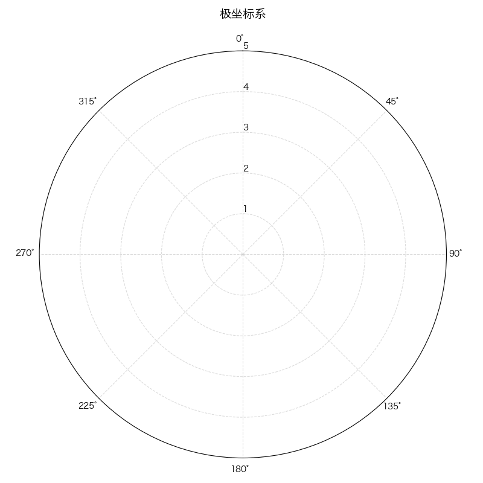

# 极坐标轴

```py
import numpy as np
import matplotlib.pyplot as plt

plt.rcParams['font.sans-serif'] = ['Hiragino Sans GB']
plt.rcParams['axes.unicode_minus'] = False

# 创建画布布并设置为极坐标模式
plt.figure(figsize=(8, 8))
ax = plt.subplot(111, polar=True)  # 设置为极坐标

# 设置角度范围（0到2π）- 使用set_xlim代替set_theta_range
ax.set_xlim(0, 2 * np.pi)

# 设置角度方向和起点（0度在正上方，顺时针方向）
ax.set_theta_direction(-1)  # -1表示顺时针，1表示逆时针
ax.set_theta_offset(np.pi / 2)  # 0度位置偏移到正上方

# 设置半径范围
max_radius = 5
ax.set_rlim(0, max_radius)

# 设置半径刻度
ax.set_rticks(np.arange(1, max_radius + 1, 1))  # 1到5，间隔1
ax.set_rlabel_position(0)  # 半径标签位置（0度方向）

# 设置角度刻度标签（0°, 45°, 90°, ..., 315°）
angles = np.arange(0, 360, 45)
ax.set_thetagrids(angles, [f'{a}°' for a in angles])

# 美化网格
ax.grid(True, linestyle='--', alpha=0.7)
ax.xaxis.grid(color='#cccccc')  # 角度网格线颜色
ax.yaxis.grid(color='#cccccc')  # 半径网格线颜色

# 添加标题
plt.title('极坐标系', fontsize=14, pad=20)

# 显示图形
plt.tight_layout()
plt.show()
```

效果:


