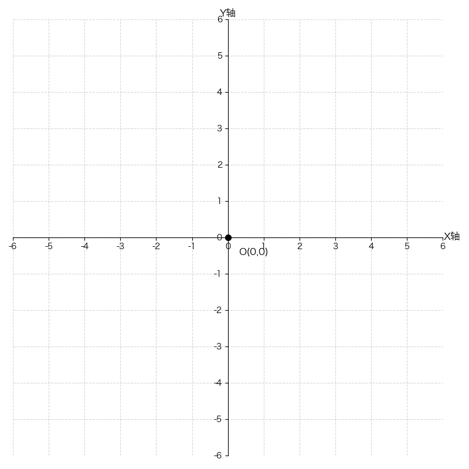

# 有四个象限的坐标轴

```py
import numpy as np
import matplotlib.pyplot as plt

plt.rcParams['font.sans-serif'] = ['Hiragino Sans GB']
plt.rcParams['axes.unicode_minus'] = False

# 使用正方形画布，使坐标系比例更协调
plt.figure(figsize=(8, 8))

# 控制坐标轴范围，x轴和y轴都是从-range_val到range_val
range_val = 6
plt.xlim(-range_val, range_val)
plt.ylim(-range_val, range_val)

# 获取当前坐标轴对象
ax = plt.gca()

# 移动坐标轴到中心位置（原点在中心）
ax.spines['left'].set_position('center')  # 左边框移到x=0位置
ax.spines['bottom'].set_position('center')  # 下边框移到y=0位置
ax.spines['top'].set_color('none')  # 隐藏上边框
ax.spines['right'].set_color('none')  # 隐藏右边框

# 设置刻度
ticks = np.arange(-range_val, range_val + 1, 1)
plt.xticks(ticks)
plt.yticks(ticks)

# 添加网格线（虚线，透明度0.5）
plt.grid(True, linestyle='--', alpha=0.5)

# X轴标签：放在X轴右端
ax.text(6.02, 0.5, 'X轴', fontsize=12,
        transform=ax.get_xaxis_transform(),  # 使用X轴的变换矩阵
        ha='left', va='center', rotation=0)  # 水平左对齐，垂直居中

# Y轴标签：放在Y轴顶端
ax.text(0.5, 6.02, 'Y轴', fontsize=12,
        transform=ax.get_yaxis_transform(),  # 使用Y轴的变换矩阵
        ha='center', va='bottom', rotation=0)  # 水平居中，垂直底部对齐

# 标记原点
plt.scatter(0, 0, color='black', s=50)  # 原点标记
plt.annotate('O(0,0)', xy=(0, 0), xytext=(0.3, -0.5), fontsize=12)

# 调整布局并显示
plt.tight_layout()
plt.show()
```

效果:


