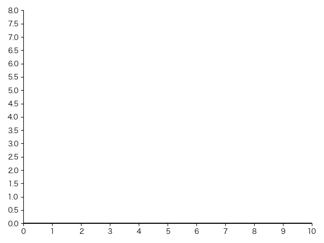
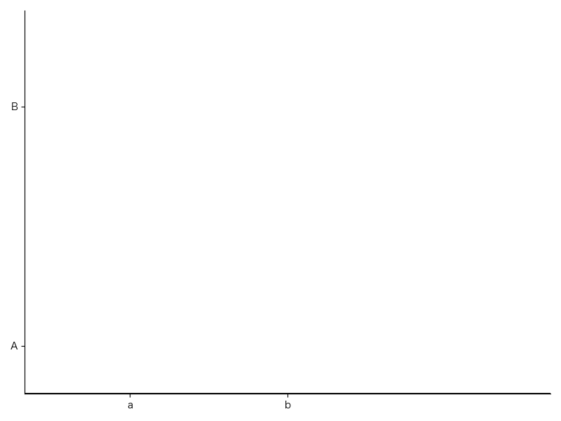

# 自定义坐标轴刻度

```py
import numpy as np
import matplotlib.pyplot as plt

plt.rcParams['font.sans-serif'] = ['Hiragino Sans GB']
plt.rcParams['axes.unicode_minus'] = False

plt.figure()

x_min, x_max = 0, 10
y_min, y_max = 0, 8
plt.xlim(x_min, x_max)
plt.ylim(y_min, y_max)

plt.axhline(y=0, color='k', linewidth=1.5)
plt.axvline(x=0, color='k', linewidth=1.5)

# 设置刻度
plt.xticks(np.arange(x_min, x_max + 1, 1))  # x轴刻度，间隔1
plt.yticks(np.arange(y_min, y_max + 0.5, 0.5))  # y轴刻度，间隔0.5

ax = plt.gca()
ax.spines['top'].set_visible(False)
ax.spines['right'].set_visible(False)
plt.tight_layout()
plt.show()
```

效果:



## 自定义刻度的名称

```py
# x轴刻度2名为a, 刻度5名为b
plt.xticks([2, 5], ['a', 'b'])
# y轴刻度1名为A, 刻度6名为B
plt.yticks([1, 6], ['A', 'B'])
```

效果:


