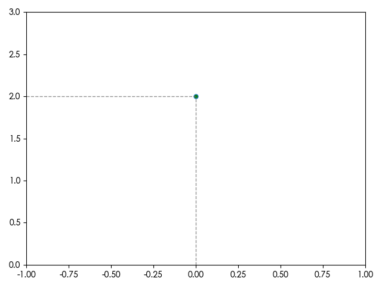

# 数据点到坐标轴的注释线

```py
import matplotlib.pyplot as plt

plt.figure()

# 绘制数据点, 坐标: (0, 2)
plt.plot(0, 2, mfc='green', markersize=5.0, marker='o')

# 需要限制坐标轴的范围
plt.xlim(-1, 1)
plt.ylim(0, 3)

# 绘制一条从 (-1, 2) 到 (0, 2) 的水平虚线，颜色为深灰色，线宽 1，透明度 0.7
plt.plot([-1, 0], [2, 2], color='#666666', linestyle='--', linewidth=1, alpha=0.7)
# 绘制一条从 (0, 0) 到 (0, 2) 的垂直虚线，颜色为深灰色，线宽 1，透明度 0.7
plt.plot([0, 0], [0, 2], color='#666666', linestyle='--', linewidth=1, alpha=0.7)

plt.tight_layout()
plt.show()
```

plt.plot 的前两个参数是 `[x1, x2]` 和 `[y1, y2]`。表示画一条由 `(x1, y1)` 和 `(x2, y2)` 这两点确定的一条直线。

效果:


