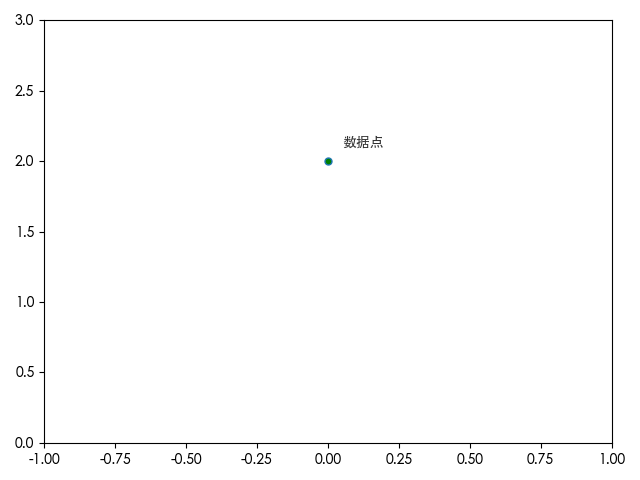

# 绘制数据点的标签

```py
import matplotlib.pyplot as plt

plt.rcParams["font.family"] = ["SimHei", "WenQuanYi Micro Hei", "Heiti TC"]
plt.rcParams['axes.unicode_minus'] = False

plt.figure()

# 绘制数据点, 坐标: (0, 2)
plt.plot(0, 2, mfc='green', markersize=5.0, marker='o')

# 需要限制坐标轴的范围
plt.xlim(-1, 1)
plt.ylim(0, 3)

# 添加数据点名称标签
# 0 + 0.05 和 2 + 0.1 控制标签相对于数据点的偏移量，避免重叠
plt.text(0 + 0.05, 2 + 0.1, '数据点', fontsize=10, color='#333333')

plt.tight_layout()
plt.show()
```

效果:


