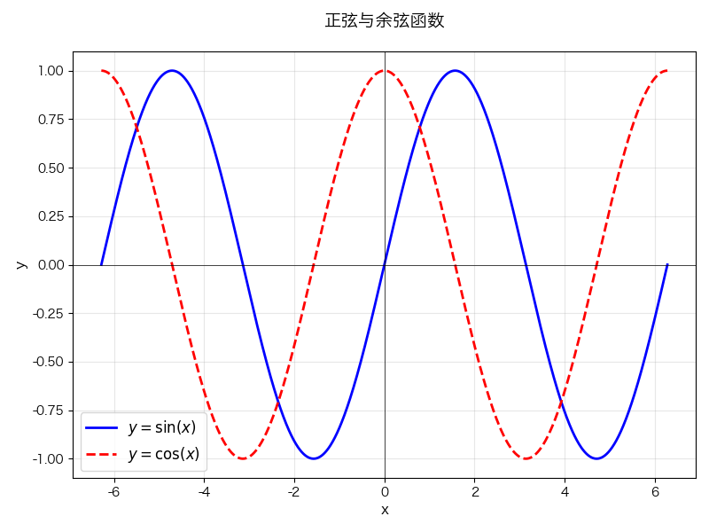

# 绘制函数图像

绘制函数图像的核心步骤：

1. 准备数据：
   - 用 `np.linspace(start, end, num_points)` 生成均匀分布的 x 值。点数越多(如 1000)，曲线越平滑
   - 根据函数的定义域调整 x 的范围（如三角函数常用 -2π 到 2π）
2. 计算函数值：
   - 直接用 numpy 函数计算, 如 `np.sin(x)`、`np.exp(x)`
   - 复杂函数可用 `np.where()` 实现分段逻辑(如绝对值函数)
   - 自定义函数可封装为 Python 函数后调用(如 `def f(x): return x**3 + 2*x`)
3. 绘制曲线：
   - 基础函数：`plt.plot(x, y)`，返回值为曲线对象
   - 曲线样式：通过 color（颜色）、linewidth（线宽）、linestyle（线型）参数调整
   - 绘制多条曲线：同一子图中多次调用 `plt.plot()` 即可
4. 添加标注：
   - 标题：`plt.title()`
   - 坐标轴标签：`plt.xlabel()`、`plt.ylabel()`
   - 图例：`plt.legend()`, 需要在 `plot()` 中设置 label 参数
   - 参考线：`plt.axhline()` 水平线、`plt.axvline()` 垂直线
   - 网格：`plt.grid()` 帮助观察坐标值
5. 布局调整：
   - 多子图用 `plt.subplot(rows, cols, index)` 布局
   - `plt.tight_layout()` 自动调整间距避免标签重叠
   - 总标题用 `plt.suptitle()`

```py
import numpy as np
import matplotlib.pyplot as plt

plt.rcParams['font.sans-serif'] = ['Hiragino Sans GB']
plt.rcParams['axes.unicode_minus'] = False

# 生成x轴数据
x = np.linspace(-2 * np.pi, 2 * np.pi, 1000)

# 计算函数值
y_sin = np.sin(x)
y_cos = np.cos(x)

# 创建画布
plt.figure(figsize=(8, 6))

# 绘制函数曲线
plt.plot(x, y_sin, label=r'$y = \sin(x)$', color='blue', linewidth=2)
plt.plot(x, y_cos, label=r'$y = \cos(x)$', color='red', linewidth=2, linestyle='--')

# 添加标注元素
plt.title('正弦与余弦函数', fontsize=14, pad=20)  # 标题
plt.xlabel('x', fontsize=12)  # x轴标签
plt.ylabel('y', fontsize=12)  # y轴标签
plt.legend(fontsize=12)  # 图例
plt.grid(alpha=0.3)  # 网格线
plt.axhline(y=0, color='black', linewidth=0.5)  # x轴
plt.axvline(x=0, color='black', linewidth=0.5)  # y轴

# 调整布局并显示
plt.tight_layout()
plt.show()
```

效果:


