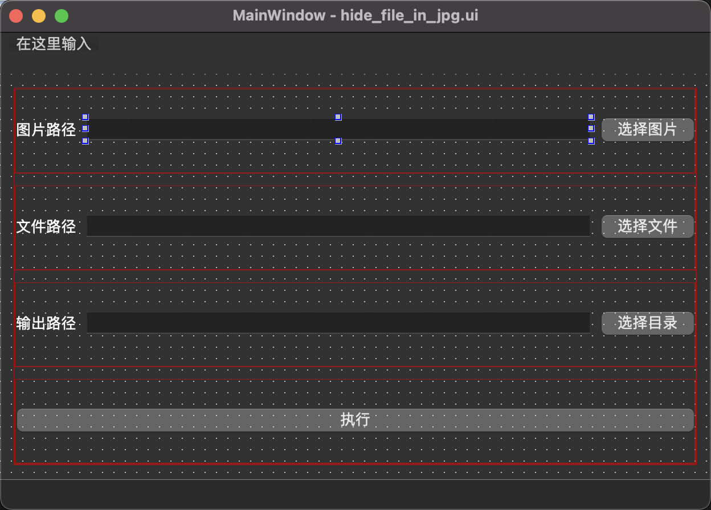
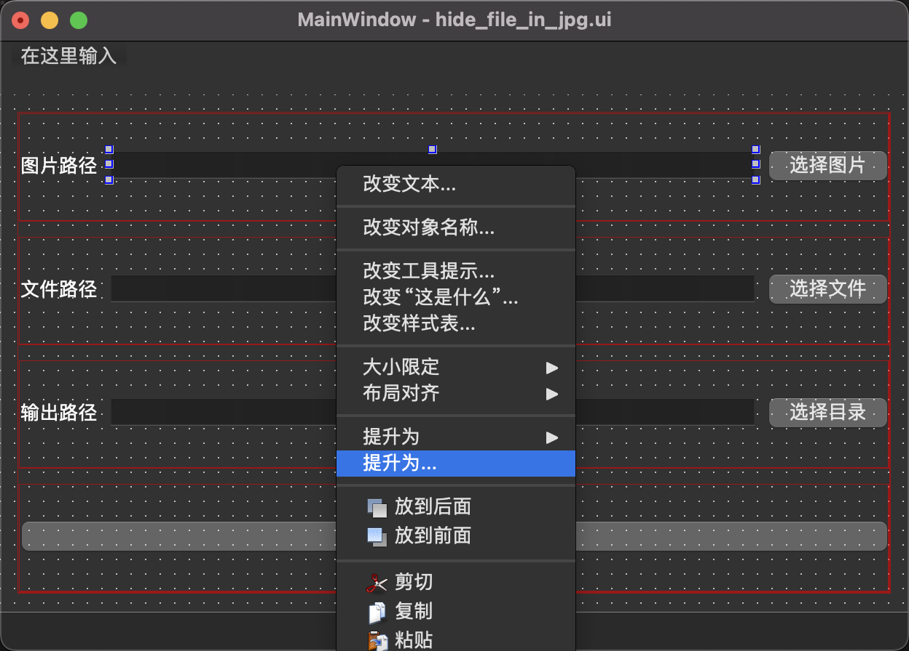
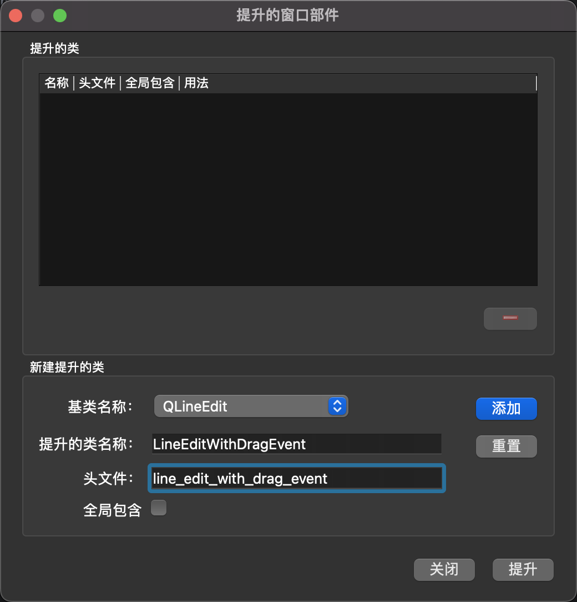
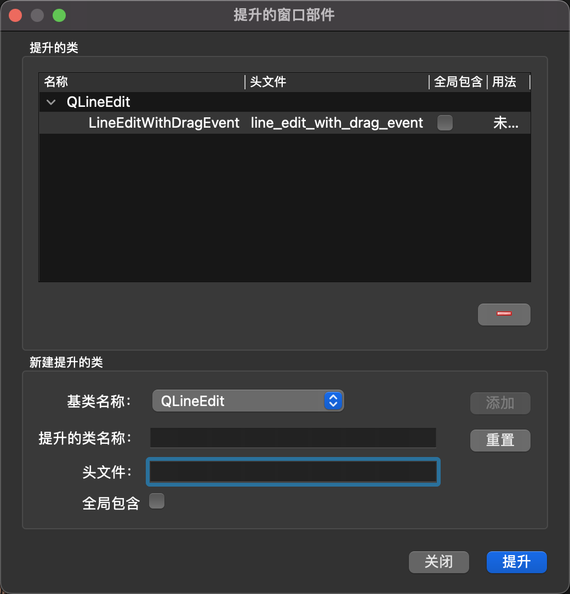
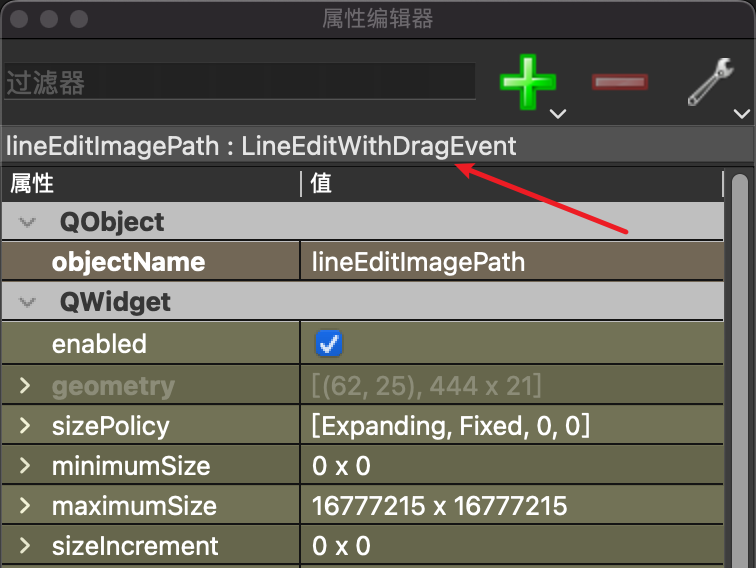

# 自定义组件

以自定义支持拖拽的 LineEdit 组件为例, 要实现的功能: 鼠标拖动文件到文本框上松开, 文本框设置成拖拽的文件的路径。

新建一个 py 文件, 比如叫 `line_edit_with_drag_event.py`:

```py
from PySide6 import QtWidgets


class LineEditWithDragEvent(QtWidgets.QLineEdit):
    def __init__(self, parent=None):
        super(LineEditWithDragEvent, self).__init__(parent)
        # 开启拖拽功能
        self.setAcceptDrops(True)

    # 拖入事件
    def dragEnterEvent(self, event):
        if event.mimeData().hasUrls():
            event.acceptProposedAction()
        else:
            super(LineEditWithDragEvent, self).dragEnterEvent(event)

    # 鼠标松开事件
    def dropEvent(self, event):
        if event.mimeData().hasUrls():
            url = event.mimeData().urls()[0]
            # 设置文件路径
            self.setText(url.toLocalFile())
        else:
            super(LineEditWithDragEvent, self).dropEvent(event)
```

## QT Designer 中使用自定义组件

1. 正常布置组件

   

2. LineEdit 上右键, 选择 `提升为...`

   

3. 在弹出的窗口中填入相关信息

   - 基类名称: `QLineEdit`
   - 提升的类名称: `LineEditWithDragEvent`
   - 头文件: `line_edit_with_drag_event`

   

4. 点击 `添加`, 再点击 `提升`

   

5. 查看属性编辑器, 可以看到已经生效

   
