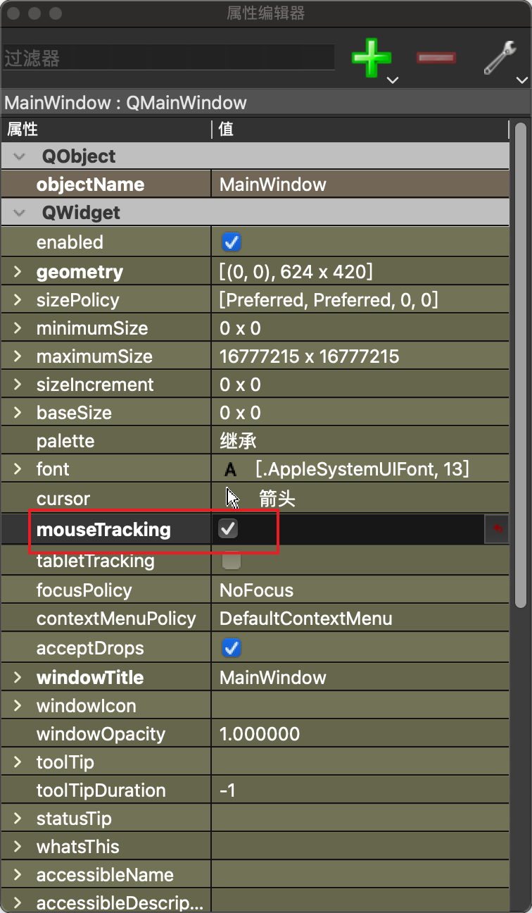

# 鼠标拖拽事件

如果要让主窗口响应鼠标拖拽事件, 需要在主窗口的属性编辑器中勾选 mouseTracking:



设置响应鼠标拖拽事件:

```py
class MyMainWindow(QMainWindow, Ui_MainWindow):
    def __init__(self, parent=None):
        super(MyMainWindow, self).__init__(parent)
        self.setupUi(self)
        # 响应鼠标拖拽事件
        self.setAcceptDrops(True)
```

监听相关事件:

```py
import sys
from PySide6.QtWidgets import QApplication, QMainWindow

from ui_main import Ui_MainWindow


class MyMainWindow(QMainWindow, Ui_MainWindow):
    def __init__(self, parent=None):
        super(MyMainWindow, self).__init__(parent)
        self.setupUi(self)
        self.setAcceptDrops(True)

    def dragEnterEvent(self, event):
        # 鼠标按住文件拖到界面窗口时触发
        print("dragEnterEvent==>")
        # 拖拽事件继续传递给dragLeaveEvent, dragMoveEvent, dropEvent
        event.accept()
        # 拖拽事件不继续传递, dragLeaveEvent, dragMoveEvent, dropEvent不会再收到这条事件
        # event.ignore()

    def dragLeaveEvent(self, event):
        # 拖拽着离开窗口时触发
        print("dragLeaveEvent==>")

    def dragMoveEvent(self, event):
        # 拖拽着在窗口内移动时触发
        print("dragMoveEvent==>")

    def dropEvent(self, event):
        # 在窗口内松开鼠标时触发
        print("dropEvent==>")


if __name__ == '__main__':
    app = QApplication(sys.argv)
    myWin = MyMainWindow()
    myWin.show()
    sys.exit(app.exec())
```

## 获取拖进来的文件路径

```py
def dropEvent(self, event):
    print("dropEvent==>")
    # 可以同时拖进来多个文件
    for url in event.mimeData().urls():
        # 输出文件的全路径
        print(str(url.toLocalFile()))
```
