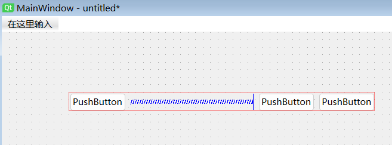
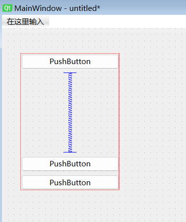
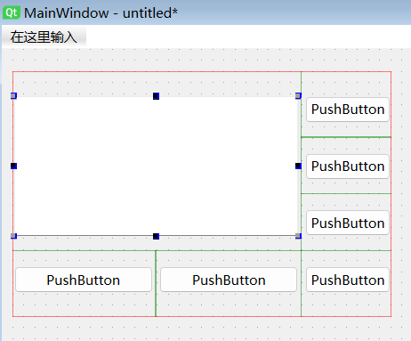

# 水平布局

QtDesigner 创建水平布局有两种使用方法：方法一是先创建水平布局中的各个控件，然后将控件加入水平布局；方法二是先创建一个水平布局，再在该水平布局内依次创建各个控件

以方法一为例

1. 先在窗口中创建几个按钮控件，控件位置可以任意布置
2. 点击鼠标左键并拖拽拉伸，选中创建的几个按钮控件
3. 点击鼠标右键，唤出下拉菜单，选择 “布局” -> “水平布局” 选项
4. 添加到水平布局框中的控件，其大小和位置是由水平布局框自动设置的，不能在 “属性编辑器” 中直接进行编辑修改
5. 如果自动布局的按钮位置不合适，可以在布局框中添加间隔控制器 “Horizontal Spacer”，以调整按钮控件的间隔

# 垂直布局

QtDesigner 创建垂直布局有两种使用方法：方法一是先创建垂直布局中的各个控件，然后将控件加入垂直布局；方法二是先创建一个垂直布局，再在该垂直布局内依次创建各个控件

以方法二为例

1. 在 QtDesigner 左侧工具栏的 “Layout” 类中，鼠标点击选择垂直布局按钮 “Vertical Layout” 后，将其拖动至中间的图形窗口内
2. 此时在图形窗口中出现一个红色直线矩形框，表示所创建的垂直布局框。鼠标选中垂直布局框，在控件边界处出现几个蓝色的小方块，拖动蓝色方块可以调整布局框大小
3. 从 QtDesigner 左侧工具栏中，选择按钮控件或其它控件，并拖动到图形窗口中的垂直布局框区域内，就将创建的控件添加到垂直布局框
4. 添加到垂直布局框中的控件，其大小和位置是由垂直布局框自动设置的，不能在 “属性编辑器” 中编辑修改
5. 如果自动布局的按钮位置不合适，可以在布局框中添加间隔控制器 “Vertical Spacer”，以调整按钮控件的间隔

# 网格布局

1. 在 QtDesigner 左侧工具栏的 “Layout” 类中，鼠标点击选择网格布局按钮 “Grid Layout” 后，将其拖动至中间的图形窗口内
2. 此时在图形窗口中出现一个红色直线矩形框，表示所创建的网格布局框。鼠标选中网格布局框，在控件边界处出现几个蓝色的小方块，拖动蓝色方块可以调整布局框大小
3. 从 QtDesigner 左侧工具栏中，选择按钮控件或其它控件，并拖动到图形窗口中的网格布局框区域内，就将创建的控件添加到网格布局框
4. 网格布局框内的控件，拖动控件可以调整其在网格布局的行列位置

一些显示控件还可以设置控件在布局中占若干行和列

1. 鼠标选中待调整的文本框，移动到右侧边界的蓝色方块，出现左右拉伸光标，点击拖动控件向右拉动，可以使控件占据网格布局的第一列和第二列
2. 鼠标选中待调整的文本框，移动到下方边界的蓝色方块，出现上下拉伸光标，点击拖动控件向下拉动，可以使控件占据网格布局的第一行至第三行

# 表单布局

表单布局以两列的形式进行布局

1. 在 QtDesigner 左侧工具栏的 “Layout” 类中，鼠标点击选择表单布局按钮 “Form Layout” 后，将其拖动至中间的图形窗口内
2. 此时在图形窗口中出现一个红色直线矩形框，表示所创建的表单布局框。鼠标选中表单布局框，在控件边界处出现几个蓝色的小方块，拖动蓝色方块可以调整布局框大小
3. 从 QtDesigner 左侧工具栏中，选择控件拖动到图形窗口中的表单布局框区域内，就将创建的控件添加到表单布局框
4. 表单布局框内的控件，拖动控件可以调整其在表单布局的行列位置

# 容器布局

容器布局将容器控件（Container）与布局管理器结合，先用容器控件将窗口分为若干区域，再在每个区域内加入布局管理器

1. 首先在 QtDesigner 左侧工具栏的 “Containers” 类中，选择 “Frame” 控件或 “Widget” 控件将其拖动至中间的图形窗口中，创建容器控件
2. 对图形窗口中的容器控件 “Frame” 或 “Widget”，可以选中后用鼠标拖动、拉伸来调整控件的位置和大小，或者在 “属性编辑器” 中设置 (X, Y)、宽度、高度属性
3. 对于需要进行布局管理的容器控件，从在 QtDesigner 左侧工具栏的 “Laytout” 类中选择所需的布局管理器控件，将其拖动至容器控件中，创建容器控件的布局管理器
