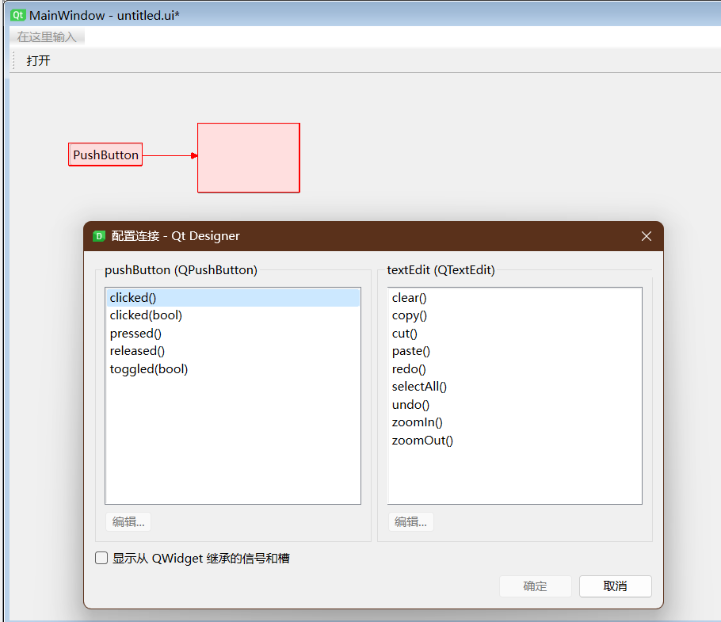
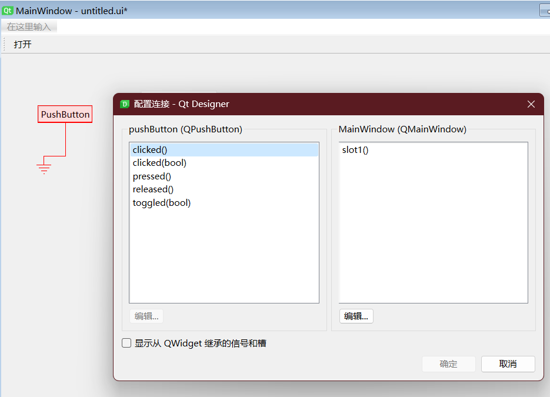
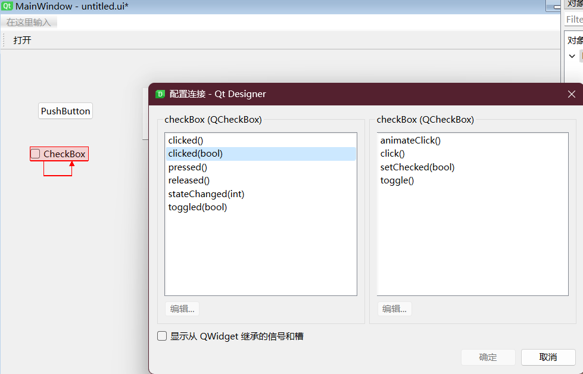

# 不同的发送者与接收者, 槽函数为控件的内置函数

1. 选择 “编辑” -> 编辑信号/槽, 或者通过快捷键 F4 或在工具栏选择, 进入信号/槽编辑模式
2. 选中控件对象发送者, 此处为按钮控件 “pushButton_1”, 鼠标左键长按不放, 该按钮控件变为浅红色。
3. 鼠标左键继续长按不放, 并拖动鼠标到控件对象 “textEdit_1”, 松开鼠标左键, 就建立了以控件对象 “pushButton_1” 为发送者、控件对象 “textEdit_1” 为接收者的信号/槽连接。
4. 此时控件对象 “pushButton_1” 和 “textEdit_1” 都变为浅红色, 带箭头的红线从 “pushButton_1” 出发, 指向 “textEdit_1” 结束。
5. 同时弹出对话框 “配置连接 - QtDesigner”, 对话框的左侧显示发送者控件的信号选项, 对话框的右侧显示接收者的控件选项。
6. 触发信号为按钮 “pushButton_1” 被点击, 从对话框左侧选中 “clicked()”；
7. 收到信号后动作是清空文本编辑控件 “textEdit_1”, 从对话框右侧选中 “clear()”；
8. 点击对话框下方的按钮 “OK”, 完成该信号/槽连接的配置。



# 不同的发送者与接收者, 槽函数为自定义函数

## 添加自定义槽函数

1. 在 QtDesigner 右侧上方的 “对象查看器”, 选中 MainWindow 或其它顶层对象, 单击鼠标右键唤出下拉菜单, 选择 “改变信号/槽”
2. 弹出 “MainWindow 的信号/槽” 对话框, 对话框的上方显示槽的选项, 下方显示信号选项
3. 点击对话框上方 “槽” 选项框下部的绿色 “+”, 系统在 “槽” 选项表的最后自动增加了一行 “slot1()”。这就是新增的自定义槽函数
4. 点击选中 “slot1()”, 再鼠标双击, 就可以修改槽函数的函数名, 例如修改为 click_pushButton_2()
5. 再点击对话框上方 “槽” 选项框下部的绿色 “+”, 可以继续添加自定义的槽函数

## 设置信号/槽的连接

1. 选择菜单项 “Edit” -> 编辑信号/槽, 或者通过快捷键 F4 或在工具栏选择, 进入信号/槽编辑模式
2. 选中控件对象发送者, 此处为按钮控件 “pushButton_2”, 长按鼠标左键并移动, 当鼠标移出控件对象区域后, 出现一条带箭头的红线和一个红色的接地符号
3. 松开鼠标左键, 就建立了以控件对象 “pushButton_2” 为发送者、控件对象 “MainWindow” 为接收者的信号/槽连接
4. 此时控件对象 “pushButton_2” 变为浅红色, 带箭头的红线从 “pushButton_2” 出发, 并不指向其它控件, 而是以一个接地符号结束
5. 同时弹出对话框 “配置连接 - QtDesigner”, 对话框的左侧显示发送者控件 “pushButton_2” 的信号选项, 对话框的右侧显示接收者 “MainWindow” 的控件选项
6. 触发信号为按钮 “pushButton_2” 被点击, 从对话框左侧选中 “clicked()”
7. 对话框右侧接收者 “MainWindow” 的控件选项列表中, 显示了刚才添加的几个自定义函数, 选择 “slot1()”
8. 点击对话框下方的按钮 “OK”, 完成该信号/槽连接的配置。



## 在主程序中添加自定义槽函数

```py
class MyMainWindow(QMainWindow, Ui_MainWindow):
    def __init__(self, parent=None):
        super(MyMainWindow, self).__init__(parent)
        self.setupUi(self)

    # 自定义槽函数
    def slot1(self):
        self.lineEdit_2.setText("click")
        return
```

# 相同的发送者与接收者, 槽函数为控件的内置函数

1. 选择菜单项 “Edit” -> 编辑信号/槽, 或者通过快捷键 F4 或在工具栏选择, 进入信号/槽编辑模式
2. 选中控件对象发送者, 此处为按钮控件 “checkBox_4”, 长按鼠标左键并移动, 当鼠标移出控件对象区域后, 出现一条带箭头的红线和一个红色的接地符号
3. 长按鼠标左键, 拖动鼠标再回到控件对象 “checkBox_4” 区域后松开鼠标左键, 就建立了发送者和接收者都是控件对象 “checkBox_4” 的信号/槽连接
4. 此时控件对象 “checkBox_4” 变为浅红色, 带箭头的红线从 “checkBox_4” 出发, 又返回到 “checkBox_4” 结束
5. 同时弹出了对话框 “配置连接 - QtDesigner”, 对话框的左侧和右侧分别是控件对象 “checkBox_4” 的信号和槽函数
6. 从对话框左侧选中 “clicked(bool)”
7. 从对话框右侧选中 “setChecked(bool)”
8. 点击对话框下方的按钮 “OK”, 完成该信号/槽连接的配置


