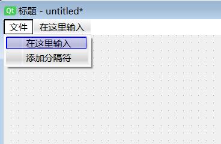
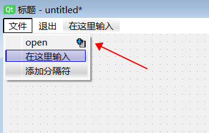

# 建立一级菜单

QtDesigner 创建的 “MainWindow” 图形窗口, 自动生成了顶部菜单栏 menubar, 在图形窗口左上角显示有文本输入框 “在这里输入”。

## 添加菜单项

1. 鼠标点击文本输入框 “在这里输入”, 选中文本输入框, 控件的边框变为紫色
2. 再双击选中的控件, 出现激活的文本输入框, 就可以输入所要建立菜单的标题
3. 输入菜单标题后回车结束, 就建立了一个一级菜单
4. 建立一级菜单后, 菜单栏在右侧又出现新的文本输入框 “在这里输入” , 按照以上操作可以接着建立更多的菜单对象



# 建立二级菜单

1. 鼠标点击一级菜单项, 出现两个下拉菜单选项: “在这里输入” 和 “添加分割符”
2. 选中 “在这里输入”, 输入二级菜单的标题。这时文本输入框不接受中文输入, 只能输入英文。因为新建的并不是菜单对象QMenu, 而是动作对象QAction
3. 编辑QAction的属性, 可以将属性 “text” 由英文修改为中文
4. 点击二级菜单, 在其右侧有个 “+” 按钮, 点击后可以创建新的下一级菜单。刚才建立的QAction被自动删除了, 同时生成了一个QMenu。这是因为只有最下级的菜单项被设为动作对象, 而上级菜单项只能是菜单对象



# 关联动作

信号与槽机制: 信号与槽是 PyQt 中对象之间进行通信的机制。简单地说, 对某个信号与某个槽函数进行连接之后, 当该信号被触发时, 自动执行对应的槽函数。

## 将函数关联到对象

1. 在 QtDesigner 右侧下方窗口 “信号/槽编辑器”, 点击绿色的 “+” 新建一个信号/槽连接
2. 点击 “<发送者>”, 从菜单中选择触发动作的对象
3. 点击 “<信号>”, 从菜单中选择 “triggered()”
4. 点击 “<接收者>”, 从菜单中选择 “MainWindow”
5. 点击 “<槽>”, 从菜单中选择要执行的函数

以上操作的作用是: 发送者触发信号时, 接收者执行槽函数。

对于菜单栏和工具栏, 在主程序中通过 connect() 建立信号/槽连接则更加简便: 

```py
self.actionQuit.triggered.connect(MainWindow.close)
```
