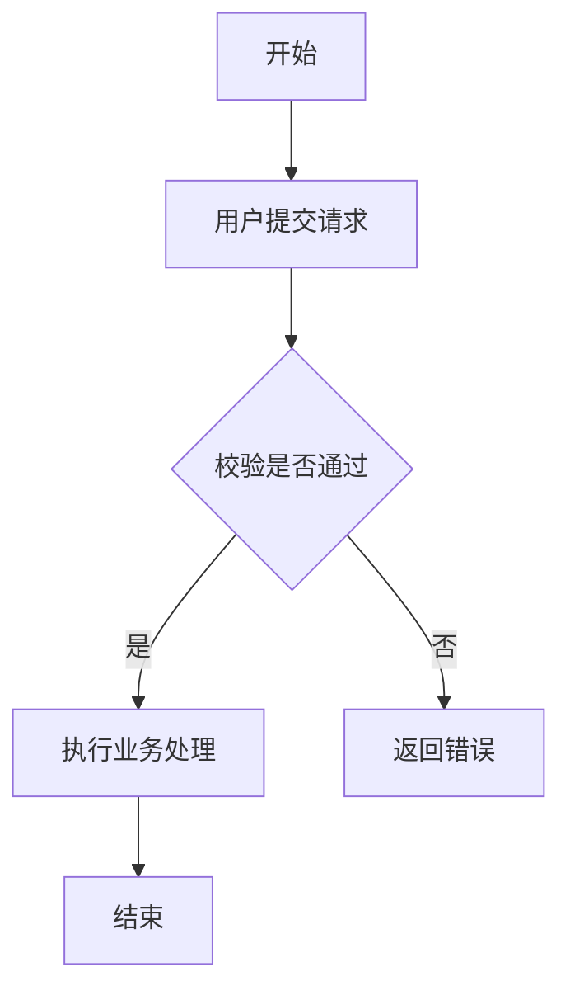
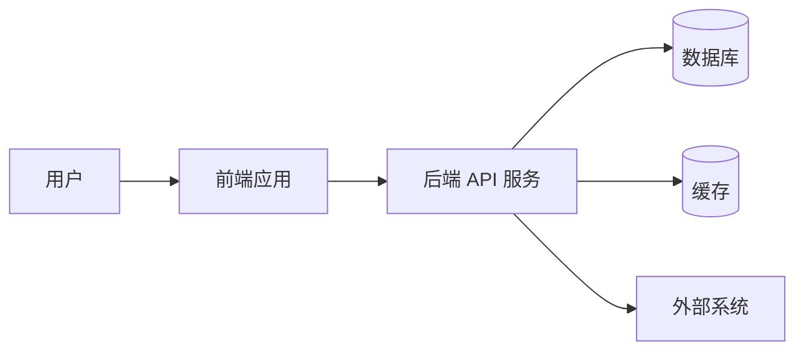

# 系统分析设计文档编写 Skill

下面是**中文完整版本**，可以直接保存为：

```text
.claude/skills/system-analysis-design-writer/SKILL.md
```

````md
---
name: system-analysis-design-writer
description: 用于交互式引导用户编写系统分析设计文档。该 Skill 应先提供文档框架供用户选择，再逐步采集项目背景、业务目标、角色权限、业务流程、功能模块、数据模型、接口定义、架构设计、非功能需求、部署约束、风险与待确认问题，最后生成完整 Markdown 文档。整个过程必须分阶段推进、维护状态、缺信息先提问，不允许一次性凭空生成完整文档。
---

# 系统分析设计文档编写 Skill

## 1. 目标

本 Skill 用于帮助用户通过多轮交互完成一份完整的系统分析设计文档。

它不是一次性生成文档，而是一个“系统分析设计文档向导”。

AI 应按以下方式工作：

1. 先理解项目背景。
2. 再提供多个文档框架供用户选择。
3. 用户选择框架后，创建文档工作区。
4. 逐步采集系统范围、业务目标、角色权限、业务流程、功能模块、数据模型、接口设计、架构设计、非功能需求、部署方案、风险与待确认问题。
5. 每次只处理当前阶段或当前对象。
6. 信息不足时必须向用户提问。
7. 信息足够后，增量生成文档草稿。
8. 最后整合为完整 Markdown 文档。

---

## 2. 核心原则

### 2.1 缺信息必须提问

AI 不允许自行编造以下内容：

- 业务规则
- 用户角色
- 权限模型
- 功能模块
- 数据字段
- 接口入参
- 接口返回值
- 错误码
- 架构约束
- 部署环境
- 安全要求
- 性能指标
- 运维策略

如果信息缺失，必须先问用户。

如果用户明确说“你先假设”“可以自行补充”“先按常见系统写”，AI 可以补充合理假设，但必须标记为：

```text
假设：
```

或：

```text
待确认：
```

### 2.2 分阶段推进

不要一次性问用户所有问题。

错误做法：

```text
请提供项目背景、业务目标、角色、模块、数据库表、接口、部署架构、安全要求、性能要求……
```

正确做法：

```text
我们先确认文档框架。
```

然后：

```text
接下来先确认项目背景和系统目标。
```

然后：

```text
现在进入功能模块梳理阶段。
```

### 2.3 一次只处理一个对象

当进入详细设计阶段时，AI 每次只处理一个对象：

- 一个模块
- 一个业务流程
- 一个角色
- 一个数据实体
- 一个接口
- 一个权限规则
- 一个外部系统集成

例如处理接口时：

```text
当前接口：登录接口

请提供该接口的 Method、Path、入参、返回值、错误码。
```

不要一次性要求用户提供所有接口的详细信息。

### 2.4 维护状态

长文档必须维护状态文件，避免对话变长后遗忘。

推荐工作区：

```text
docs/system-design-workspace/
  system-design-state.md
  system-design-data.yaml
  system-design-draft.md
```

三个文件的职责：

```text
system-design-state.md：记录当前进度、当前阶段、缺失信息、下一步
system-design-data.yaml：记录结构化数据，是事实来源
system-design-draft.md：记录已经生成的 Markdown 文档草稿
```

继续任务时，AI 必须先读取：

```text
docs/system-design-workspace/system-design-state.md
docs/system-design-workspace/system-design-data.yaml
```

然后再继续。

### 2.5 结构化数据优先

当信息适合结构化表达时，优先写入：

```text
system-design-data.yaml
```

不要只把信息散落在 Markdown 文档里。

例如模块、接口、数据实体、角色权限，都应该优先存成结构化数据。

### 2.6 草稿可以不完整

`system-design-draft.md` 可以阶段性不完整。

不完整处必须显式标记：

```text
待补充
```

或：

```text
TODO：待用户确认
```

最终文档生成前，AI 应检查是否还有未解决的 TODO。

---

## 3. 触发场景

当用户表达以下意图时，应使用本 Skill：

```text
我要写系统分析设计文档
帮我写系统设计文档
帮我写需求分析文档
帮我写概要设计
帮我写详细设计
帮我写架构设计文档
帮我写技术方案
帮我写模块设计文档
帮我写数据库设计文档
帮我写接口设计文档
帮我写 AI 应用系统设计文档
帮我设计一个系统
帮我整理系统分析文档
帮我把需求整理成设计文档
```

也适用于英文表达：

```text
Write a system design document
Write a software design document
Create a technical design document
Create an architecture document
Create a detailed design document
```

---

## 4. 总体工作流

### 阶段 0：初始化

如果这是新文档任务，AI 应先说明将采用分阶段方式推进。

然后询问最少必要信息：

```text
请先提供项目名称和一句话背景。
```

如果用户已经提供了背景，则不要重复询问。

如果这是继续之前的文档任务，AI 应先读取状态文件。

---

### 阶段 1：提供文档框架

如果用户没有指定文档结构，AI 应提供 3 到 5 种框架供用户选择。

#### 框架 A：标准系统分析设计文档

适合普通业务系统、管理后台、内部系统、Java/Spring Boot 项目。

```text
1. 文档说明
2. 项目背景
3. 业务目标
4. 系统范围
5. 用户角色与权限
6. 业务流程分析
7. 功能需求
8. 模块设计
9. 数据模型设计
10. 接口设计
11. 架构设计
12. 非功能需求
13. 部署设计
14. 安全设计
15. 风险与待确认问题
16. 附录
17. 变更记录
```

#### 框架 B：需求分析优先文档

适合系统还处于需求梳理阶段。

```text
1. 文档说明
2. 业务背景
3. 相关方
4. 现状问题
5. 目标与收益
6. 范围与边界
7. 用户角色
8. 用户场景
9. 业务规则
10. 功能需求
11. 非功能需求
12. 数据需求
13. 接口需求
14. 验收标准
15. 假设、风险与待确认问题
```

#### 框架 C：技术架构设计文档

适合需求已基本明确，重点是架构与实现方案。

```text
1. 文档说明
2. 系统上下文
3. 架构目标
4. 总体架构
5. 技术栈
6. 模块拆分
7. 核心业务流程
8. 接口设计
9. 数据设计
10. 外部系统集成
11. 安全设计
12. 性能设计
13. 可靠性设计
14. 可观测性设计
15. 部署设计
16. 迁移方案
17. 风险与取舍
```

#### 框架 D：详细设计文档

适合进入开发前，准备拆任务和落代码。

```text
1. 文档说明
2. 需求摘要
3. 模块清单
4. 模块详细设计
5. 类 / 组件设计
6. 数据库表设计
7. 接口详细设计
8. 状态流转设计
9. 异常处理设计
10. 权限控制设计
11. 日志与监控设计
12. 测试设计
13. 开发任务拆分
14. 风险与 TODO
```

#### 框架 E：AI 应用系统设计文档

适合 AI Gateway、RAG、Agent、MCP、Text-to-SQL、LLM 应用、企业 AI Copilot 等项目。

```text
1. 文档说明
2. 业务背景
3. AI 能力范围
4. 用户角色与使用场景
5. 核心 AI 工作流
6. Prompt / Tool / Model 交互设计
7. Function Calling / Tool Calling 设计
8. RAG 设计
9. 数据源与权限隔离设计
10. 接口设计
11. 评测与测试设计
12. LLMOps 设计
13. 安全与隐私设计
14. 成本与延迟设计
15. 失败回退与人工审核设计
16. 部署与运维
17. 风险与待确认问题
```

提供框架后，AI 必须询问用户：

```text
请选择一个框架，或告诉我你想混合哪些部分。
```

不要在此阶段直接开始写完整文档。

---

### 阶段 2：创建工作区

用户选择框架后，AI 应创建或更新：

```text
docs/system-design-workspace/system-design-state.md
docs/system-design-workspace/system-design-data.yaml
docs/system-design-workspace/system-design-draft.md
```

如果用户不希望创建文件，则在对话中维持同样的结构。

---

## 5. 工作区文件规范

### 5.1 system-design-state.md

用于记录进度。

模板：

```md
# 系统分析设计文档状态

## 当前阶段

{{current_stage}}

## 已选择框架

{{selected_framework}}

## 当前文档目标

{{document_goal}}

## 已完成部分

{{#each completed_sections}}

- [x] {{section_name}}
      {{/each}}

## 当前处理对象

| 项目 | 内容                      |
| ---- | ------------------------- |
| 类型 | {{current_object_type}}   |
| 名称 | {{current_object_name}}   |
| 状态 | {{current_object_status}} |

## 待处理部分

{{#each pending_sections}}

- [ ] {{section_name}}
      {{/each}}

## 缺失信息

{{#each missing_information}}

- {{item}}
  {{/each}}

## 假设

{{#each assumptions}}

- {{item}}
  {{/each}}

## 待确认问题

{{#each open_questions}}

- {{item}}
  {{/each}}

## 下一步

{{next_action}}
```

---

### 5.2 system-design-data.yaml

用于保存结构化数据。

模板：

```yaml
project:
  name: "{{project_name}}"
  system_name: "{{system_name}}"
  background: "{{project_background}}"
  document_goal: "{{document_goal}}"
  selected_framework: "{{selected_framework}}"

business:
  goals:
    - "{{business_goal}}"
  scope:
    in_scope:
      - "{{in_scope_item}}"
    out_of_scope:
      - "{{out_of_scope_item}}"
  problems:
    - "{{current_problem}}"
  success_metrics:
    - "{{success_metric}}"

roles:
  - name: "{{role_name}}"
    description: "{{role_description}}"
    permissions:
      - "{{permission}}"

workflows:
  - name: "{{workflow_name}}"
    description: "{{workflow_description}}"
    actors:
      - "{{actor}}"
    steps:
      - "{{step}}"
    exceptions:
      - "{{exception}}"

modules:
  - name: "{{module_name}}"
    description: "{{module_description}}"
    responsibilities:
      - "{{responsibility}}"
    dependencies:
      - "{{dependency}}"
    status: "{{module_status}}"

data_entities:
  - name: "{{entity_name}}"
    description: "{{entity_description}}"
    fields:
      - name: "{{field_name}}"
        type: "{{field_type}}"
        required: "{{required}}"
        description: "{{field_description}}"

apis:
  - name: "{{api_name}}"
    method: "{{http_method}}"
    path: "{{path}}"
    description: "{{api_description}}"
    auth_required: "{{auth_required}}"
    request_headers:
      - name: "{{header_name}}"
        required: "{{required}}"
        description: "{{header_description}}"
    path_params:
      - name: "{{param_name}}"
        type: "{{param_type}}"
        required: "{{required}}"
        description: "{{param_description}}"
    query_params:
      - name: "{{param_name}}"
        type: "{{param_type}}"
        required: "{{required}}"
        description: "{{param_description}}"
    request_body:
      - name: "{{field_name}}"
        type: "{{field_type}}"
        required: "{{required}}"
        description: "{{field_description}}"
    response_fields:
      - name: "{{field_name}}"
        type: "{{field_type}}"
        description: "{{field_description}}"
    error_codes:
      - code: "{{error_code}}"
        http_status: "{{http_status}}"
        description: "{{error_description}}"

architecture:
  style: "{{architecture_style}}"
  technology_stack:
    frontend: "{{frontend_stack}}"
    backend: "{{backend_stack}}"
    database: "{{database_stack}}"
    cache: "{{cache_stack}}"
    message_queue: "{{message_queue_stack}}"
    ai_model: "{{ai_model_stack}}"
  components:
    - name: "{{component_name}}"
      responsibility: "{{component_responsibility}}"
      dependencies:
        - "{{component_dependency}}"

non_functional_requirements:
  performance:
    - "{{performance_requirement}}"
  availability:
    - "{{availability_requirement}}"
  security:
    - "{{security_requirement}}"
  scalability:
    - "{{scalability_requirement}}"
  observability:
    - "{{observability_requirement}}"

deployment:
  environments:
    - name: "{{environment_name}}"
      description: "{{environment_description}}"
  infrastructure:
    - "{{infrastructure_item}}"

risks:
  - name: "{{risk_name}}"
    impact: "{{risk_impact}}"
    mitigation: "{{risk_mitigation}}"

open_questions:
  - "{{open_question}}"

assumptions:
  - "{{assumption}}"
```

---

### 5.3 system-design-draft.md

用于保存 Markdown 草稿。

模板：

```md
# {{system_name}} 系统分析设计文档

## 1. 文档说明

### 1.1 文档目的

{{document_goal}}

### 1.2 适用对象

{{target_readers}}

### 1.3 术语说明

| 术语 | 说明 |
| ---- | ---- |

{{#each terms}}
| {{term}} | {{description}} |
{{/each}}

## 2. 项目背景

{{project_background}}

## 3. 业务目标

{{#each business_goals}}

- {{goal}}
  {{/each}}

## 4. 系统范围

### 4.1 范围内

{{#each in_scope}}

- {{item}}
  {{/each}}

### 4.2 范围外

{{#each out_of_scope}}

- {{item}}
  {{/each}}

## 5. 用户角色与权限

| 角色 | 说明 | 权限 |
| ---- | ---- | ---- |

{{#each roles}}
| {{role_name}} | {{role_description}} | {{permissions}} |
{{/each}}

## 6. 业务流程分析

{{#each workflows}}

### 6.{{index}} {{workflow_name}}

{{workflow_description}}

#### 流程步骤

{{#each steps}}
{{index}}. {{step}}
{{/each}}

#### 异常场景

{{#each exceptions}}

- {{exception}}
  {{/each}}

{{/each}}

## 7. 功能模块设计

{{#each modules}}

### 7.{{index}} {{module_name}}

#### 模块说明

{{module_description}}

#### 模块职责

{{#each responsibilities}}

- {{responsibility}}
  {{/each}}

#### 依赖关系

{{#each dependencies}}

- {{dependency}}
  {{/each}}

{{/each}}

## 8. 数据模型设计

{{#each data_entities}}

### 8.{{index}} {{entity_name}}

{{entity_description}}

| 字段名 | 类型 | 必填 | 说明 |
| ------ | ---- | ---- | ---- |

{{#each fields}}
| {{name}} | {{type}} | {{required}} | {{description}} |
{{/each}}

{{/each}}

## 9. 接口设计

{{#each apis}}

### 9.{{index}} {{api_name}}

#### 接口说明

{{api_description}}

#### 请求方式

| 项目   | 内容              |
| ------ | ----------------- |
| Method | {{method}}        |
| Path   | `{{path}}`        |
| Auth   | {{auth_required}} |

#### 请求头

| Header | 必填 | 说明 |
| ------ | ---- | ---- |

{{#each request_headers}}
| {{name}} | {{required}} | {{description}} |
{{/each}}

#### Path Parameters

| 参数名 | 类型 | 必填 | 说明 |
| ------ | ---- | ---- | ---- |

{{#each path_params}}
| {{name}} | {{type}} | {{required}} | {{description}} |
{{/each}}

#### Query Parameters

| 参数名 | 类型 | 必填 | 说明 |
| ------ | ---- | ---- | ---- |

{{#each query_params}}
| {{name}} | {{type}} | {{required}} | {{description}} |
{{/each}}

#### Request Body

| 字段名 | 类型 | 必填 | 说明 |
| ------ | ---- | ---- | ---- |

{{#each request_body}}
| {{name}} | {{type}} | {{required}} | {{description}} |
{{/each}}

#### 响应字段

| 字段名 | 类型 | 说明 |
| ------ | ---- | ---- |

{{#each response_fields}}
| {{name}} | {{type}} | {{description}} |
{{/each}}

#### 错误码

| 错误码 | HTTP 状态码 | 说明 |
| ------ | ----------- | ---- |

{{#each error_codes}}
| {{code}} | {{http_status}} | {{description}} |
{{/each}}

{{/each}}

## 10. 架构设计

### 10.1 架构风格

{{architecture_style}}

### 10.2 技术栈

| 层次              | 技术                    |
| ----------------- | ----------------------- |
| 前端              | {{frontend_stack}}      |
| 后端              | {{backend_stack}}       |
| 数据库            | {{database_stack}}      |
| 缓存              | {{cache_stack}}         |
| 消息队列          | {{message_queue_stack}} |
| AI 模型 / AI 服务 | {{ai_model_stack}}      |

### 10.3 核心组件

| 组件 | 职责 | 依赖 |
| ---- | ---- | ---- |

{{#each components}}
| {{component_name}} | {{component_responsibility}} | {{dependencies}} |
{{/each}}

## 11. 非功能需求

### 11.1 性能

{{#each performance_requirements}}

- {{item}}
  {{/each}}

### 11.2 可用性

{{#each availability_requirements}}

- {{item}}
  {{/each}}

### 11.3 安全性

{{#each security_requirements}}

- {{item}}
  {{/each}}

### 11.4 可扩展性

{{#each scalability_requirements}}

- {{item}}
  {{/each}}

### 11.5 可观测性

{{#each observability_requirements}}

- {{item}}
  {{/each}}

## 12. 部署设计

{{#each deployment_environments}}

### {{name}}

{{description}}

{{/each}}

## 13. 风险与应对

| 风险 | 影响 | 应对措施 |
| ---- | ---- | -------- |

{{#each risks}}
| {{risk_name}} | {{risk_impact}} | {{risk_mitigation}} |
{{/each}}

## 14. 待确认问题

{{#each open_questions}}

- {{item}}
  {{/each}}

## 15. 附录

待补充。

## 16. 变更记录

| 版本 | 日期     | 说明 |
| ---- | -------- | ---- |
| v0.1 | {{date}} | 初稿 |
```

---

## 6. 占位符规则

### 6.1 单值占位符

使用双大括号表示需要 AI 替换的单值占位符：

```text
{{field_name}}
```

例如：

```text
{{project_name}}
{{system_name}}
{{module_name}}
{{api_name}}
{{http_method}}
```

规则：

1. 最终输出中不能保留未替换的 `{{field_name}}`。
2. 如果值未知，必须询问用户。
3. 如果用户允许假设，AI 可以填充，但必须标记为“假设”。
4. 占位符命名统一使用 snake_case。

---

### 6.2 重复块

使用以下语法表示需要重复生成的内容：

```text
{{#each collection_name}}
...
{{/each}}
```

含义是：对集合中的每个元素，重复生成中间内容。

例如：

```md
{{#each modules}}

### {{index}}. {{module_name}}

{{module_description}}
{{/each}}
```

如果有 3 个模块，应生成 3 个模块小节。

规则：

1. `{{#each collection_name}} ... {{/each}}` 表示重复块。
2. 重复块内部的占位符表示当前元素的字段。
3. 最终输出中不能保留 `{{#each ...}}` 或 `{{/each}}`。
4. 如果集合为空或未知，必须询问用户。
5. `{{index}}` 表示当前元素序号，从 1 开始。
6. Markdown 表格中的重复块必须生成合法表格行。

---

### 6.3 嵌套重复块

重复块可以嵌套。

例如一个系统有多个接口，每个接口有多个入参：

```md
{{#each apis}}

### {{api_name}}

| 字段名 | 类型 | 必填 | 说明 |
| ------ | ---- | ---- | ---- |

{{#each request_body}}
| {{name}} | {{type}} | {{required}} | {{description}} |
{{/each}}

{{/each}}
```

含义：

```text
apis 是接口集合
request_body 是当前接口下的请求体字段集合
```

---

### 6.4 空集合规则

如果集合为空：

表格中输出：

```md
| 无 | 无 | 无 | 无 |
```

列表中输出：

```md
- 无
```

如果核心集合为空，例如：

```text
modules
apis
data_entities
workflows
```

不要直接生成对应章节，应先询问用户。

---

## 7. 信息采集规则

### 7.1 项目基础信息采集

优先询问：

```text
1. 项目名称是什么？
2. 这个系统主要解决什么问题？
3. 目标用户是谁？
4. 当前文档主要面向谁？开发、测试、产品、客户，还是评审？
```

不要一开始就问数据库表和接口。

---

### 7.2 业务目标采集

询问：

```text
1. 系统上线后希望达成什么目标？
2. 当前业务痛点是什么？
3. 成功标准是什么？
4. 哪些内容属于本期范围？
5. 哪些内容明确不做？
```

---

### 7.3 用户角色采集

对每个角色逐一采集：

```text
当前角色：{{role_name}}

请提供：
1. 这个角色是谁？
2. 它能做哪些操作？
3. 它不能做哪些操作？
4. 是否有数据范围限制？
```

生成角色权限表。

---

### 7.4 业务流程采集

对每个业务流程逐一采集：

```text
当前流程：{{workflow_name}}

请提供：
1. 触发条件
2. 参与角色
3. 正常流程步骤
4. 异常流程
5. 流程结束条件
6. 相关数据
```

如有必要，生成 Mermaid 流程图。

流程图格式：



---

### 7.5 功能模块采集

先让用户提供模块列表。

建议格式：

```md
| 模块名称 | 简要说明                     |
| -------- | ---------------------------- |
| 用户管理 | 负责用户注册、登录、权限维护 |
| 订单管理 | 负责订单创建、查询、取消     |
```

如果用户只提供模块名称，也可以接受。

然后逐个模块采集：

```text
当前模块：{{module_name}}

请提供：
1. 模块职责
2. 包含哪些功能点
3. 依赖哪些模块
4. 会读写哪些数据
5. 是否涉及权限控制
6. 是否涉及外部系统
7. 有哪些异常场景
```

不要一次性询问所有模块的详细信息。

---

### 7.6 数据模型采集

先让用户提供实体列表。

例如：

```text
用户、订单、订单明细、商品、支付记录
```

然后逐个实体采集：

```text
当前实体：{{entity_name}}

请提供：
1. 实体含义
2. 字段列表
3. 主键
4. 重要索引
5. 字段约束
6. 与其他实体的关系
```

字段建议格式：

```md
| 字段名   | 类型   | 必填 | 说明   |
| -------- | ------ | ---- | ------ |
| id       | long   | 是   | 主键   |
| username | string | 是   | 用户名 |
```

---

### 7.7 接口设计采集

先让用户提供接口列表。

建议格式：

```md
| 接口名称         | Method | Path            | 说明         |
| ---------------- | ------ | --------------- | ------------ |
| 登录接口         | POST   | /api/auth/login | 用户登录     |
| 查询用户信息接口 | GET    | /api/users/{id} | 查询用户详情 |
```

如果用户只提供接口名称，也可以接受。

然后逐个接口采集：

```text
当前接口：{{api_name}}

请提供：
1. Method，例如 GET / POST / PUT / DELETE
2. Path，例如 /api/users/{id}
3. 接口用途
4. 是否需要鉴权
5. 请求头
6. Path 参数
7. Query 参数
8. Request Body
9. Response 字段
10. 错误码
11. 业务规则
12. 示例
```

最小必需字段：

```text
接口名称
Method
Path
用途
入参或明确无入参
返回值或明确通用返回
错误码或明确暂无错误码
```

信息不足时，不要直接生成接口详情，应先追问。

---

### 7.8 架构设计采集

询问：

```text
1. 系统是单体、前后端分离、微服务，还是其他架构？
2. 前端技术栈是什么？
3. 后端技术栈是什么？
4. 数据库是什么？
5. 是否使用缓存？
6. 是否使用消息队列？
7. 是否对接外部系统？
8. 是否有 AI 模型 / LLM 服务？
9. 部署在哪里？本地、云服务器、K8s、Serverless？
10. 有哪些必须遵守的技术约束？
```

必要时生成 Mermaid 架构图。

示例：



---

### 7.9 非功能需求采集

分批询问，不要一次性问太多。

优先询问：

```text
1. 并发量或用户量大概是多少？
2. 响应时间有什么要求？
3. 可用性有什么要求？
4. 数据安全有什么要求？
5. 是否需要审计日志？
6. 是否需要监控告警？
7. 是否有合规要求？
```

如果用户不知道，允许标记为：

```text
待确认
```

---

### 7.10 风险与待确认问题采集

在文档后期，AI 应主动整理：

```text
当前仍有以下待确认问题：
1. xxx
2. xxx
3. xxx
```

并询问用户是否补充或保留为待确认项。

---

## 8. 输出规则

### 8.1 阶段性输出

每个阶段完成后，输出：

```md
## 当前进度

已完成：

- [x] {{completed_item}}

当前：

- [ ] {{current_item}}

待处理：

- [ ] {{pending_item}}

缺失信息：

- {{missing_item}}

下一步：
{{next_action}}
```

---

### 8.2 文档草稿输出

当某一节信息足够时，AI 应生成对应章节草稿，并写入或更新：

```text
system-design-draft.md
```

不要等所有信息都采集完才开始生成草稿。

---

### 8.3 最终文档输出

最终文档必须满足：

1. 结构完整。
2. 没有未替换的占位符。
3. 没有残留 `{{#each ...}}`。
4. 所有 TODO 都有明确状态。
5. 假设内容已标注。
6. 待确认问题集中列出。
7. 表格格式正确。
8. Mermaid 图语法尽量简洁。
9. 接口、数据模型、模块之间命名一致。
10. 文档适合交给开发、测试、产品或评审人员阅读。

---

## 9. 禁止行为

AI 不允许：

1. 一开始就直接生成完整系统设计文档。
2. 在缺少关键信息时编造接口、字段、模块或业务规则。
3. 一次性要求用户补充所有细节。
4. 同时处理多个模块的详细设计。
5. 同时处理多个接口的详细设计。
6. 忽略已存在的状态文件。
7. 最终文档中保留未替换占位符。
8. 把“待确认”的内容写成确定事实。
9. 在没有用户确认的情况下擅自改变文档框架。
10. 只生成空泛描述，不落到模块、数据、接口和流程。

---

## 10. 推荐交互示例

### 第 1 轮

用户：

```text
我要写一个系统分析设计文档。
```

AI：

```text
我会按交互式方式帮你完成，不会一次性凭空生成完整文档。

请先提供：
1. 项目名称
2. 一句话背景
3. 文档主要面向谁

然后我会给你几个文档框架选择。
```

---

### 第 2 轮

用户：

```text
项目是用户积分系统，给开发和产品评审用。
```

AI：

```text
收到。下面是 4 个可选框架：

A. 标准系统分析设计文档
B. 需求分析优先文档
C. 技术架构设计文档
D. 详细设计文档

我建议使用 A，并补充部分 D 的详细设计内容。

请选择一个框架，或告诉我你要混合哪些部分。
```

---

### 第 3 轮

用户：

```text
用 A，后面补充详细设计。
```

AI：

```text
好的。我将创建文档工作区：

docs/system-design-workspace/system-design-state.md
docs/system-design-workspace/system-design-data.yaml
docs/system-design-workspace/system-design-draft.md

接下来先确认项目背景与业务目标。

请回答：
1. 这个积分系统解决什么问题？
2. 积分从哪里来？
3. 积分可以用来做什么？
4. 本期范围包括哪些能力？
5. 本期明确不做什么？
```

---

### 第 4 轮

用户：

```text
积分来自签到、下单、活动奖励，可以兑换优惠券。本期做积分发放、查询、扣减，不做商城。
```

AI 应更新结构化数据和草稿，然后继续：

```text
已记录。

当前已知：
- 积分来源：签到、下单、活动奖励
- 积分用途：兑换优惠券
- 本期范围：积分发放、查询、扣减
- 范围外：商城

下一步进入“用户角色与权限”阶段。

请提供系统中有哪些角色。
例如：
- 普通用户
- 运营人员
- 管理员
```

---

## 11. 适合与其他工具结合

如果用户的系统已经有代码，应优先参考真实代码：

```text
Controller
DTO
Entity
数据库脚本
OpenAPI / Swagger
README
已有需求文档
```

如果有 OpenAPI / Swagger 文件，应优先基于 OpenAPI 生成接口设计章节。

如果有数据库 DDL，应优先基于 DDL 生成数据模型章节。

如果有已有需求文档，应先总结已有内容，再进入补充问题阶段。

---

## 12. 最终目标

本 Skill 的最终目标不是“写一篇看起来很长的文档”，而是生成一份可以用于实际研发协作的系统分析设计文档。

最终文档应能回答：

1. 为什么要做这个系统？
2. 系统解决什么问题？
3. 做到什么范围？
4. 谁使用系统？
5. 用户如何完成核心业务流程？
6. 系统有哪些模块？
7. 模块之间如何协作？
8. 系统有哪些核心数据？
9. 系统提供哪些接口？
10. 系统采用什么架构？
11. 如何部署和运维？
12. 如何保证安全、性能、可靠性？
13. 哪些问题仍需确认？
````
