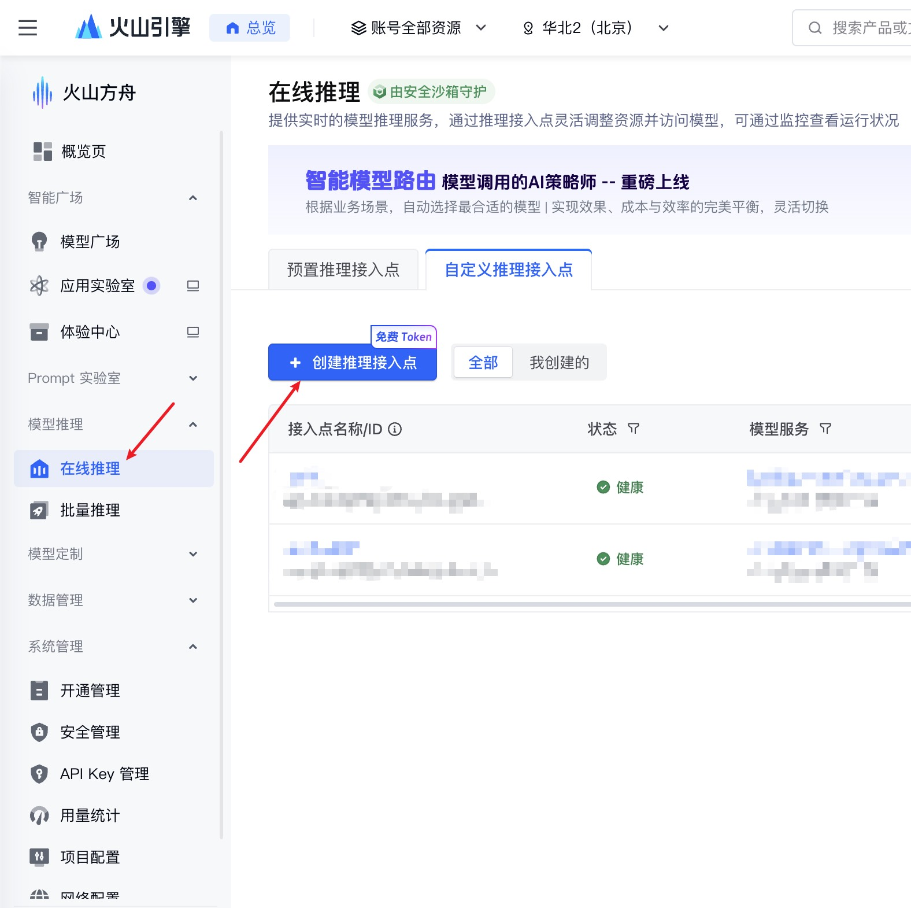

# 开始搭建一个最基础的RAG接口

在这个实战中，我们将模拟一个企业知识库的场景：把几段特定的文本存入内存级别的向量数据库，然后通过 API 提问，让大模型基于这些文本来回答。

简单来说，RAG（检索增强生成）就是给大模型配上一个可以随时查阅的“外部知识库”，让它在回答问题前先翻书找资料，从而输出更准确、更实时的内容。

### 1. 获取接入点ID

1. 访问 [火山引擎控制台](https://console.volcengine.com/ark/)
2. 在线推理 -> 自定义推理接入点 -> 创建推理接入点
   
3. 选择想要的模型，点击"创建并接入"
4. 回到自定义推理接入点列表，"接入点名称/ID"列中以"ep-"开头的编号就是接入点ID

### 2. 安装依赖

```sh
pip install fastapi uvicorn pydantic langchain langchain_community langchain-openai langchain-huggingface faiss-cpu python-dotenv
# 注意：如果终端使用了代理的话需要安装下面的依赖：
pip install socksio
```

### 3. 创建main.py

```py
from fastapi import FastAPI, HTTPException
from pydantic import BaseModel
from langchain_openai import ChatOpenAI
from langchain_community.vectorstores import FAISS
from langchain_core.prompts import ChatPromptTemplate
from langchain_core.runnables import RunnablePassthrough
from langchain_core.output_parsers import StrOutputParser
from langchain_huggingface import HuggingFaceEmbeddings

# ================= 豆包 (Volcengine) 配置区 =================
# 替换为你自己的火山引擎 API Key 和 接入点 ID (Endpoint ID)
DOUBAO_API_KEY = "替换"
DOUBAO_BASE_URL = "https://ark.cn-beijing.volces.com/api/v3"
LLM_ENDPOINT_ID = "ep-11111111111111-aaaaa"  # 对话模型接入点id
# =========================================================

# 1. 初始化 FastAPI 应用 (相当于 Spring Boot 的 @SpringBootApplication)
app = FastAPI(title="My First RAG API")


# 2.1. 定义请求体 DTO (相当于 Java 里的 POJO + @Data)
class QueryRequest(BaseModel):
    query: str


# 2.2. 定义响应体 DTO (相当于 Java 里的 POJO + @Data)
class QueryResponse(BaseModel):
    answer: str


# 3. 初始化 RAG 知识库 (模拟企业私有数据注入)
# 这里我们用两段特定的私有领域知识作为测试数据
knowledge_base = [
    "关于特斯拉（TSLA）与卫星产业指数（931594）的估值对比：在2026年3月的最新评估中，建议严格依据最新的市盈率（PE）、市净率（PB）和净资产收益率（ROE）等核心财务指标，并结合博格公式（Bogle's Equation）来计算真实的投资回报预期，必须确保市场数据的准确性与时效性。",
    "508班2026跨年元旦晚会概况：本次晚会共有24个节目，精心编排了包括小提琴独奏、街舞和传统武术在内的多种表演形式。晚会的宣传海报采用了富有活力的喜庆新年视觉设计。"
]

print("正在初始化向量数据库和模型，请稍候...")
# 初始化 Embedding 模型 (将文字转为高维向量)
# 使用 BGE (智源研究院开源的最强中文向量模型之一)
# 第一次运行会自动从 HuggingFace 下载模型权重（约几百MB），缓存在本地
print("正在加载本地 BGE 向量模型，第一次需下载权重，请稍候...")
embeddings = HuggingFaceEmbeddings(
    model_name="BAAI/bge-small-zh-v1.5",  # 使用轻量级中文模型，CPU 推理极快
    model_kwargs={'device': 'cpu'},
    encode_kwargs={'normalize_embeddings': True}
)
# 初始化内存向量库 (类似把数据存入带有向量检索插件的 Redis)
vectorstore = FAISS.from_texts(knowledge_base, embedding=embeddings)
# 将向量库转换为检索器，每次检索最相关的 1 条内容
retriever = vectorstore.as_retriever(search_kwargs={"k": 1})

# 初始化大语言模型
llm = ChatOpenAI(
    api_key=DOUBAO_API_KEY,
    base_url=DOUBAO_BASE_URL,
    model=LLM_ENDPOINT_ID,
    temperature=0,
    max_tokens=1024
)

# 定义 Prompt 模板 (指导大模型如何基于检索到的上下文回答)
prompt_template = """你是一个专业的智能助手。请严格基于以下<context>中的信息来回答用户的问题。
如果你在<context>中找不到答案，请直接回复“根据现有知识库，我无法回答该问题”，不要编造数据。

<context>
{context}
</context>

用户问题: {question}
回答:"""
prompt = ChatPromptTemplate.from_template(prompt_template)

# 构建 LCEL (LangChain Expression Language) 处理链
# 相当于 Java 中的 Stream API 操作流：检索 -> 组装 Prompt -> 调用 LLM -> 解析字符串
rag_chain = (
        {"context": retriever, "question": RunnablePassthrough()}
        | prompt
        | llm
        | StrOutputParser() # 这里只简单地原样返回字符串，实际应用中可以按要求解析
)


# 4. 定义 HTTP 接口 (相当于 @PostMapping("/api/chat"))
@app.post("/api/chat", response_model=QueryResponse)
async def chat_endpoint(request: QueryRequest):
    try:
        # 调用 RAG 链进行推理
        result = rag_chain.invoke(request.query)
        return QueryResponse(answer=result)
    except Exception as e:
        # 全局异常捕获
        raise HTTPException(status_code=500, detail=str(e))


if __name__ == "__main__":
    import uvicorn

    # 启动服务器 (类似启动 Tomcat)
    uvicorn.run(app, host="0.0.0.0", port=8000)
```

### 4. 运行

1. 启动项目
2. FastAPI 默认集成了 Swagger UI，打开浏览器访问：http://127.0.0.1:8000/docs
3. 在页面中找到 POST /api/chat 接口，点击 Try it out，输入 JSON 格式的数据进行测试

### 5. 测试案例 1

```json
{
  "query": "评估特斯拉和卫星产业指数时，需要参考哪些核心指标和模型？"
}
```

预期模型会精准提取出 PE、PB、ROE 和博格公式，并强调数据的准确性。

### 6. 测试案例 2

```json
{
  "query": "明天的天气怎么样？"
}
```

预期模型会回答：“根据现有知识库，我无法回答该问题”，这有效防止了 AI 的“幻觉”（胡编乱造）。

## 总结

做完这一步，你目前的系统架构实际上变成了一个**“端云结合”的混合形态，这也是目前很多企业级 AI 应用为了兼顾数据隐私和大模型能力**的标准做法：

1. 本地计算（Embedding阶段）：你的私有数据（特斯拉的估值逻辑、508班的节目单）在变成向量时，完全由你本机的 CPU 和 BGE 模型处理。数据不传云，绝对安全。
2. 云端推理（LLM阶段）：只有检索出来的、最相关的几句话，才会作为 Prompt 发给火山引擎的豆包大模型，让它帮你总结出漂亮的中文回答。
