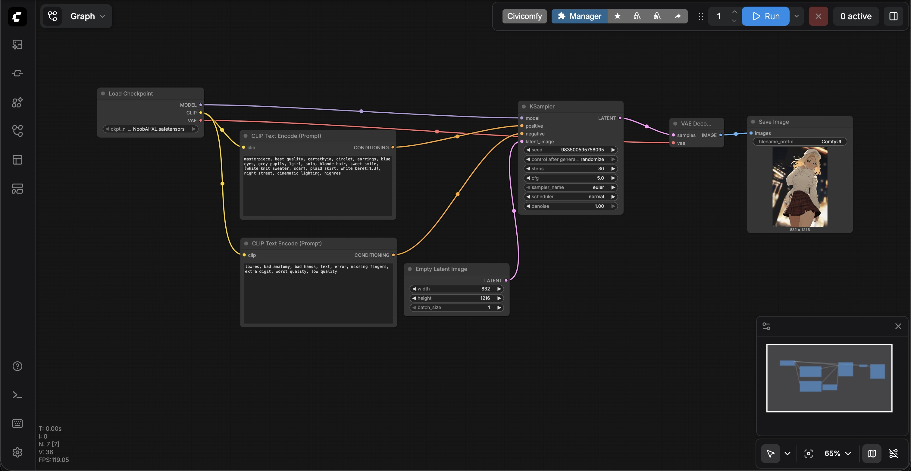

# 核心概念

## 潜空间 (Latent) 与 VAE：数据的序列化与反序列化

你有没有注意到，连接 KSampler 和 VAE Decode 的线是粉色的，上面写着 Latent？

- Latent (潜空间张量)： 在系统内部，AI 绝对不会直接传递和处理巨大的像素图片。它处理的是高度压缩、只有机器能看懂的“高维特征数据” (Latent)。这就像后端服务之间不会直接传输渲染好的 HTML 页面，而是传输序列化好的二进制数据流或 DTO (数据传输对象)。
- VAE Decode (Variational Auto-Encoder)： 它的作用相当于 Jackson。它的唯一任务，就是把算好的 Latent 二进制数据，“反序列化”成人类肉眼能看懂的 RGB 像素图片。

## KSampler (采样器)：核心的业务逻辑处理层

这是整个计算流中最吃算力的地方。点击 KSampler，你会看到几个决定生死的核心参数：

- Steps (迭代步数)： 相当于算法去噪的 for 循环次数。默认是 20。步数太低（比如 5），出来的图是一团模糊的噪点；但超过 30 步以后，边际效应递减，纯属浪费算力。
- CFG (提示词引导系数)： 这个参数决定了 AI 的“服从度”。
  - CFG < 4：AI 彻底放飞自我，基本不看你的提示词。
  - CFG 7~8：最完美的黄金区间，听话且画面自然。（注意：NoobAI 模型要用低 CFG：4.5 ~ 5.5）
  - CFG > 12：AI 会过度用力地去拼凑你的提示词，导致画面对比度极高，甚至出现色彩断层（俗称“画面烧坏了”）。
- Seed (随机种子)： 如果把 “生成后控制 (control_after_generate)” 改成 fixed (固定)，只要提示词和参数不变，每次跑出来的图像素级一致。这是我们后续做视频、排查 Bug 时必须锁死的参数。

## 提示词权重 (Prompt Weighting)：你的 Elasticsearch 查询语法

提示词不是普通的文本，它是带有权重的查询语句。如果你发现生成的女孩没戴帽子，不要去抱怨大模型，你需要手动提高“帽子”的权重。

- 基本语法： 使用英文括号 `()` 来强调。比如 `(white beret:1.5)`，意思是把白色贝雷帽的权重放大 1.5 倍。
  - NoobAI 的语义理解能力极强，通常 1.1 到 1.3 就能达到你想要的效果。推荐范围：1.1 ~ 1.25。
- 降权语法： 比如 `(blue eyes:0.8)`，意思是保留蓝眼睛，但不要太抢眼。
  - 权重不要低于 0.5。如果低于 0.5，AI 可能会完全无法理解这个词，甚至产生逻辑冲突导致画面崩坏。
- NoobAI 专属的“隐形”语法：
  - `{word}`：等同于微增权重（约 1.05 倍）。
  - `[[word]]`：等同于微减权重。
