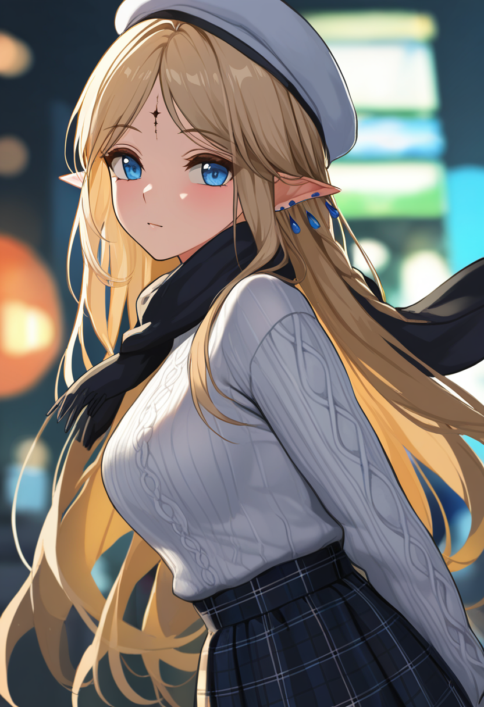

# 生成图片：从零构建视频“材质包”

## 1. 进入命令行终端

**☁️ 云端 RunPod 环境：**

1.  RunPod 开机
2.  点击面板上的 `Port 8888 -> JupyterLab` 快捷入口。这会打开一个类似完整操作系统的网页界面。
3.  在 JupyterLab 界面中，点击左上角的蓝色加号按钮，新建一个 Terminal。

**💻 本地 Windows 环境：**

1.  打开 Windows 菜单，搜索并打开 **Anaconda Prompt** (或直接在系统自带的 Terminal/CMD 中操作，如果已配置好环境变量)。
2.  激活我们专属的 AI 运行环境：
    ```cmd
    conda activate ai_demo
    ```

## 2. 下载模型

我们需要拉取主模型 (Checkpoint) 和特定的角色微调模型 (LoRA)。

**☁️ 云端 RunPod 环境 (使用 `wget`)：**

```sh
# 1. 拉取 NoobAI-XL 底模
cd /workspace/runpod-slim/ComfyUI/models/checkpoints/
wget -c -O NoobAI-XL.safetensors "https://huggingface.co/Laxhar/noobai-XL-1.1/resolve/main/NoobAI-XL-v1.1.safetensors"

# 2. 拉取卡提希娅 LoRA
cd /workspace/runpod-slim/ComfyUI/models/loras/
wget -c -O Cartethyia_V5_XL.safetensors "https://civitai.com/api/download/models/2525827"
```

**💻 本地 Windows 环境 (使用自带的 `curl` 或浏览器)：**
_方法 A：命令行下载_

```cmd
# 1. 拉取 NoobAI-XL 底模
cd C:\Users\ILove\software\ai_video\ComfyUI\models\checkpoints
curl -L -C - -o NoobAI-XL.safetensors "https://huggingface.co/Laxhar/noobai-XL-1.1/resolve/main/NoobAI-XL-v1.1.safetensors"

# 2. 拉取卡提希娅 LoRA
cd C:\Users\ILove\software\ai_video\ComfyUI\models\loras
curl -L -C - -o Cartethyia_V5_XL.safetensors "https://civitai.com/api/download/models/2525827"
```

_方法 B：手动下载_（如果命令行下载较慢，可以直接将上述网址复制到浏览器或迅雷中下载，然后将 `.safetensors` 文件分别拖入上述对应的本地文件夹中）。

## 3. 打开 ComfyUI 图形化操作界面

模型就位后，启动我们的工作台。

**☁️ 云端 RunPod 环境：**
回到 RunPod 页面点击 `Port 8188 -> ComfyUI`。

**💻 本地 Windows 环境：**
进入 `C:\Users\ILove\software\ai_video\ComfyUI` 目录，双击我们之前写好的 `run.bat`。等待控制台加载完毕后，在浏览器中访问 `http://127.0.0.1:8188`。

_(通用设置)_：点击界面左下角设置图标 (齿轮) -\> `comfy` -\> 区域设置 -\> 语言 -\> 换成 **English**（以确保节点名称与本教程完全对应）。

## 4. 构建 DAG 拓扑

在空白区域双击左键即可打开搜索框，输入关键字搜索对应的模块。

1.  **`Load Checkpoint`**: 选择 `NoobAI-XL.safetensors`
2.  **`Load LoRA (Model and CLIP)`**: 选择 `Cartethyia_V5_XL.safetensors`
    - **连线**: 将 `Load Checkpoint` 的 MODEL 和 CLIP 连入此节点
3.  **两个 `CLIP Text Encode (Prompt)`**
    - 一个用做正向, 另一个用做反向
    - **连线**: 两个节点的输入端都连接 LoRA 输出的 CLIP
4.  **`Empty Latent Image`**
    - **参数**: 宽度 832，高度 1216，`batch_size` 设为 1（极其重要，我们现在只画单张图）
5.  **`KSampler`**:
    - **连线**:
      - 接收 `Load LoRA (Model and CLIP)` 的 MODEL
      - 正向的 `Load LoRA (Model and CLIP)` CONDITIONING 连到 positive
      - 反向的 `Load LoRA (Model and CLIP)` CONDITIONING 连到 negative
      - `Empty Latent Image` 的 LATENT 连到 latent_image
    - **参数**:
      - `seed` 设为 randomize (我们要抽卡了)
      - `steps`: 30
      - `CFG`: 5.0
      - `sampler_name`: euler
      - `scheduler`: normal
6.  **`VAEDecode`**:
    - **连线**: 接收 `KSampler` 的 LATENT 和 `Load Checkpoint` 原始输出的 VAE
7.  **`Save Image`**: 接收 `VAEDecode` 的 IMAGE 输出

## 5. 注入业务参数

把下面的提示词直接复制进你的 CLIP Text Encode 节点中。记住，这张图是未来视频的“材质包”，所以她必须安静地站着，没有任何复杂的动作。

### 正向提示词 (Positive)

```text
masterpiece, best quality, very awa, highres, cartethyia, 1girl, solo, blonde hair, long hair down to the waist, blue eyes, highly detailed face, (forehead tattoo:1.3), teardrop earrings, alternate costume, (white knit sweater, scarf, plaid skirt, white beret:1.2), standing, facing viewer, looking at viewer, night street background, cinematic lighting, soft lighting
```

**为什么这么写：**

- **very awa**：这是作者强烈推荐的 NoobAI-XL 专属最高质量词，能极大提升画面的细腻度。
- **(forehead tattoo:1.3)**：直接调用了说明书里明确列出的声痕触发词，同时赋予 1.3 的高权重，确保底模绝对不敢把它“优化”掉。
- **alternate costume**：按照作者说明，当让卡提希娅穿非官方衣服（白毛衣）时，必须加上这个词，告诉模型放弃默认的盔甲和长裙。

### 反向提示词 (Negative)

```text
lowres, low quality, video artifacts, jpeg artifacts, chromatic aberration, film grain, absurdly detailed composition, sketch, red pupils, pink pupils, bad anatomy, bad hands, error, missing fingers, extra digit, worst quality, mutated, deformed, blurry, action, movement, dynamic pose
```

**为什么这么写：**

- **官方黑名单全量接入**：把作者列出的 `chromatic aberration` (色差)、`film grain` (胶片颗粒) 和 `video artifacts` 全部加进去了，这能让画面变得极其干净，非常适合作为后续视频的材质包。
- **absurdly detailed composition**：这个词非常精妙，它能压制画师过度炫技带来的“杂乱无章感”，保证画面的主体（卡提希娅）足够清晰。
- **red pupils, pink pupils**：防止瞳孔颜色在渲染时发生变异。

## 6. 最后的重要参数对齐

调整 `Load LoRA (Model and CLIP)` 的参数:

- `strength_model` (主模型权重): 保持 **0.85**。
- `strength_clip` (文本编码器权重): 按照作者“可能炼炸了”的警告，必须把它降到 **0.5 到 0.6 之间**！

## 7. 运行

点击右侧面板的 **Run**。


