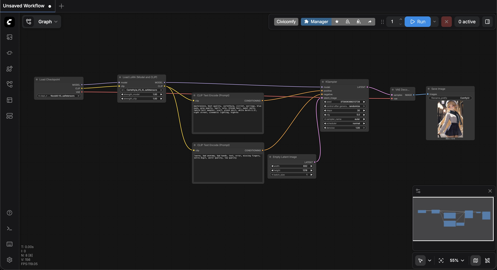

# 为你的链路注入“特征中间件” (LoRA)

纯靠写提示词去“抽卡”是不可能做动画的。为了让卡提希娅本尊降临，我们需要把你之前提前下载好的专属 LoRA 节点，像**拦截器（Interceptor）**一样热插拔进现有的工作流中，给流动的数据打上强特征的思想钢印。

## 获取卡提希娅的专属“特征包” (LoRA)

大模型（NoobAI）相当于基础画师，而 LoRA 就是画师需要参考的“卡提希娅人物设定集”。没有这本设定集，画师只能靠猜。

请切回到你的 JupyterLab Terminal，依次执行以下命令：

```sh
# 切换到 LoRA 目录并下载卡提希娅最新特征包
cd /workspace/runpod-slim/ComfyUI/models/loras/
wget -c -O Cartethyia_V5_XL.safetensors "https://civitai.com/api/download/models/2525827"
```

下载完毕后，切回到浏览器里的 ComfyUI 网页界面，刷新浏览器页面。这一步是为了让底层的 Python 服务重新扫描 loras 文件夹，发现新下载的模型。

## 重新作画

请在 ComfyUI 的网页界面里完成以下“重新布线”：

### 1. 添加 LoRA 模块

在空白区域双击左键（或者点击右键 -> Add Node），添加 LoRA 模块：

1. loaders：
   - Load LoRA (Model and CLIP)：选择 Cartethyia_V5_XL.safetensors。

### 2. 连线

请按照以下逻辑进行重新连线（鼠标左键按住端口拖动到目标端口）：

1. Model 骨干网 (紫色线):
   - Load Checkpoint (MODEL) → Load LoRA (model)
   - Load LoRA (MODEL) → KSampler (model)
2. CLIP 语义网 (黄色线):
   - Load Checkpoint (CLIP) → Load LoRA (clip)
   - Load LoRA (CLIP) → 两个 CLIP Text Encode 的 (clip) 输入端。
3. 其它保持不变

现在你的数据流变成了：通用大模型（Checkpoint） -> 卡提希娅专属补丁(LoRA) -> 文本解析与采样运算。这就等于在系统层面锁死了角色的物理特征。

### 6. 参数注入

请确保你的正向提示词里依然保留了代表她的触发词（在civitai.com特征包作者写的备注里）

- 正向 (Positive): masterpiece, best quality, cartethyia, circlet, earrings, blue eyes, grey pupils, 1girl, solo, blonde hair, sweet smile, (white knit sweater, scarf, plaid skirt, white beret:1.3), night street, cinematic lighting, highres
- 负面 (Negative): lowres, bad anatomy, bad hands, text, error, missing fingers, extra digit, worst quality, low quality

### 6. 生成图片

一切就绪后，点击右侧控制面板顶部的 Run。


