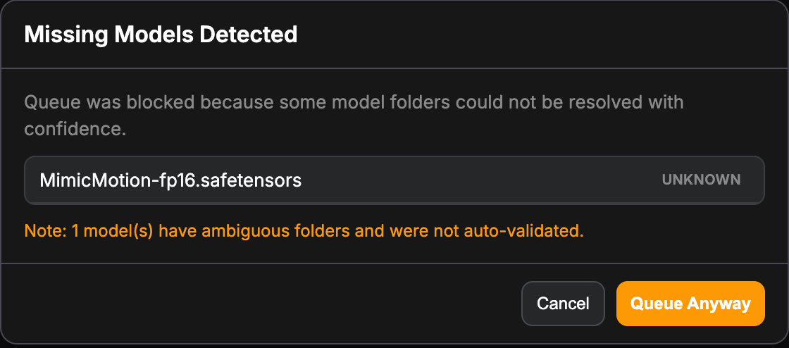

# 数据清洗与信号提取

如果说阶段一是“建立数据库主键”，那么阶段二就是典型的 **“数据清洗与信号提取 (Data Cleaning & Signal Extraction)”**。

找一段（5秒左右）真人背对着走路的视频，但是这个视频包含着大量我们 **不需要的“脏数据”**（真实的背景、真人的衣服、真人的长相）。如果直接把这些数据喂给视频大模型，它会产生严重的认知混乱（“我到底是该画卡提希娅，还是画这个真人？”）。

我们要用特定的算法层，把这层“物理外壳”彻底剥离，只提取出纯粹的**“运动坐标矩阵”**（也就是彩色火柴人骨架）。

为了保证模块化开发，请在 ComfyUI 中 **新建一个空白画布**。

### 1. 安装插件

1. 呼出包管理器 (ComfyUI Manager)
   - 在 ComfyUI 网页界面的右侧控制面板，点击 Manager 按钮。（如果你选的 RunPod 镜像自带了 Manager 的话）。
   - 点击 Install Custom Nodes (安装自定义节点)。
2. 搜索并安装核心组件
   - comfyui_controlnet_aux, 作者是 Fannovel16
   - ComfyUI-VideoHelperSuite, 作者是 Kosinkadink

## 2. 构建 DAG 拓扑

在空白区域双击左键即可打开搜索框，输入关键字搜索对应的模块。

1. `Load Video (Upload) 🎥🅥🅗🅢`
   - 双击空白处搜索加载这个节点
   - **操作**：点击 `choose video to upload`，把你那段“人物背对着走路”的 MP4 视频传上去
   - **参数配置**：找到 `frame_load_cap`（最大加载帧数），把它设为 **`64`**（这是目前开源 DiT 视频模型的黄金测试帧数，大约对应 2~3 秒的流畅运动，足够我们做验证了）
2. `DWPose Estimator`
   - 搜索并添加这个节点（这是 2026 年最顶级的姿态估计模型，远超老旧的 OpenPose，它能极其精准地捕获手指关节和面部朝向）
   - **连线**：将 `VHS_LoadVideo` 的 **`IMAGE`** 输出 -> 连入 `DWPreprocessor` 的 **`image`** 输入
   - **参数配置**：保持默认即可（它会自动加载 `yolox` 来框选人物，用 `dw-ll` 来计算骨架）
3. `Video Combine 🎥🅥🅗🅢`
   - 搜索并添加这个节点。
   - **连线**：将 `DWPreprocessor` 的 **`IMAGE`** 输出 -> 连入 `VHS_VideoCombine` 的 **`images`** 输入。
   - **参数配置**：把 `frame_rate`（帧率）设为和你原视频一样的数值（通常是 `24` 或 `30`）。`format` 可以选 `video/h264-mp4` 以便直接在网页里预览。

### 3. 运行与 QA 测试 (Quality Assurance)

这三个节点连好之后，这就是一条完美的“解耦数据清洗流”。

点下 **Run**。你的 5090 将动用它的 Tensor Core，逐帧扫描这段视频。

**小里程碑验收标准：**
跑完之后，在最右侧的 `VideoCombine` 节点里，你会看到一个在纯黑背景下走路的彩色火柴人视频。
请用 QA 的眼光仔细检查这个火柴人：

1. **有没有断帧/闪烁？**（比如走到一半突然火柴人消失了，说明原视频该处的光线或遮挡太严重，导致算法丢失了目标）。
2. **手脚是否完整？**（如果原视频里脚被裁掉了，骨架也会没有脚，这会导致后续卡提希娅生成的腿部直接畸形崩溃）。

## 处理运行报错

_报错内容不一定要和图中完全一样，类似的报错也一样处理_

原因：Manager 插件在请求发送前做了一次 **“前置静态校验 (Pre-flight Check)”**。它扫描了你的本地硬盘，发现找不到 dw-ll_ucoco_384_bs5.torchscript.pt 这个模型，于是直接把队列 Block（阻塞）了，报出了这个警告。但 Manager 不知道的是，DWPreprocessor 这个节点内部写了 **“运行时动态拉取 (Runtime Lazy-loading)”**的代码。只要请求打到它那里，它就会自己去下载。

解决方案：直接点击报错弹窗右下角的 Queue Anyway (无论如何都要排队) 按钮！
