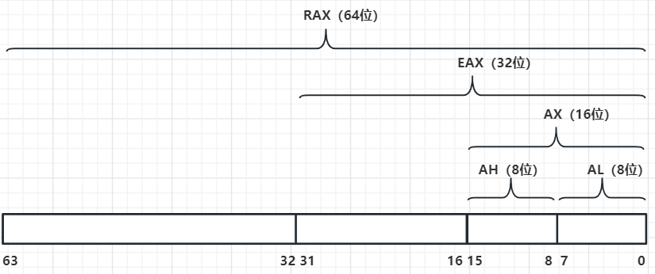

# 寻址方式

内存寻址的通用格式如下：

```
地址或偏移量 (%基址寄存器, %索引寄存器, 比例因子)
```

所有字段都是可选的, 最终地址为：

```
结果地址 = 地址或偏移量 + %基址寄存器 + (%索引寄存器 x 比例因子)
```

`地址或偏移量` 以及 `比例因子` 都必须是常量，其余两个必须是寄存器。如果省略任何一项，那么等式中将以 0 代替该项。

## 直接寻址

通过使用 `地址或偏移量` 部分实现。

```x86asm
# 把内存地址ADDRESS位置的数据加载到%eax
movl ADDRESS, %eax
```

## 索引寻址

这种模式通过使用 `地址或偏移量` 以及 `索引寄存器` 实现。可以将任何通用寄存器用作 `索引寄存器`，也可以将 `索引寄存器` 的 `比例因子` 定为 1、2 或 4，使之更适合为字节、双字节和字进行索引。例如，有一个名为 `string_start` 的字节串，并想访问其中第三个字节，`%ecx` 中的值是 2:

```x86asm
movl string_start(, %ecx, 1), %eax
```

该指令从 `string_start` 处开始，将该地址与 `1 * %ecx` 相加，并将所得值加载到 `%eax` 中。

## 间接寻址

间接寻址方式从寄存器指定的地址加载值。例如，如果 `%eax` 保存着一个地址，可通过以下操作将该地址中的数据移入 `%ebx`：

```x86asm
movl(%eax), %ebx
```

## 基址寻址

基址寻址方式与间接寻址方式类似，不同之处在于它将一个常量值与寄存器中的地址相加。

例如，如果有一个记录，其中年龄值位于记录起始地址后 4 字节处，该记录的起始地址在 `%eax` 中，那么可以通过发出以下指令将年龄提取到 `%ebx` 中：

```x86asm
movl 4(%eax), ebx
```

## 立即寻址

立即寻址与通用格式不同, 立即寻址方式用于将直接值加载到寄存器或存储位置。例如，如果想把数字 12 加载到 `%eax`，只需执行以下操作：

```x86asm
movl $12, %eax
```

注意，为了表明立即寻址方式，需要在数字前加上一个 `$` 符号。否则就会变成直接寻址方式，将位于地址为 12 中的值而不是数字 12 本身加载到 `%eax`。

## 寄存器寻址

在寄存器寻址模式下，指令的操作数直接是寄存器。例如:

```x86asm
movl %ebx, %eax
```

会将 `%ebx` 寄存器中的值复制到 `%eax` 寄存器中。

立即寻址方式除外的所有模式都可用作源或目的操作数。立即寻址方式只能是源操作数。

## RAX 寄存器

在 x86-64 架构中，RAX 是一个 64 位的通用寄存器，它可以被划分为几个较小的寄存器，以支持不同大小的操作。以下是 RAX 寄存器的结构图：



在这个结构中：

- RAX 是整个 64 位寄存器
- EAX 是 RAX 的低 32 位，用于执行 32 位的操作
- AX 是 EAX 的低 16 位，用于执行 16 位的操作
- AH 是 AX 的高 8 位，用于执行 8 位的操作
- AL 是 AX 的低 8 位，用于执行 8 位的操作

这种划分允许程序员根据需要选择适当的寄存器大小，以执行不同类型的操作。例如，如果一个操作只需要处理 16 位的数据，那么可以使用 AX 寄存器。如果需要处理 64 位的数据，则可以使用整个 RAX 寄存器。

注意: 当为 RAX 赋值时, EAX, AX, AH, AL 中原来的值都会被清空。当为 EAX 赋值时, AX, AH, AL 中原来的值都会被清空。当为 AX 赋值时, AH, AL 中原来的值都会被清空。
