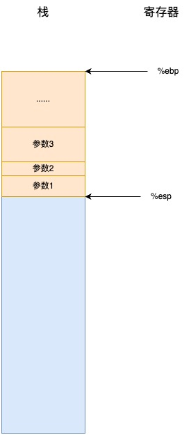
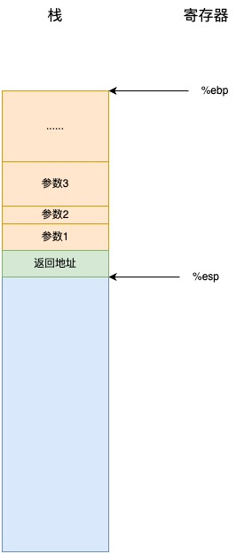
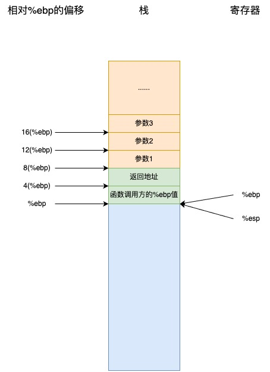
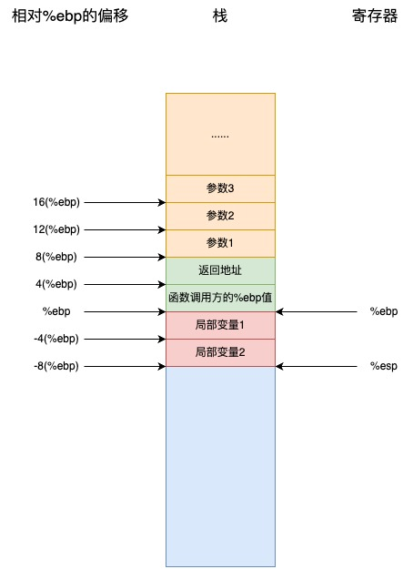
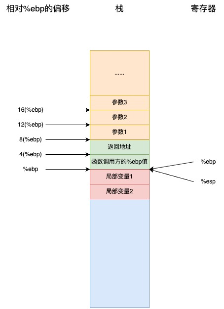
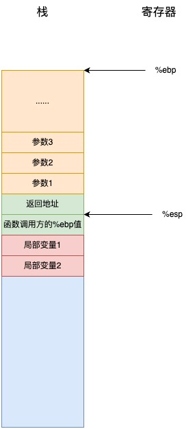
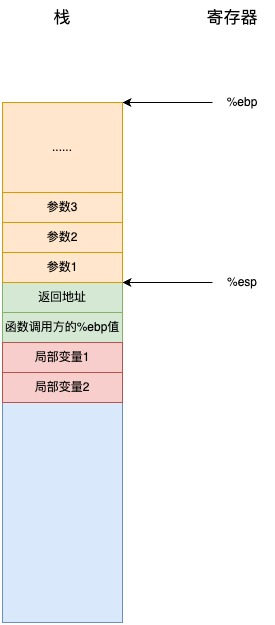

# 函数的执行原理

C 语言调用约定（Calling Convention）是一组规则，定义了如何在函数调用过程中传递参数、如何管理函数调用期间的寄存器以及函数返回值的存放方式。

在 C 语言调用约定中，栈是实现函数的局部变量、参数和返回地址的关键因素。

## 调用函数

在调用函数之前，调用方会将被调用函数的所有参数按逆序压入栈中。

此时的栈结构:



接着，调用方执行 `call` 指令, `cal1` 指令会做两件事：

1. 首先，它将`cal1` 指令的下一条指令的地址(即返回地址)压入栈中
2. 然后，修改指令指针(`%eip`)以指向被调用函数的起始地址

此时的栈结构:



此时 `%eip` 已经指向了被调用函数, 接着开始执行被调用函数的指令。

首先，被调用函数通过 `pushl %ebp` 指令保存当前的基址指针寄存器 `%ebp`(即调用方的 `%ebp`)。基址指针是一个特殊的寄存器，用于访问函数的参数和局部变量。

此时的栈结构:


然后，它会用 `movl %esp, %ebp` 将栈指针 `%esp` 复制到 `%ebp`，这使你能够把函数参数作为相对于基址指针的固定索引进行访问。

在函数开始时将栈指针复制到基址指针寄存器可以让你一直清楚参数和局部变量的位置，即使在将其他数据压入/弹出栈的情况下也是如此。`%ebp` 将一直是栈指针在函数开始时的位置，所以可以说是对栈帧的常量引用。(栈帧包含一个函数中使用的所有栈变量， 包括参数、局部变量和返回地址。)

此时的栈结构:



可以看到，每个参数都可以用 `%ebp` 通过基址寻址方式访问。

接下来，函数为其所需的所有局部变量保留栈空间，只需将栈指针向外移动即可实现。假设要运行函数，我们需要两个字的内存(一个字的长度为 4 字节)，只需将栈指针 `%esp` 向下移动两个字即可预留空间。这是通过如下指令实现的：

```x86asm
subl $8 %esp
```

该指令将 `%esp` 减去 8, 这样，我们就能将栈用于变量存储，而无需担心函数调用引起的入栈会破坏存储的变量。

此时的栈结构:



所以我们现在可以使用 `%ebp` 中的不同偏移量，通过基址寻址访问这个函数所需的所有数据。`%ebp` 正是专门为这一目的设计的，这就是它被称为基址指针的原因。你可以在基址指针寻址方式中使用其他寄存器，但在 x86 架构中，使用 `%ebp` 寄存器速度会快得多。

## 函数返回

当一个函数执行完毕后，它会做三件事:

1. 将其返回值存储到 `%eax`
2. 将栈恢复到调用函数时的状态(移除当前栈帧，并使调用方的栈帧重新生效)
3. 将控制权交还给调用它的函数。这是通过 ret 指令实现的，该指令将栈顶的值(返回地址)弹出，并将指令指针寄存器 `%eip` 设置为该弹出值

所以，在函数将控制权返回给调用它的代码时，必须恢复前一个栈帧。如果不这样做，`ret` 将无法正常工作，因为当前栈帧的返回地址不在栈顶。因此，返回前必须将栈指针 `%esp` 和基址指针 `%ebp` 重新设置为函数开始时的值。

因此，要从函数返回，你必须使用如下指令：

```x86asm
# 移除当前栈帧
movl %ebp, %esp
# 恢复调用方的%ebp寄存器
popl %ebp
# 把%eip设置为返回地址
ret
```

执行 `movl %ebp, %esp` 后的栈结构:



执行 `popl %ebp` 后的栈结构:



执行 `ret` 后的栈结构:



现在控制权已经转回调用代码那里，调用代码现在可以检查 `%eax` 中的返回值。调用代码也需要弹出其人栈的所有参数，以将栈指针复位至其原先的位置(如果不再需要参数值，那你用 `add1` 指令将 `4 * 参数个数` 加到 `%esp` 即可)。

## 调用函数前保存寄存器的中的值

当你调用函数时，应该假设目前寄存器中的一切内容都会被去除。可以确保函数开始后其值仍然被保留的唯一一个寄存器就是 `%ebp`。

`%eax` 肯定会被覆盖，而其他寄存器则可能被覆盖。如果你要在调用函数前保存寄存器的内容，必须在函数参数入栈前将其入栈。然后，你可以在弹出参数后以逆序将其弹出存回寄存器。即使你知道函数不会覆盖某个寄存器，也应该保存它，因为该函数将来的版本可能会覆盖该寄存器。
