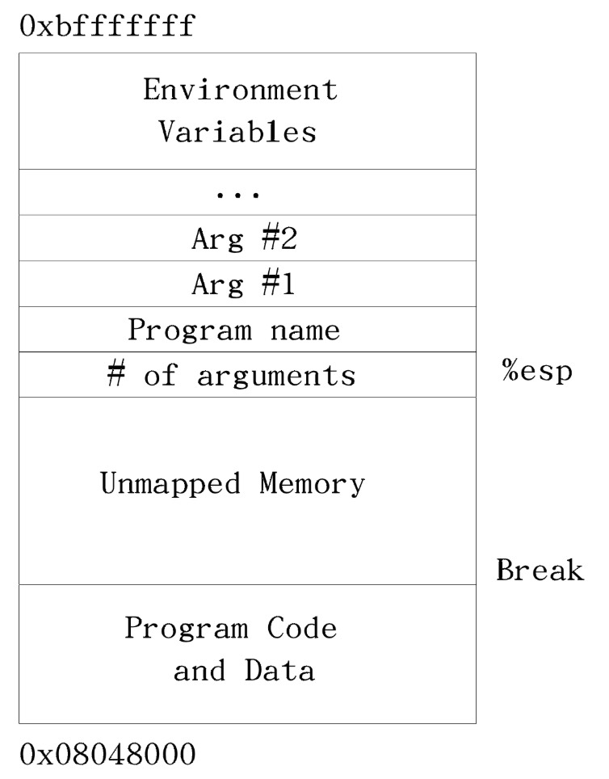

# Linux 程序的内存布局

当程序被加载到内存时, 每个 `.section` 都被加载到其自己的内存区。在每个段中声明的代码和数据将被组合起来, 即使它们在源代码中是分离的。`.text` 段被加载到地址 `0x08048000`, 而 `.data` 段紧随其后被加载, 再之后是 `.bss` 段。

在 Linux 上可以寻址的最后一个字节是存储位置 `0xBFFFFFFF` 。Linux 的栈从这里开始, 并向下增长。但栈与其他段之间的距离很大。

栈的初始布局如下: 栈底(栈底为内存最顶端的地址)。接着是 ASCII 字符表示、以空字符结束的程序名。程序名后是程序的环境变量。接着是程序的命令行参数。在这之后就是用到的参数数量。程序开始时, 此处就是栈指针 `%esp` 指向的位置。新的数据入栈会使 `%esp` 在内存中向下移动。

栈和程序数据段之间的内存地址是无法访问的(还未映射的内存地址), 除非向 Linux 申请内存。程序最后的可访问内存地址称为系统中断(break)。

## 虚拟内存

应用程序只能访问虚拟内存。

每个程序都在自己的沙盒内运行。在计算机上运行的每个程序都认为其被加载到内存地址 `0x08048000`, 其栈起始地址为 `0xBFFFFFFF`。当 Linux 加载程序时, 它先找到一个未使用的物理内存段, 然后告诉处理器将该段内存当做地址 `0x08048000` 用于该程序。程序认为自己在使用的地址称为虚拟地址, 而其在内存芯片上实际对应的地址称为物理地址。将物理地址分配到虚拟地址的过程称为映射。

在程序加载完成时, 栈和数据段之间的区域还没有把虚拟内存地址映射到物理内存地址。映射过程需要大量的时间和空间, 所以如果每一个可能程序可能的虚拟地址都映射到物理地址, 那么连运行一个程序的物理内存可能都不会剩下。所以, break 是未映射内存区的起始处。但有了栈, Linux 将自动映射通过入栈可访问的内存。

虚拟内存可映射的不只是物理内存, 还可以映射到磁盘。假设物理内存只有 16M,  Linux 和一些基本的应用程序正在使用其中 8M, 而此时要运行一个需要 20M 内存的程序。当剩余的 8M 物理内存都映射到虚拟内存时, Linux 开始将一部分应用程序的虚拟内存映射到磁盘块。所以, 如果访问程序的某个内存位置, 该位置可能实际上不在内存中, 而在磁盘上。

当你尝试访问映射到磁盘的内存时, 处理器发现不能直接为你的内存请求提供服务, 它会要求 Linux 介入。Linux 发现内存实际上在磁盘上, 因此会将某些目前在内存中的数据移动到磁盘上以腾出空间, 然后将从磁盘访问的内存移回物理内存。接着, 它调整处理器的“虚拟到物理”内存查找表, 使之能在新的位置找到该内存数据。最后, Linux 将控制权还给程序, 并在程序最初试图访问数据的指令处重新启动程序。

为了使这一过程更有效率, 内存被拆分成组, 这些组称为页。当在 x86 处理器上运行 Linux 时, 一个页面是 4096 字节内存。所有的内存映射都一次映射一个页面。物理内存的分配, 交换, 映射等都以内存页为单位, 而非以单个内存地址为单位进行。这意味着在编程时应该尽量在同一基本内存范围内进行内存访问, 这样一次只需要一两个内存页。否则, Linux 为了满足你的内存需求, 可能不得不随时将页面移到磁盘或从磁盘移入内存。

如果需要更多的内存, 可以使用 brk 系统调用申请。brk 的系统调用号为 45。所请求的新的 break 地址放到到 `%ebx` 中。然后调用 `int $0x80` 发信号给 Linux 让其完成相应工作。在映射内存后, Linux 将新的 break 地址返回到 `%eax`。新的 break 地址实际上可能比申请的大, 因为 Linux 会四舍五入至最接近的页。如果没有足够的物理内存或页面交换能满足你的要求, Linux 将返回 0 到 `%eax`。另外, 如果调用 brk 时 `%ebx` 为 0, 该调用会返回当前的 break 地址。
