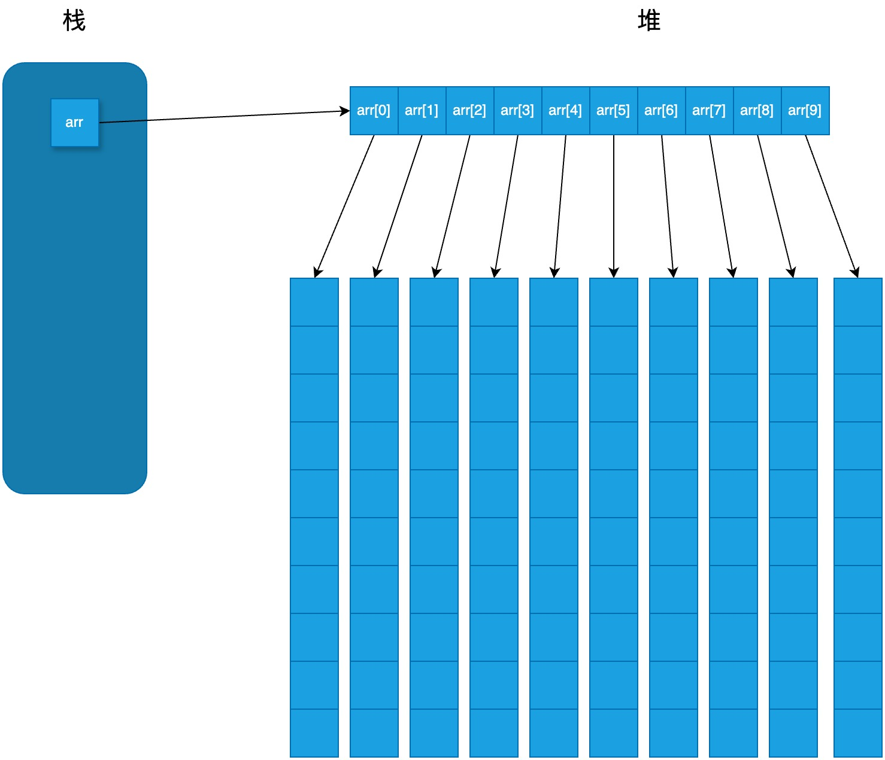

# 数组

栈数组和堆数组:

```cpp
// 在栈中分配数组
int arr1[10];
// 在堆中分配数组
int length = 10;
int* arr2 = new int[length];
```

## 多维数组

注意: 多维数组的在堆中分配方式和想象的不同:

```cpp
// 无法编译: Cannot initialize a variable of type 'int **' with an rvalue of type 'int (*)[10]'
int ** arr = new int[10][10];
```

正确的的分配方式是: 首先为数组的第一个下标分配一个连续的数组。该数组的每个元素实际上是指向另一个数组的指针，另一个数组保存的是第二个下标维度的元素:

```cpp
int main() {
    int array_length = 10;
    int sub_array_length = 10;

    // 在堆中创建一个二维数组
    int **arr = new int *[array_length];
    for (int i = 0; i < array_length; i++) {
        arr[i] = new int[sub_array_length];
    }

    // 使用二维数组
    arr[1][2] = 100;

    // 清理数组
    for (int i = 0; i < array_length; i++) {
        delete[] arr[i];
    }
    delete[] arr;

    return 0;
}
```


