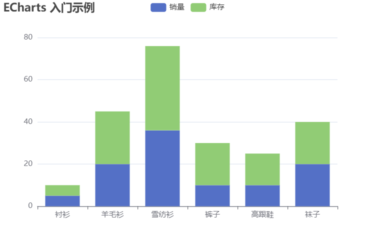

# 柱状堆叠图

要实现堆叠图, 只需要在 series 中配置 stack 属性, 要合到一起的数据配置相同的 stack 值。stack 只支持堆叠于 ‘value’ 和 ‘log’ 类型的类目轴上

```html
<!DOCTYPE html>
<html lang="en">
  <head>
    <meta charset="UTF-8" />
    <meta name="viewport" content="width=device-width, initial-scale=1.0" />
    <title>ECharts Demo</title>
    <script src="https://cdn.jsdelivr.net/npm/echarts@5.4.3/dist/echarts.min.js"></script>
  </head>
  <body>
    <!-- 为 ECharts 准备一个定义了宽高的 DOM -->
    <div id="main" style="width: 600px; height: 400px"></div>
    <script type="text/javascript">
      // 基于准备好的dom, 初始化echarts实例
      var myChart = echarts.init(document.getElementById("main"));

      // 指定图表的配置项和数据
      var option = {
        title: {
          text: "ECharts 入门示例",
        },
        tooltip: {},
        legend: {
          data: ["销量", "库存"],
        },
        xAxis: {
          data: ["衬衫", "羊毛衫", "雪纺衫", "裤子", "高跟鞋", "袜子"],
        },
        yAxis: {},
        series: [
          {
            name: "销量",
            type: "bar",
            // 注意这里
            stack: "随便写",
            data: [5, 20, 36, 10, 10, 20],
          },
          {
            name: "库存",
            type: "bar",
            // 注意这里
            stack: "随便写",
            data: [5, 25, 40, 20, 15, 20],
          },
        ],
      };

      // 使用刚指定的配置项和数据显示图表。
      myChart.setOption(option);
    </script>
  </body>
</html>
```

## 效果


