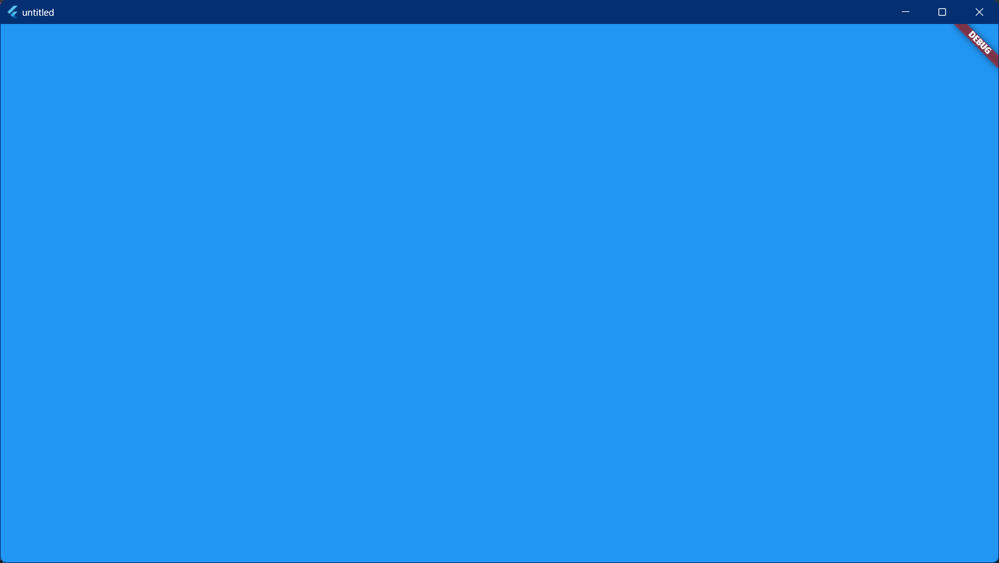
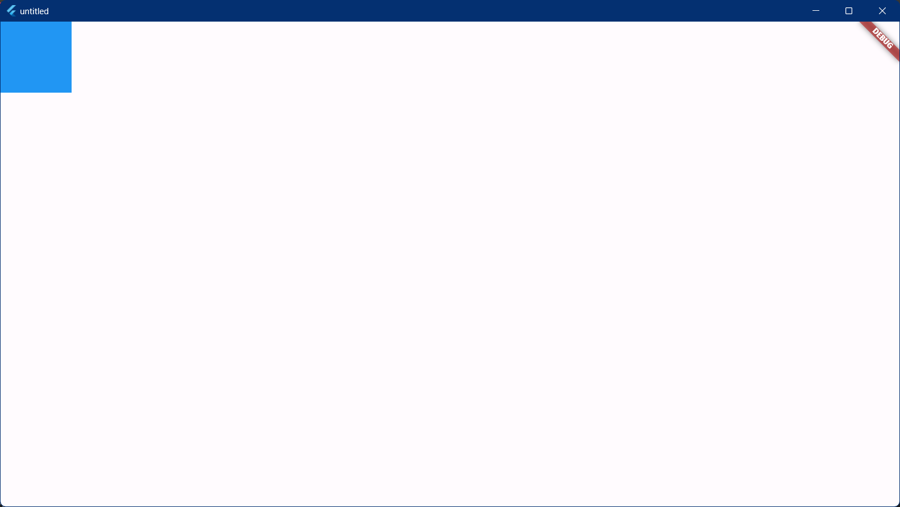

# constraints

constraints 用来限制子组件的大小。

1. 父组件向子组件传递 constraints 条件
2. 子组件确定自己的大小, 然后告诉父组件。注意子组件的大小必须符合父组件的约束
3. 大多数情况下父组件会根据子组件确定自身的大小

比如, 父组件传递给子组件的 constraints 是: maxWidth=maxHeight=100, minWidth=minHeight=0, 如果子组件设置宽高都为 200, 则子组件最终的大小是 100×100, 因为任何时候子组件都必须先遵守父组件的约束, 在此基础上再应用子组件约束(相当于父组件的约束和自身的大小求一个交集)。

```dart
const BoxConstraints({
  this.minWidth = 0.0, // 最小宽度
  this.maxWidth = double.infinity, // 最大宽度
  this.minHeight = 0.0, // 最小高度
  this.maxHeight = double.infinity, // 最大高度
});
```

提供了几个方便的方法:

```dart
BoxConstraints.tight(Size size)
  : minWidth = size.width,
    maxWidth = size.width,
    minHeight = size.height,
    maxHeight = size.height;

const BoxConstraints.tightFor({
  double? width,
  double? height,
}) : minWidth = width ?? 0.0,
     maxWidth = width ?? double.infinity,
     minHeight = height ?? 0.0,
     maxHeight = height ?? double.infinity;

const BoxConstraints.tightForFinite({
  double width = double.infinity,
  double height = double.infinity,
}) : minWidth = width != double.infinity ? width : 0.0,
     maxWidth = width != double.infinity ? width : double.infinity,
     minHeight = height != double.infinity ? height : 0.0,
     maxHeight = height != double.infinity ? height : double.infinity;

BoxConstraints.loose(Size size)
  : minWidth = 0.0,
    maxWidth = size.width,
    minHeight = 0.0,
    maxHeight = size.height;
```

首先把父组件 Container 的 constraints 设置为填满窗口, 子组件 Container 不设置宽高:

```dart
class MyHomePage extends StatelessWidget {
  const MyHomePage({super.key});

  @override
  Widget build(BuildContext context) {
    return Scaffold(
      body: Container(
        // 设置最大值, 填满窗口
        constraints: const BoxConstraints(
          minWidth: double.infinity,
          maxWidth: double.infinity,
          minHeight: double.infinity,
          maxHeight: double.infinity,
        ),
        // 不设置宽高
        child: Container(
          color: Colors.blue,
        ),
      ),
    );
  }
}
```

效果:



设置子组件 Container 的宽高, 发现并不会生效, 因为父组件要求最小宽高是 double.infinity:

```dart
class MyHomePage extends StatelessWidget {
  const MyHomePage({super.key});

  @override
  Widget build(BuildContext context) {
    return Scaffold(
      body: Container(
        // 设置最大值, 填满窗口
        constraints: const BoxConstraints(
          minWidth: double.infinity,
          maxWidth: double.infinity,
          minHeight: double.infinity,
          maxHeight: double.infinity,
        ),
        // 设置宽高
        child: Container(
          color: Colors.blue,
          width: 100,
          height: 100,
        ),
      ),
    );
  }
}
```

效果:


修改父组件 Container 的 constraints , 改为不限制子组件(0~double.infinity), 此时子组件 Container 的宽高生效:

```dart
class MyHomePage extends StatelessWidget {
  const MyHomePage({super.key});

  @override
  Widget build(BuildContext context) {
    return Scaffold(
      body: Container(
        // 不限制子组件
        constraints: const BoxConstraints(
          minWidth: 0,
          maxWidth: double.infinity,
          minHeight: 0,
          maxHeight: double.infinity,
        ),
        // 设置宽高
        child: Container(
          color: Colors.blue,
          width: 100,
          height: 100,
        ),
      ),
    );
  }
}
```

效果:


