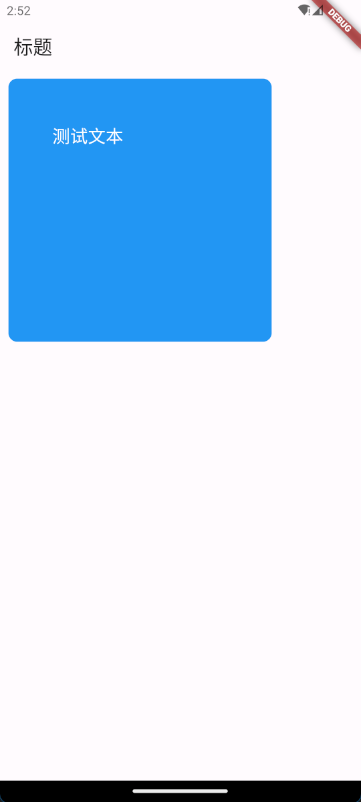

# Container

```dart
Container({
  super.key,
  this.alignment,
  this.padding,
  this.color,
  this.decoration,
  this.foregroundDecoration,
  double? width,
  double? height,
  BoxConstraints? constraints,
  this.margin,
  this.transform,
  this.transformAlignment,
  this.child,
  this.clipBehavior = Clip.none,
})
```

- alignment: 子组件的对齐方式。可选值:
  - Alignment.topLeft
  - Alignment.topCenter
  - Alignment.topRight
  - Alignment.centerLeft
  - Alignment.center
  - Alignment.centerRight
  - Alignment.bottomLeft
  - Alignment.bottomCenter
  - Alignment.bottomRight
- padding: 内边距, width 和 height 包含 padding 值。可选值:
  - EdgeInsets.all(double value): 上下左右设置同一个值
  - EdgeInsets.fromLTRB(double left, double top, double right, double bottom): 分别设置左上右下的值
- color: 背景色。可选值:
  - Colors.blue
  - Colors.white
  - ...
- decoration: 设置装饰, 比如边框、圆角、背景图等。不能同时设置 decoration 和 color, 如果要同时设置, 可以给 decoration 设置 color。可选值:
  - BoxDecoration
- foregroundDecoration: 前景装饰。可选值:
  - BoxDecoration
- width: 宽度
- height: 高度
- constraints: 大小范围约束。可选值:
  - BoxConstraints
- margin: 外边距。可选值:
  - EdgeInsets.all(double value): 上下左右设置同一个值
  - EdgeInsets.fromLTRB(double left, double top, double right, double bottom): 分别设置左上右下的值
- transform: 变换效果, 比如翻转、旋转、变形等。可选值:
  - Matrix4
- child: 子组件, 可以不设置

## 示例

```dart
import 'package:flutter/material.dart';

void main() {
  runApp(const MyApp());
}

class MyApp extends StatelessWidget {
  const MyApp({super.key});

  @override
  Widget build(BuildContext context) {
    return const MaterialApp(
      home: MyHomePage(),
    );
  }
}

class MyHomePage extends StatelessWidget {
  const MyHomePage({super.key});

  @override
  Widget build(BuildContext context) {
    return Scaffold(
        appBar: AppBar(
          title: const Text("标题"),
        ),
        body: Container(
          alignment: Alignment.topLeft,
          padding: const EdgeInsets.all(50.0),
          decoration: const BoxDecoration(
              color: Colors.blue,
              borderRadius: BorderRadius.all(Radius.circular(10))),
          width: 300,
          height: 300,
          margin: const EdgeInsets.all(10.0),
          // 子组件
          child: const Text(
            "测试文本",
            style: TextStyle(color: Colors.white, fontSize: 20),
          ),
        ));
  }
}
```

效果:


