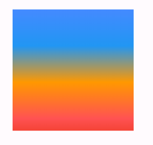
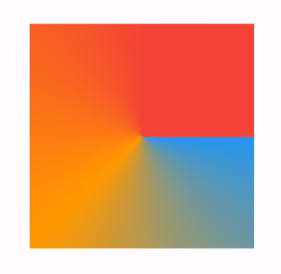

# 渐变

## 线性渐变

begin 和 end 表示渐变的方向。color 表示渐变的颜色。stops 表示渐变的进度, 取值为 0~1。

```dart
class MyHomePage extends StatelessWidget {
  const MyHomePage({super.key});

  @override
  Widget build(BuildContext context) {
    return Scaffold(
      body: Center(
        child: Container(
          decoration: const BoxDecoration(
            // 线性渐变
            gradient: LinearGradient(
              begin: Alignment.topCenter,
              end: Alignment.bottomCenter,
              colors: [
                Colors.blueAccent,
                Colors.blue,
                Colors.orange,
                Colors.redAccent,
                Colors.red,
              ],
              stops: [
                0,
                0.3,
                0.6,
                0.9,
                1,
              ],
            ),
          ),
          width: 200,
          height: 200,
        ),
      ),
    );
  }
}
```



## 放射渐变

center 表示渐变开始的圆心。radius 表示渐变的半径, 取值为 0~1。color 表示渐变的颜色。stops 表示渐变的进度, 取值为 0~1。

```dart
class MyHomePage extends StatelessWidget {
  const MyHomePage({super.key});

  @override
  Widget build(BuildContext context) {
    return Scaffold(
      body: Center(
        child: Container(
          decoration: const BoxDecoration(
            // 线性渐变
            gradient: RadialGradient(
              center: Alignment.topLeft,
              radius: 1,
              colors: [
                Colors.blue,
                Colors.orange,
                Colors.red,
              ],
              stops: [
                0,
                0.5,
                1,
              ],
            ),
          ),
          width: 200,
          height: 200,
        ),
      ),
    );
  }
}
```


## 扇形渐变

startAngle 和 endAngle 表示开始和结束角度。color 表示渐变的颜色。stops 表示渐变的进度, 取值为 0~1。

```dart
import 'dart:math' as math;

class MyHomePage extends StatelessWidget {
  const MyHomePage({super.key});

  @override
  Widget build(BuildContext context) {
    return Scaffold(
      body: Center(
        child: Container(
          decoration: const BoxDecoration(
            // 线性渐变
            gradient: SweepGradient(
              center: Alignment.center,
              startAngle: 0,
              endAngle: math.pi * 1.5,
              colors: [
                Colors.blue,
                Colors.orange,
                Colors.red,
              ],
              stops: [
                0,
                0.5,
                1,
              ],
            ),
          ),
          width: 200,
          height: 200,
        ),
      ),
    );
  }
}
```


