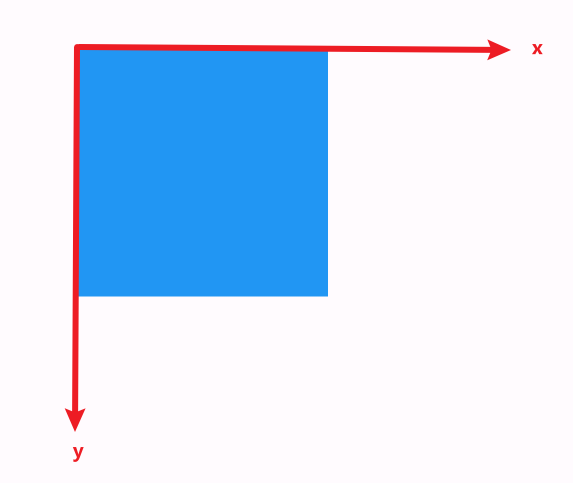

# Matrix4

Matrix4 是用来变换的 4×4 的矩阵, 需要 16 个参数。可以使用它提供的方法简化传参。

操作是以组件左上角为坐标原点:



## 缩放

```dart
Matrix4.diagonal3Values(double x, double y, double z)
```

三个参数分别表示组件在 x 轴, y 轴, z 轴上的缩放比例。

```dart
// 不做缩放
Matrix4.diagonal3Values(1, 1, 1)
// 沿x轴正向放大2倍
Matrix4.diagonal3Values(2, 1, 1)
// 沿x轴和y轴正向放大2倍
Matrix4.diagonal3Values(2, 2, 1)
```

## 移动

```dart
Matrix4.translationValues(double x, double y, double z)
```

三个参数分别表示组件在 x 轴, y 轴, z 轴上的移动距离。

```dart
// 不移动
Matrix4.translationValues(0, 0, 0)
// 向右移动100个单位
Matrix4.translationValues(100, 0, 0)
```

## 旋转

```dart
Matrix4.rotationX(double radians)
Matrix4.rotationY(double radians)
Matrix4.rotationZ(double radians)
```

三个方法分别表示组件在 x 轴, y 轴, z 轴上的旋转情况, radians 是弧度。

```dart
// 不旋转
Matrix4.rotationZ(0)
// 绕z轴顺时针旋转45度
import 'dart:math' as math;
Matrix4.rotationZ(math.pi / 4)
```
