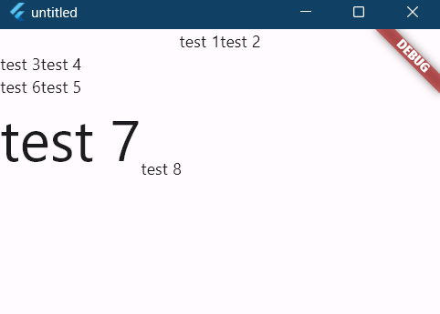

# 线性布局

所谓线性布局, 指沿水平或垂直方向排列子组件。Flutter 中通过 Row 和 Column 来实现线性布局。Row 和 Column 都继承自 Flex。

对于线性布局, 有主轴和纵轴之分, 如果布局是沿水平方向, 那么主轴就是指水平方向, 纵轴是垂直方向。如果布局沿垂直方向, 那么主轴就是指垂直方向, 纵轴就是水平方向。在线性布局中, 有两个定义对齐方式的枚举类 MainAxisAlignment 和 CrossAxisAlignment, 分别代表主轴对齐和纵轴对齐。

## Row

Row 沿水平方向排列子组件。

```dart
const Row({
  super.key,
  super.mainAxisAlignment,
  super.mainAxisSize,
  super.crossAxisAlignment,
  super.textDirection,
  super.verticalDirection,
  super.textBaseline,
  super.children,
  })
```

- mainAxisSize: 表示 Row 在水平方向占用的空间, 默认是 MainAxisSize.max, 表示尽可能多的占用水平方向的空间, 此时无论子组件实际占用多少水平方向的空间, Row 的宽度始终等于水平方向的最大宽度。而 MainAxisSize.min 表示尽可能少的占用水平空间, 当子组件没有占满水平方向的剩余空间, 则 Row 的实际宽度等于所有子组件占用的水平空间
- textDirection: 表示子组件的布局顺序(是从左往右还是从右往左), 默认为系统当前 Locale 环境的文本方向(如中文、英语都是从左往右)
- mainAxisAlignment: 表示子组件在 Row 所占用的水平空间内对齐方式, 如果 mainAxisSize 值为 MainAxisSize.min, 则此属性无意义, 因为子组件的宽度等于 Row 的宽度。只有当 mainAxisSize 的值为 MainAxisSize.max 时, 此属性才有意义, MainAxisAlignment.start 表示沿 textDirection 的初始方向对齐, 如 textDirection 取值为 TextDirection.ltr 时, 则 MainAxisAlignment.start 表示左对齐, textDirection 取值为 TextDirection.rtl 时表示从右对齐。而 MainAxisAlignment.end 和 MainAxisAlignment.start 正好相反；MainAxisAlignment.center 表示居中对齐
- verticalDirection：表示纵轴的对齐方向, 默认是 VerticalDirection.down, 表示从上到下
- crossAxisAlignment：表示子组件在纵轴方向的对齐方式, Row 的高度等于子组件中最高的子元素高度, 它的取值和 MainAxisAlignment 一样(包含 start、end、 center 三个值), 不同的是 crossAxisAlignment 的参考系是 verticalDirection, 即 verticalDirection 值为 VerticalDirection.down 时 crossAxisAlignment.start 指顶部对齐, verticalDirection 值为 VerticalDirection.up 时, crossAxisAlignment.start 指底部对齐；而 crossAxisAlignment.end 和 crossAxisAlignment.start 正好相反

```dart
Column(
  //测试Row对齐方式, 排除Column默认居中对齐的干扰
  crossAxisAlignment: CrossAxisAlignment.start,
  children: [
    Row(
      // Row 占满水平方向的空间
      // 默认 mainAxisSize: MainAxisSize.max,
      // 子组件水平居中
      mainAxisAlignment: MainAxisAlignment.center,
      children: [
        Text("test 1"),
        Text("test 2"),
      ],
    ),
    Row(
      // Row 占用的水平方向的空间取决于子组件
      mainAxisSize: MainAxisSize.min,
      // 子组件水平居中没效果
      mainAxisAlignment: MainAxisAlignment.center,
      children: [
        Text("test 3"),
        Text("test 4"),
      ],
    ),
    Row(
      // textDirection为rtl时, 表示左对齐
      mainAxisAlignment: MainAxisAlignment.end,
      // 子组件从右向左排列
      // rtl: right to left
      textDirection: TextDirection.rtl,
      children: [
        Text("test 5"),
        Text("test 6"),
      ],
    ),
    Row(
      // 顶部(此处是下方)对齐
      crossAxisAlignment: CrossAxisAlignment.start,
      // 子组件垂直方向从下向上对齐
      verticalDirection: VerticalDirection.up,
      children: [
        Text(
          "test 7",
          style: TextStyle(fontSize: 50.0),
        ),
        Text("test 8"),
      ],
    ),
  ],
),
```



## Column

Column 沿垂直方向排列子组件。

```dart
const Column({
  super.key,
  super.mainAxisAlignment,
  super.mainAxisSize,
  super.crossAxisAlignment,
  super.textDirection,
  super.verticalDirection,
  super.textBaseline,
  super.children,
})
```
