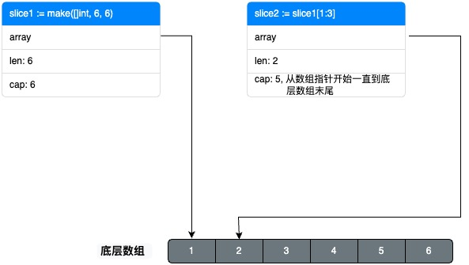

# 切片

切片(slice)是动态数组, 长度会动态扩展。

slice 底层结构是 struct, 包含三个字段:

```go
type slice struct {
    array unsafe.Pointer
    len   int
    cap   int
}
```

- array 指向底层数组
- len 表示切片的长度
- cap 表示切片的容量

## 切片的基本使用

```go
// var 变量名 []类型
var s []string
// 追加元素, append返回一个新的 slice, 原始的 slice 不变
s = append(s, "e1", "e2")
// 使用元素
fmt.Println(s[0])
```

## 初始化方式

```go
// 创建并初始化切片
s := []string{"a", "b", "c", "d", "e"}

// 使用make创建切片, 并设置初始长度(len)为5, 容量(cap)为10
// 初始值为数据类型的默认值
s := make([]int, 5, 10)
```

## 切片化

```go
s1 := []string{"a", "b", "c", "d", "e"}
s2 := s1[1:3]
fmt.Println(s2)
// 输出: [b c]
```

## 底层实现


