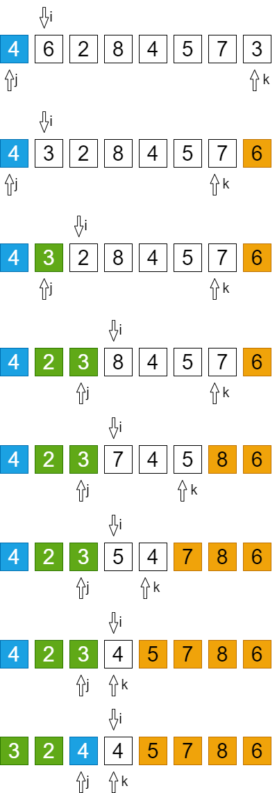

# 三路快速排序(快速排序优化)

选中第一个元素v, 调整数组使得左边的元素小于v, 中间的元素等于v, 右边的元素大于v, 使v所在的中间部分将原数组在逻辑上分割为左右两个子数组, 
不断重复这个操作, 直到分割后的所有子数组长度都等于4, 此时排序已经完成

```
[小于V的元素, 等于V的元素, 大于V的元素]
```

# 调整数组

- 随机取数组中的一个元素作为V，把V和第一个元素交换，使V成为数组第一个元素
- j指向数组第一个元素V
- k指向数组最后的元素
- i指向数组第二个元素
- 从i开始遍历整个数组
- 把i指向的元素和V比较，如果大于V，就把i指向的元素和k指向的元素交换，i不变，k--
- 如果小于V，就把i指向的元素和j+1指向的元素交换，i++，j++
- 如果等于V，i++
- 以此类推，直到i和k相等。最后把V和j指向的元素交换
- 此时：`[left,j-1]<V`，`[k+1,right]>V`，`[j,k]==V`


