# B+树

## 一个m阶的B+树具有如下几个特征

- 中间节点中的每个元素都有且只有一个子节点。
- 中间节点不保存数据, 只用来索引, 所有数据都保存在叶子节点。
- 所有的中间节点的元素都同时存在于其子节点, 是子节点中的最大元素。
- 所有的叶子节点中包含了全部元素的信息, 且叶子节点本身依元素的大小顺序链接, 形成了一个有序链表。
- 根节点的最大元素也是整个B+树的最大元素。

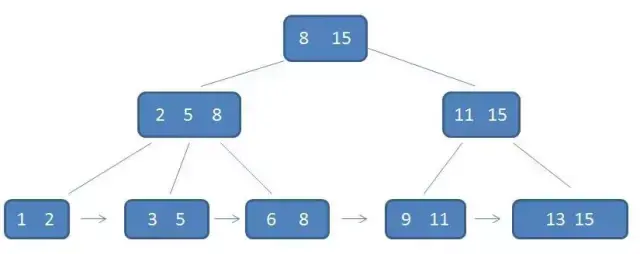

## 查询单个元素

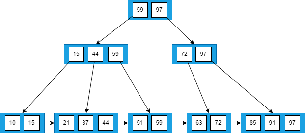

查询 59

- 访问根节点`[59,97]`, 发现 59 小于等于`[59,97]`中的 59 , 则访问根节点的第一个子节点
- 访问节点`[15,44,59]`, 发现 59 大于 44 且小于等于 59 , 则访问当前节点的第三个子节点
- 访问叶子节点`[51,59]`, 顺序遍历节点内部, 找到要查找的元素 59

## 查询区间

查询区间`[21~63]`

- 访问根节点`[59,97]`, 发现区间的左端点 21 小于 59, 则访问第一个子节点
- 访问节点`[15,44,59]`, 发现 21 大于 15 且小于 44 , 则访问第二个子节点
- 访问节点`[21,37,44]`, 找到了左端点 21 , 此时只需要进行单链表的遍历, 直接从左端点 21 开始一直遍历到右端点 63 即可

## 插入

设B+树的阶数 M = 3

### 情况1

若被插入元素所在的节点, 其含有元素数小于阶数 M, 则直接插入

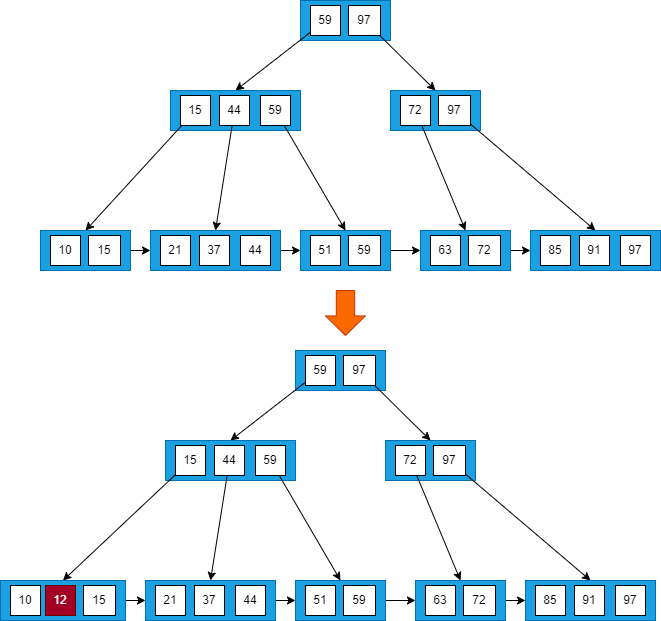

插入元素12 , 按查找的步骤找到要插入的节点, 插入元素所在的节点的`[10,15]`包含2个元素, 小于3, 则直接插入元素12

### 情况2

若插入元素所在的节点, 其含有元素数目等于阶数M, 则需要将该节点分裂为两个节点, 左节点包含(`ceil(M/2)`)个元素, 右节点包含(`floor(M/2)`)个元素。同时, 将左节点的最大元素上移至其父节点。假设其父节点中包含的元素个数小于等于M, 则插入操作完成。

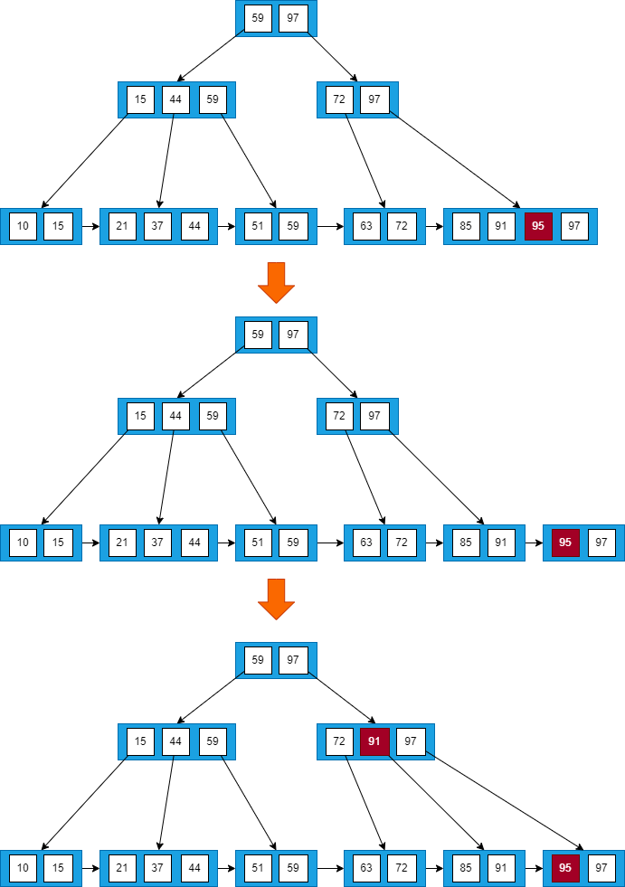

插入元素95, 插入元素所在节点`[85,91,97]`包含元素个数3等于阶数M, 需要分裂, 将元素95插入到节点`[85,91,97]`中, 将`[85,91,95,97]`分裂为两个节点`[85,91]`和节点`[95,97]`, 并将左节点的最大元素91上移至其父节点中, 发现其父节点`[72,97]`中包含的元素的个数2小于阶数M, 插入操作完成。

### 情况3

在情况2中, 如果上移操作导致其双亲节点中元素个数大于M, 则应继续分裂其双亲节点。

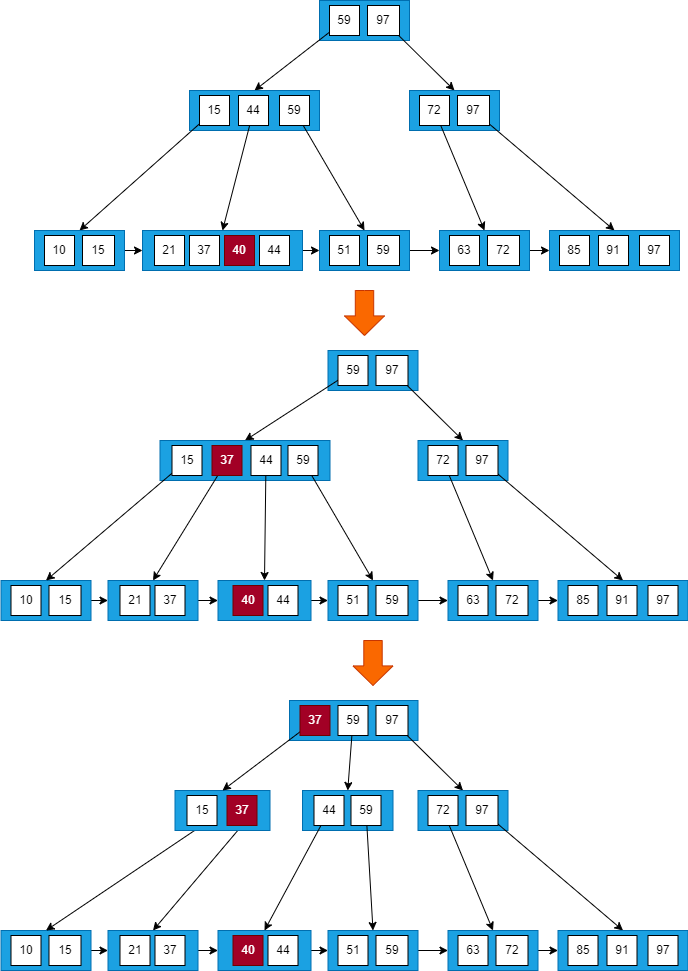

插入元素40, 按照第2种情况将节点分裂, 并将元素37上移到父节点, 发现父节点`[15,44,59]`包含的元素的个数等于M , 所以将插入37后的节点`[15,37,44,59]`分裂为两个节点`[15,37]`和节点`[44,59]`, 并将左节点的最大元素37上移到父节点`[59,97]`中. 父节点`[59,97]`包含元素个数2小于M, 插入结束。

### 情况4

若插入的元素比当前节点中的最大值还大, 破坏了B+树中从根节点到当前节点的所有索引值, 此时需要修正后, 再做其他操作。

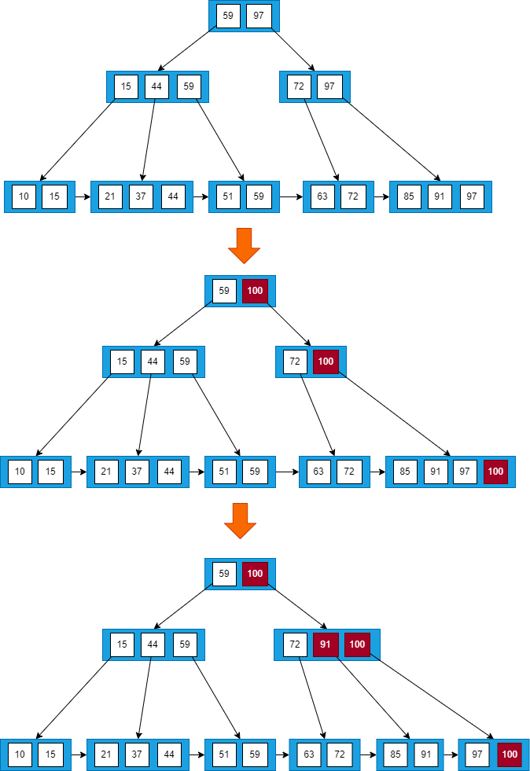

插入元素100, 由于其值比最大值97还大, 插入之后, 从根节点到该节点经过的所有节点中的所有值都要由97改为100。改完之后再做分裂操作。

## 删除

设B+树的阶数 M = 3

### 情况1

找到要删除的元素所在的节点时, 如果该节点中元素个数大于`ceil(M/2)`, 删除操作不会破坏B+树的结构, 则可以直接删除。

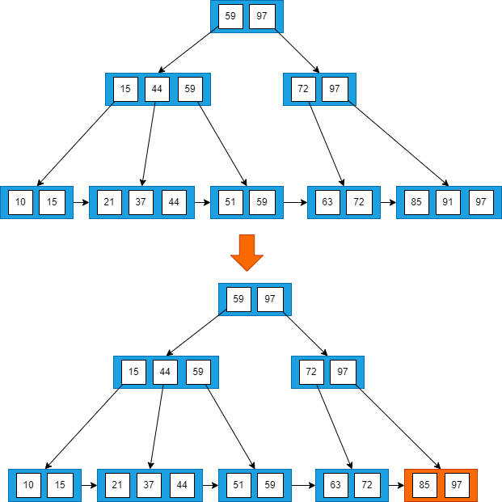

删除元素 91, 包含91的节点 `[85,91,97]`中元素的个数3大于2(`ceil(M/2)`), 做删除操作不会破坏 B+树的特性, 直接删除。

### 情况2

当删除某节点中最大或者最小的元素, 就会涉及到更改其双亲节点一直到根节点中所有索引值的更改。

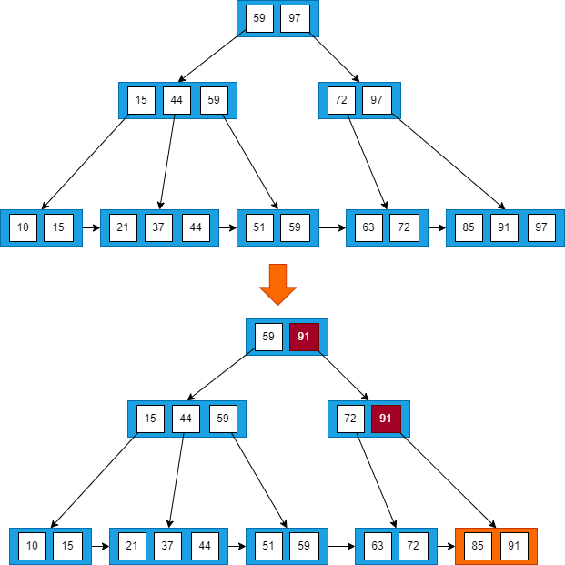

以删除整颗 B+树中最大的元素97为例, 查找并删除元素97, 然后向上回溯, 将所有元素97替换为次最大的元素91

### 情况3

当删除该元素导致当前节点中元素个数小于`M/2`时, 若其兄弟节点中含有多余的元素, 可以从兄弟节点中借元素完成删除操作。

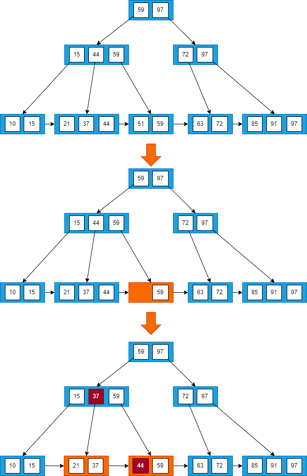

删除元素51, 由于其左兄弟节点`[21,37,44]`中含有3个元素, 所以可以选择借最大的元素44, 同时将父节点中的索引值44修改成37

### 情况4

第3种情况中, 如果其兄弟节点没有多余的元素, 则需要同其兄弟节点进行合并。

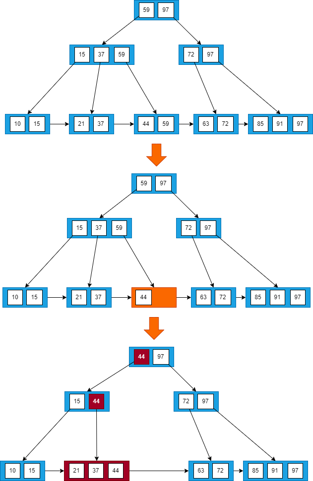

删除元素59, 首先找到元素59所在节点`[44,59]`, 发现该节点的兄弟节点`[21,37]`包含的元素个数等于2(`ceil(M/2)`), 所以删除元素59后, 将节点`[21,37]`和`[44]`进行合并, 然后向上回溯, 将所有元素59替换为次最大的元素44

### 情况5

当进行合并时, 可能会产生因合并使其父节点破坏B+树的结构, 需要依照以上规律处理其父节点。

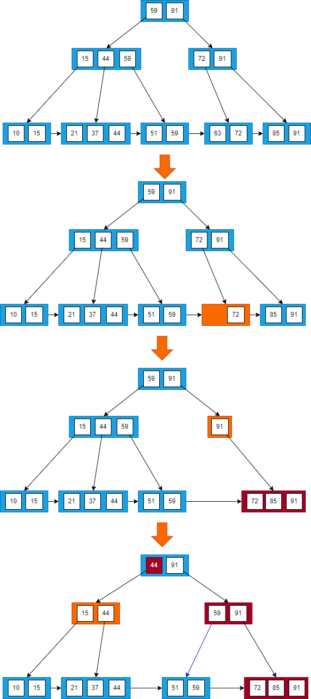

删除元素63, 当删除元素后, 该节点中只剩元素72, 且其兄弟节点`[85,91]`中只有2个元素, 所以将`[72]`和`[85,91]`进行合并, 向上回溯, 删除节点`[72,91]`当中的元素72, 此时节点中只有元素91, 不满足B+树中节点元素个数要求, 但其兄弟节点`[15,44,59]`中包含3个元素, 所以从其兄弟节点当中借一个元素59, 再对其兄弟节点的父节点中的元素进行调整, 将元素59替换为44
